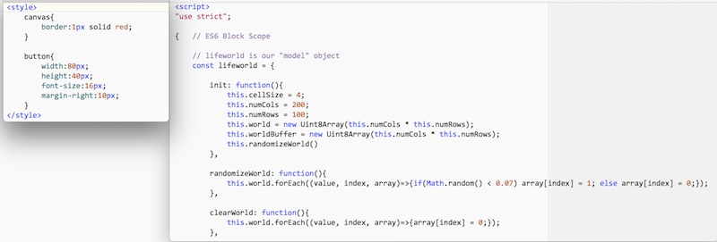
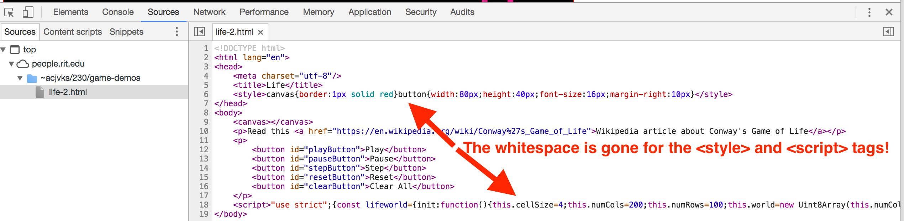

# Saving banjo.rit.edu from itself
## I. Overview
`banjo.rit.edu` is the new RIT web server for http://people.rit.edu

While this new web server solves a lot of problems we had with the old `gibson.rit.edu`, it also creates a host of new ones. 
Most of these new issues are because Banjo has enabled the [Google PageSpeed Module](https://www.modpagespeed.com) to help pages load significantly faster and more consistently. 

+ https://moz.com/blog/use-googles-pagespeed-module-to-dramatically-increase-the-speed-of-your-website

Unfortunately, there are undesirable byproducts for creaters of web pages that are under active development: it makes HTML/CSS/JavaScript debugging more difficult, and HTML validation impossible. So, we basically need to "turn it off" for all of our 230 web development this semester.

### An example of PageSpeed module causing trouble
**A) Here's some CSS and JavaScript we've created for a simple game. Note how it's nicely indented and easy to read.**

**B) When we upload it to Banjo, and view it in the Inspector, you can see how the white space has been stripped out, and it's harder to read**

## II. .htaccess files to the rescue!

.htaccess files allow you to make web server configuration changes on a per-folder basis. 

We have given you a text file named "htaccess" (inside of the [FixingBanjo.zip](FixingBanjo.zip) file) that contains a single line of text - "ModPagespeed off" (without the quotes). This unsurprisingly tells the webserver to not enable ModPagespeed for the directory that contains the file, and all of its sub-directories.

## III. Instructions:
1. Using your SFTP client of choice, upload this file to the www folder on your banjo.rit.edu account.
2. Then, on Banjo, change its filename from htaccess to .htaccess (just add a "." to the front of the name). Make sure you set the permissions on this file to 644. Then you should be all good!
3. **Important:** If you already have a .htaccess file in the www folder, don't replace it with the one we gave you. Instead, just add ModPagespeed off to the end of it.

**Note:** The reason we don't use the "." before uploading the file is that on Unix-based systems, like the Mac, any file starting with a "." is considered a system file and *hidden* - i.e., invisible, and difficult for us to find in order to upload to the server.

## IV. HTTPS versus HTTP
One more thing to watch for on banjo - external scripts must be downloaded *securely* via **https** rather than by *insecure* **http**.

Example - this will fail on banjo:

``

Your code will fail and you will see this error in the browser console:

`The page was not allowed to run insecure content from http://code.jquery.com/
jquery-2.2.0.min.js.`

If you change the 'src' value to the following, the jQuery will now successfully load:

``
