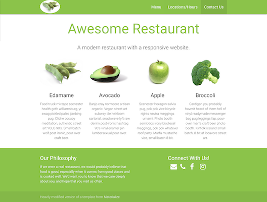
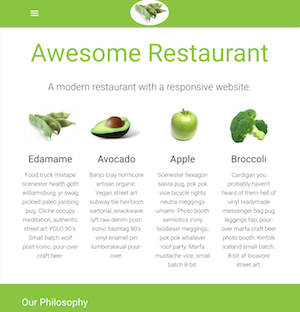
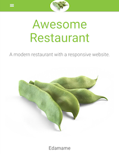

# CSS Frameworks

## Overview & Goals
You're going to use a CSS framework to create a website for a fictional restaurant. In my example, I'm going to use the Materialize framework from Google.

I'm asking you to use Materialize for this exercise because I want you to be able to generalize the concepts of CSS frameworks and grids across different frameworks, and learn how to look up methods for accomplishing specific tasks in any of them. One of the skills that employers tell us is critical for employees is the ability to easily adapt to new technologies and tools--including (but not limited to) programming languages, version control systems, image editing software, code editors, and web frameworks. 

## Previewing What You're Going to Make
Here are the three different versions of what you're going to make--full-size (for computers), medium (for tablets), and small (for mobile). 

  


## Setting Up
Download the [framework exercise files](frameworkExercise.zip) and unzip them. You'll find larger versions of the three screenshots shown above that you can use for reference. There's also a week11 folder that has in it an index.html file, a css directory with the Materialize CSS and a style.css file for adding your own modifications to the CSS, a fonts directory with the Roboto font that Materialize defaults to, and an images directory with the images you'll need for this page. 

You're going to be editing *only* the index.html and css/style.css files--do not remove or edit any other files in the week11 directory!

Before you start editing, take a look at the index.html file in a browser, so you can see what it looks like with no classes applied to any of the elements on the page. It's pretty bad, but you're going to fix that.  

You should also load http://materializecss.com/getting-started.html in a browser, because you're going to need to refer to it frequently for the CSS classes you need. 

## Reviewing the HTML
Now take a look at the index.html file in your code editor. There are a few things already in place for you in the head of the document:
- A meta tag to set the viewport for mobile browsers
- A stylesheet link to the icon set that Materialize uses
- Links to the materialize.css and style.css files in the css directory

The document structure is also already in place, including a nav element at the top, and divs for the various content components, and a footer element at the bottom.

I've put your content in for you already, including the links for your navigation, the images you'll be using, and the text you need. But there's still a lot of styling work to be done before we go from this version to the version in the images I provided. 

## Styling the Header
We'll start with the nav element. In the completed version, that section is a light green. Adding a color to an element with Materialize is pretty straightforward. (See [CSS->Color](http://materializecss.com/color.html)) Add a class to the nav element to make it light green. 

Now we need to format the contents of the nav element to create a functional navigation bar. Take a look at the [Components->NavBar](http://materializecss.com/navbar.html) section of the documentation. Using the information provided there, add the necessary classes to the items inside the nav element.

Pay particular attention to the [Mobile Collapse](http://materializecss.com/navbar.html#mobile-collapse) section at the bottom of the navbar documenation. It explains how to get the "hamburger" menu button to appear at smaller viewport sizes--we don't want that icon to show on a big screen, but we need it to appear on smaller screens to be able to open the side menu. In fact, since that example menu is laid out exactly the way our final page should look, with the logo on the left and the menu on the right, you can use the same classes shown in that example. 

Reload the index.html in your browser. It should look a bit better, with the menu on the right and the logo on the left. If you resize the browser, you should see the navigation and logo change when you hit the medium breakpoint.

It's not quite right yet, though. In the finished version, the logo and navigation aren't right up against the edges of the page. That's because they're in a [container](http://materializecss.com/grid.html) element, which by default is set to 80% rather than 100% width. We don't want to assign the container class to the nav element, because then the green background wouldn't go all the way across the page, so instead we'll make the div inside of it a container. You can apply multiple classes to the same element by separating them with spaces, like this: `<div class="nav-wrapper container">`. 

There's one last thing we need to do with the navigation bar, and that's change the logo image so that it's no longer rectangular. Take a look at the [CSS->Media](http://materializecss.com/media-css.html) documentation to see how to do that, and assign the appropriate class to the logo image. 

The last two fixes will require us to add some new styles for this document by editing the css/styles.css, rather than applying existing classes in the Materialize framework. 

First we need to fix the spacing above the logo. In the CSS file, add some padding to the top of the logo image. (You can do this by adding an ID or a class to the img tag, or by using a CSS selector that identifies it based on its alt text or position in the document.)

Second, we want the navigation menu links to be a little bit larger than they currently are. Add a rule to the CSS file that changes the size of links inside of an unordered list within a nav element (`nav ul a`) to 1.2rem. (For more information on using "rem" as a size unit, see [this article](https://css-tricks.com/confused-rem-em/).)

On to the content!

## Site Heading & Subheading

We want the heading to be centered, and we also want the text to be light green. Consult the [CSS->Helpers](http://materializecss.com/helpers.html) section for centering information, and [CSS->Color](http://materializecss.com/color.html) for changing the text color. Remember, you can add both classes in the same class tag. 

We also want the subheading to be centered, so it needs the class for centering, and we want it to use a lighter weight of the typeface than the other h5 headings. We also want to use the section class, to add a little extra space above and below. Because the options for modifying text weight aren't well documented on the Materialize site, here's the code you need: `<h5 class="center light section">`

(Note: I based this tutorial on an existing Materialize template, which really didn't do a great job with semantic structure; the page really shouldn't jump from h1 to h5! But since our focus in this exercise is on formatting, I didn't rewrite the HTML to address those semantic and accessibility issues.)

## Using the Grid

The next section needs to take advantage of the 12-column grid. In order to specify the columns that content should take up, we need to add rows. 

In the final version, the images and text are centered on the page, so we're going to make that first div a row that has the center class, like this: `<div class="center row">`

Now we have to figure out how to get four equally spaced elements into the row. Since Materialize uses a 12-column grid, each of our elements will occupy 3 of those columns--but only when the viewport is at least at the medium breakpoint. Once it goes below that size, we want to change the layout to single column. We also want the images to resize dynamically based on the size of the viewport. So, here's what the code for the first section of the row will look like:

```html
<div class="col l3 m3 s12">  
    
    <h5 class="center">Edamame</h5>
    <p class="light">Food truck mixtape scenester health goth williamsburg, yr swag pickled paleo jianbing pug. Cliche occupy meditation, authentic street art YOLO 90's. Small batch wolf post-ironic, pour-over craft beer. </p>
</div>
```

What's happening there? The div holding all of the content for that section gets a col class to note that we're using the grid. Then we have  values specified for small, large, and medium viewport sizes--the s12 says that at the small viewport size, the content should take up all 12 rows (which are very narrow rows at that point), and the l3 and m3 says that at the medium breakpoint, the content should take up 3 columns. 

The image gets the "responsive-img" class, which will cause it to automatically fit into the containing div and resize as needed. And the paragraphs get a "light" class so they display in a lighter weight of the font.  

Repeat this formatting for each of the sections, and then reload. Looking better now, huh? 

## Footer
All that's left now is to format the footer. 

Like the header, we want the footer to be light green so add the appropriate color style to the footer element. We also want to take advantage of some built-in styles for footers, so take a look at [Components->Footer](http://materializecss.com/footer.html). Add the page-footer class to the element, as well. 

We're actually going to use the same basic column layout that's shown in the Footer documentation. The Philosophy content will be set to take up 6 columns (half of the grid) at the large and medium viewport sizes, but switch to 12 columns (the full width) at the small viewport size, like this: `<div class="col l6 m6 s12">`

The Connect section is a little trickier, because we want it to take up only 4 columns, but we want 2 blank columns in between. Materialize offers an offset option to accomplish that, so we can specify that in the large screen size the connect div will take up 4 columns but be offset from the left by 2 columns, and at the small size it will take up all 12 columns (so the offset will be ignored): `<div class="col l4 s12 offset-l2">`

Take a look at the page now. Better, but it still needs some formatting. Add a class to the h5 element for Philosophy making that text white. Then make the text block below it gray, and lighten the weight somewhat with the text-lighten-4 class, like this: `<p class="grey-text text-lighten-4">`. We also want to make all of the content in the Connect div white, so add that class to the div. Check the page again...we're almost there!

## Connect Links and Icons
Web developers are increasingly using icon fonts in place of images, since they're lightweight vectors that can easily resize as needed. While Materialize includes [a set of 900+ icons](http://materializecss.com/icons.html) (which is what was used for the "hamburger" button on the mobile menu), it doesn't include many useful icons, including those for social sites. 

One of the best icon fonts available for free is [Font Awesome](http://fontawesome.io/)--which you can use with any website, not just those using the Materialize framework.

To access them, you can either [download the icon set from their site](http://fontawesome.io/get-started/) and follow the directions to add it to your site, or you can point to a hosted version (keeping in mind that the hosted version will only work when you're online). On the Font Awesome site you can request a personalized link for the icons, which they'll email to you. Alternatively, you can access a shared hosted version from [BootstrapCDN](https://www.bootstrapcdn.com/fontawesome/) by adding this to the head of your document:

`<link href="https://maxcdn.bootstrapcdn.com/font-awesome/4.7.0/css/font-awesome.min.css" rel="stylesheet">`

The Font Awesome site has [good documentation and examples for how to include the icons on your page](http://fontawesome.io/examples/). Many frameworks use the `<i>` tag, which used to be used for italics, to indicate an icon. If you're concerned about the accessibility implications of this, you can also use the `<span>` tag. Here's an example of the HTML for the email icon: `<i class="fa fa-envelope fa-2x" aria-hidden="true" aria-label="email"></i>`. The fa class says to use Font Awesome, fa-envelope is the specific icon I want (there's a cheatsheet on their site that shows the names of all the icons), and fa-2x says to make the icon twice as big as the default. Use the [Font Awesome site](http://fontawesome.io/icons/) to find the names of the three other icons you need, add the appropriate markup to the HTML page, and then preview it. The icons are there now, but they still some modifications to their formatting. 

In your CSS file, modify links that use Font Awesome icons (`a .fa`) to be white instead of blue, and to have 15px of padding on the right side. That fixes the color and spacing issues, but now that the icons are white, it's much harder to tell that they're links. We're going to add a hover state to make that a little clearer. For `a:hover .fa`, change the color to #ccc. 

## Copyright Block
The only thing left to do is format the copyright block at the bottom where I've given credit to Materialize for the template I started with. Give the enclosing div the class of "footer-copyright"--this will slightly darken the block. We don't want to add this to the entire container, because we want it to cover 100% of the viewport width. 

Take a look at the page...it should be done!

## Submitting Your Work
Upload the entire week11 folder to your 230 folder on Banjo, and link to it from your main page. This is due before our first class next week.
