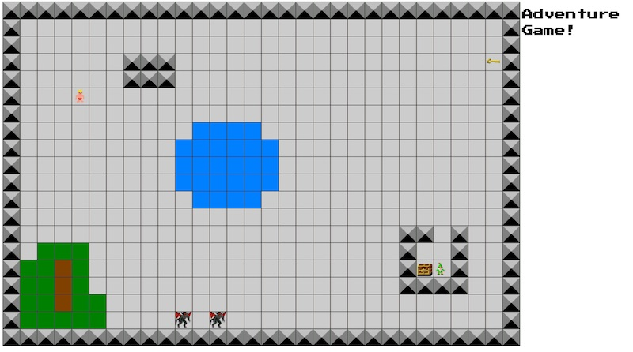

# Adventure! Game

## I. Overview
This is currently a demo (all done for you), not a homework assignment. You can download the complete files here:

[HW-adventure-done.zip](_files/HW-adventure-done.zip)

This game could be a good start on project 2 - either as a turn-based "Rogue-like" (the monsters move when the player does), or with real-time challenges. See the [HW-Life.md](HW-life.md) exercise to see how to set up a game loop using `window.requestAnimationFrame()`

### A. Screen shot of final version:

## II. Features
1. Game board is laid out on a 30x20 grid.
    - the tile elements are absolutely positioned &lt;span> elements.
    - the map data is read from a 2D array in `gamedata.js`.
    - tile types are floor, wall, grass, water and ground. 
    - tile backgrounds are read from terrain.png as CSS image sprites - see  [HW-chibi-matching.md](./HW-chibi-matching.md) for an explanation.
    - tiles belong to multiple classes, depending on which type of tile they are.
1. The player can use arrow keys to move their `player` avatar up, down, left, and right `onkeydown`
    - the `player` is an object literal.
    - `player` has 3 properties: `x` and `y` (in columns), and `element`
    - `player` has 4 methods: `moveRight()`, `moveDown()`, `moveLeft()` and `moveUp()`
    - `player.element` is an absolutely positioned &lt;span> element.
    - uses CSS animations - `transition-property: all;` and `transition-duration: .2s;` for a smooth transition between tiles.
    - not allowed to move into wall or water squares - see the `checkIsLegalMove(nextX,nextY)` function.
    - the `currentGameObjects` array is looped through every time the player moves, and the objects and monsters are re-positioned if necessary.
1. A simple audio effect - using a hidden &lt;audio> tag - is played when the player attempts to enter a wall or water square.
1. "Game Objects"
    - examples: treasure, chest, key, and monsters
    - also loaded in from a single sprite sheet.
    - are object literals with 3 properties: `x` and `y` (in columns), and `element`
    - `.element` is an absolutely positioned &lt;span> element.
    - can be added, removed, and moved on the game board.
    - the `currentGameObjects`array - (which is not a 2D array like `gameworld.world1`) is used to hold the game objects. This allows there to be more than one game object per square.
1. The code for detecting which square is clicked by the mouse is implemented, but not used.
1. If you don't like the border between the tiles, set `cellSpacing = 0`, and in the CSS under `span.cell{...}` set `border:none;`

## III. Possible Enhancements
- Use ES6 classes for the game objects (monsters, treasures, keys) instead of object literals. The `player` would then extend (be a subclass of) `GameObject`
- get the monsters to move, either turn-based or real-time
- collisions: handle *player->monster* and *player->game* object interactions. Get keys opening chests, allow the player to pick up a weapon, etc ...
- add grid tiles for doors, staircases, spiky pits, etc...
- give the player a HUD for hitpoints, collected items, level etc
- have multiple levels
- add story elements
- add a menu system and keyboard shortcuts (menu commands are probably done `onkeyup`)
- if necessary, fix "keyboard repeating" issues associated with the user holding the arrow keys down
- save game state in `localStorage` - see [web-apps-9.md](./web-apps-9.md)
- or do a completely different kind of a game like [Robots aka Daleks](https://en.wikipedia.org/wiki/Robots_(computer_game))

## IV. Review questions
- note that we use `Object.freeze()` on some of our Object literals, but `Object.seal()`on others. What are the differences between these methods, and why did we choose one over the other?
- in `loadLevel()`, we use the ES6 static object method `Object.assign()` - what does it do?
- give 2 ways to add a new CSS class to an element (so that it has more than 1 class), and 2 ways to remove one of these classes from an element.
