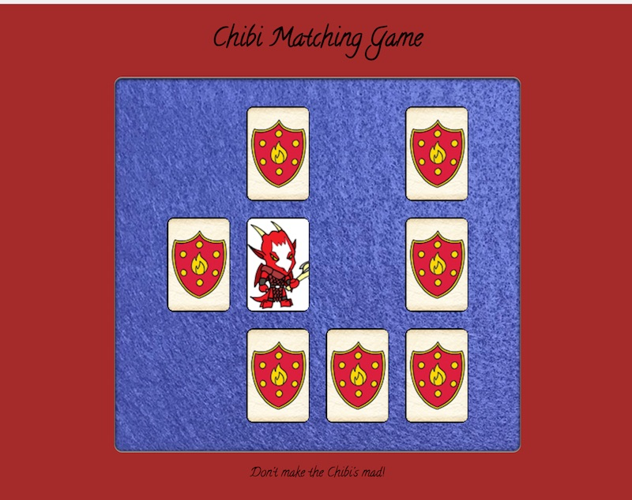
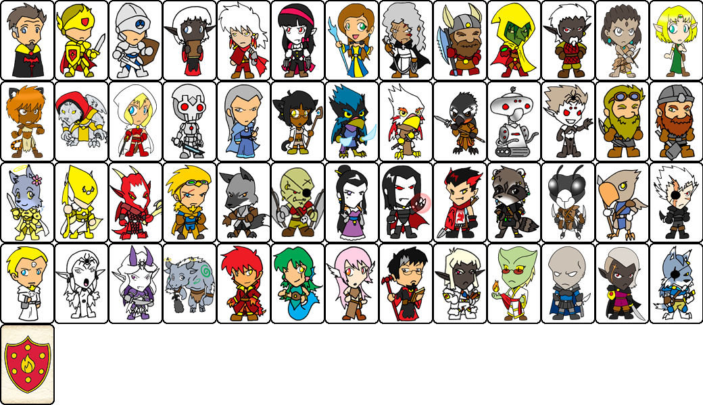

# Chibi Card Matching DOM Game

## I. Overview
This is a demo (all done for you), NOT a homework assignment. You can download the complete files here:

[HW-chibi-matching-done.zip](_files/HW-chibi-matching-done.zip)

### A. Screen shot of working version:


## II. Concepts covered

### A. CSS Image Sprites

These are basically sprite sheets for the web. Rather than have 52 separate image files for the cards, we just use 1 image.

The trick is to change the `background-position` property from 0,0 to another point on the spritesheet. Here is a sample of the CSS from this demo:

```css
/* Row 1 */
.cardR01C01 {background-position:  0 0;}
.cardR01C02 {background-position:  -80px 0;}
.cardR01C03 {background-position: -160px 0;}

.cardR01C11 {background-position: -800px 0;}
.cardR01C12 {background-position: -880px 0;}
.cardR01C13 {background-position: -960px 0;}
``` 

- https://developer.mozilla.org/en-US/docs/Web/CSS/CSS_Images/Implementing_image_sprites_in_CSS
- https://www.w3schools.com/css/css_image_sprites.asp
- https://css-tricks.com/css-sprites/

**Here is the full Chibi sprite sheet**:




### B. `classList.add()` & `classList.remove()`

- In this demo, there are classes that represent the `.card` and `.card-flipped` states. These are added and removed from the card elements as needed. The CSS `transition` property then dictates the animation between the 2 states.
- **HTML elements can belong to more than one class**, thus there are methods for adding and removing classes the of an element. (Unfortunately, it is buggy in the Safari Browser for some reason ...)
- Docs here: https://developer.mozilla.org/en-US/docs/Web/API/Element/classList


### C. Other stuff (see the code!)

- absolute positioning
- `.cloneNode()`
- `array.forEach()`
- `.setTimeout()`

## III. Ideas for project 2

For project 2 you could extend this application:

- keep track of how many cards the players click and then store their score using the WebStorage API (see Part 9 of the web apps tutorial)
- add a timer, and make that part of their score (use `requestAnimationFrame()` to create a timer)
- add a timer and a time limit on each level, and represent that time limit in an interesting way (ex. the prince or princess is sinking into the swamp, only YOU can save them)
- add a computer opponent driven by a timer, or have the opponent do something every time the user clicks 2 cards
- multiple levels (different cards, different challenges)
- add a new mechanic to the game (fantasy combat?) and have your matching game effect the fight in some way

or create a completely different kind of card game!
