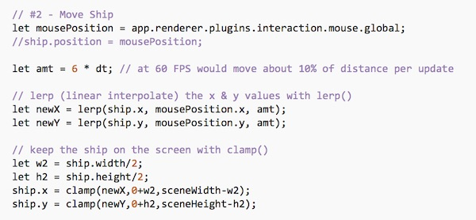
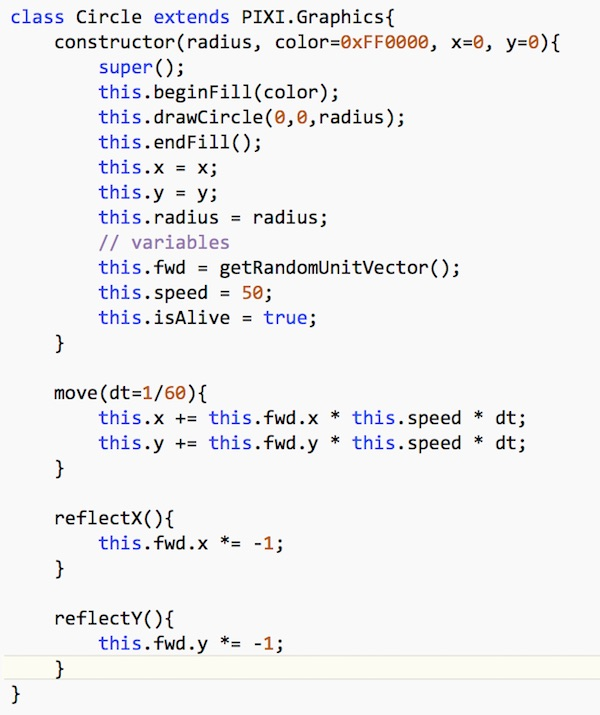
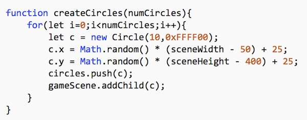
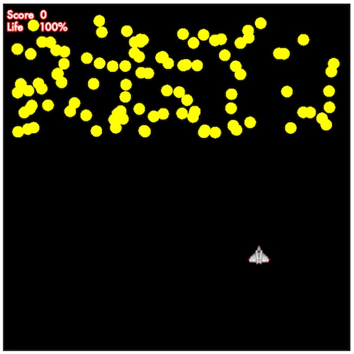
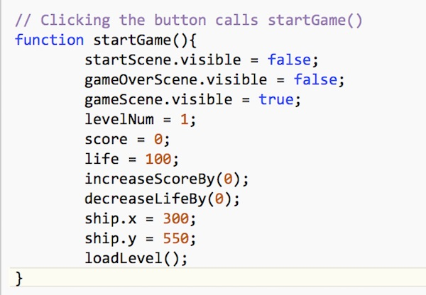
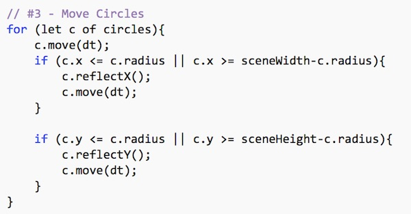
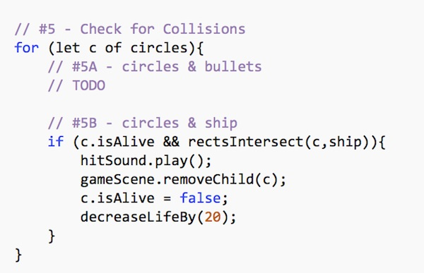
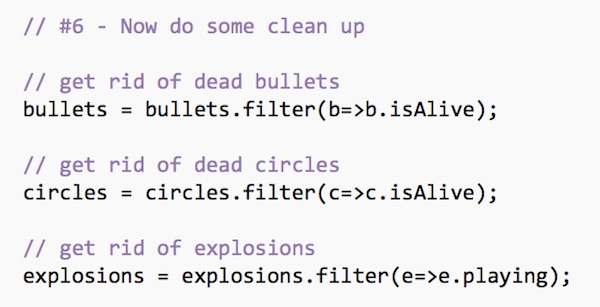
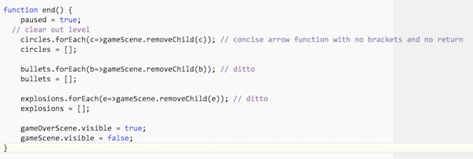

# HW - Circle Blast! - Part 2

## Contents
<!--- Local Navigation --->
I. [Overview](#section1)

II. [Implement our main "game loop"](#section2)
   
   - calculate `dt` "delta time"
   - get the ship following the mouse

III. [Create some obstacles](#section3)

IV. [Get level loading working](#section4)

V. [Ship->Circle Collisions](#section5)

VI. [Ending the game](#section6)

<hr><hr>

## I. <a id="section1">Overview
In this walkthrough we will continue to work on *Circle Blast!* by adding ship animation, circle animation, collision detection, and a game over state.

## II. <a id="section2">Implement our main "game loop"

We are going to skip past "#7 - load sprite sheet" for now and instead handle "#8 - Start update loop"

### II-A. Get started on `gameLoop()`
Here's the stub for `gameLoop()`, in copy/paste form. Add this to the bottom of **main.js**:


```
function gameLoop(){
	// if (paused) return; // keep this commented out for now
	
	// #1 - Calculate "delta time"
	
	
	// #2 - Move Ship
	
	
	// #3 - Move Circles
	
	
	// #4 - Move Bullets

	
	// #5 - Check for Collisions
	
	
	// #6 - Now do some clean up
	
	
	// #7 - Is game over?
	
	
	// #8 - Load next level
}
```

- **And now we need to call it, 60 times a second. Add the following to the `setup()` function:**

```javascript
// #8 - Start update loop
app.ticker.add(gameLoop);
```

### II-B. Calculate "Delta time"

We need to figure out how much time has passed since the last update, and adjust the speed of our sprites accordingly.
Ideally, this would be precisely 1/60th of a second, but frame rates can fluctuate depending on what else the browser or OS is working on, so calculating this value every frame makes the animations run much smoother. 

- **Add the following to `gameLoop()`:**

```javascript
// #1 - Calculate "delta time"
let dt = 1/app.ticker.FPS;
if (dt > 1/12) dt=1/12;
```

Note that if `dt` is greater than 1/12 of a second we will clamp it to 1/12 of a second. When could `dt` be that large?
- #1 - when first starting the game up
- #2 - when the user creates a new browser tab in the same window as the game, `app.ticker` will pause the updates. If the user returns 5 seconds later, `dt` will now be 5 instead of 1/60, which will wreck the game animation.


### II-C. Get the ship moving

- **Add the following to `gameLoop()`:**

```javascript
// #2 - Move Ship
let mousePosition = app.renderer.plugins.interaction.mouse.global;
ship.position = mousePosition;
	
```

Note: `.position` is a [PIXI.Point](http://pixijs.download/dev/docs/PIXI.Point.html) - which is an object that looks like this `{x:0,y:0}`

- Reload the page and try it out. The ship should now move to the position of the mouse pointer (which gives it an unreasonably fast speed). The ship will also move off of the game scene, which is not good.

- **Modify the code to instead look like this:**



The ship should now smoothly move towards the position of the mouse. If you would rather have a slower or faster ship, you just have to tweak `amt`.

Note: Here we are using the `lerp()` and `clamp()` helper functions that were given to you in **utilities.js** - please check out the implementaion of those functions right now.


## III. <a id="section3">Create some obstacles

So we have a moving ship, but no opponents yet. Now we need to create those circles that the player will eventually be dodging and shooting.

### III-A. Create the Circle class.

- **Add the following to classes.js:**



Note that this is an improved version of the `Circle` we created back in [Pixi 2 - ES6 Classes & PixiJS Animation](pixi-js-2.md):
- we are now using `dt` so that the circle's perceived speed never changes, regardless of what the actual frame rate of the game is.
- we are using the `getRandomUnitVector()` function (defined in **utilities.js**) so that `fwd` is always a *unit vector* (displacement of 1), which means that all of our circles are going to move at the same speed.

- **Reload the page - there should not be any errors**

### III-B. Implement the `createCircles()` function.

**Here's a new function for main.js - it needs to look like this:**



This code is hopefully self-explanatory: it creates circles, adds them to the array, and places them on the top 1/3 of the scene (plus a 25-pixel margin).

- **Test the code by typing this into the console -  `createCircles(100)` - which should create 100 circles and put them on the screen:**




## IV. <a id="section4">Get level loading working

### IV-A. In **main.js** implement `loadLevel()`:

```
function loadLevel(){
	createCircles(levelNum * 5);
	paused = false;
}
```

### IV-B. Now make `startGame()` look like this:



- **Reload the page - click the start button - there should be 5 circles at the top of the screen**

### IV-C. Get the circles moving

- **Finally, to get the circles moving, add the following to `gameLoop()`:**



- **and be sure to *uncomment* this line of code that is at the top `gameLoop()`:**

 `if (paused) return;`
 
- **Reload the page - the 5 circles are now moving and bouncing off of the sides of the scene**

## V. <a id="section5">Ship->Circle Collisions

For now we will skip past **#4 - Move Bullets** and work on **#5 - Check for Collisions**.


### V-A. Add the following to `gameLoop()`



- **Reload the page, and move the ship into the circles. You should see the circle disappear, a sound should play, and the life value should go down.**

To do bounding box collision detection between the ship and the circles, we are calling `rectsIntersect()`, which is yet another helper function from **utilities.js**. Remember when we said that PixiJS is a *rendering engine*, not a *game engine*? This means that we have to write a lot of these kinds of methods ourselves when we use PixiJS to build a game. That's OK! It's a good way to learn about and appreciate everything that game engines do for us.

We also set the `.isAlive` property of the collide with circle to `false`. Which will help us to filter them out of the `circles` array in the next step.

### V-B. Cleaning up

After colliding with all of the circles, if you type `circles.length` into the console you get a result of `5`, even though there are no circles on the screen. 
While we DID remove the circles from the game scene, we DID NOT removed them from the array, which will cause problems later on.

- **To empty out the `circles` array (and others) every frame, add the following to `gameLoop()`:**



Recall that `array.filter()` accepts a "testing" (or predicate) function that returns `true` or `false`, and that this function is called on every element of the array. If an element passes the test, it goes into the newly created array.

- **Reload the page, and move the ship into the circles. Type `circles.length` into the console again, you should get a `0` this time**.


## VI. <a id="section6">Ending the game

### VI-A. Add the following to `gameLoop()`

```
// #7 - Is game over?
if (life <= 0){
	end();
	return; // return here so we skip #8 below
}
```

### VI-B. Add the `end()` function to main.js



The `end()` function transitions to the new screen, and empties out all of the arrays. Once we have bullets, explosions, and multiple levels then this code will be essential.

- **Reload the page, and move the ship into the circles. Once the ship health reaches zero, you should see the "Game Over" screen. Clicking the Play Again button send the player back to the "Game Screen" and starts the game over.**

<hr>
<hr>


 **[Previous Chapter <- Circle Blast! (part 1)](HW-circle-blast.md)**
 
 **[Next Chapter -> Circle Blast! (part 3)](HW-circle-blast-3.md)**
