# HW - Circle Blast!

## Contents
<!--- Local Navigation --->
I. [Overview](#section1)

II. [Get started!](#section2)

III. [Coding game.html](#section3)

IV. [Getting started on main.js](#section4)

V. [Getting started on the 3 scenes](#section5)

VI. [Creating the Start Scene](#section6)

VII. [Begin coding the Game Scene](#section7)

VIII. [Getting the ship on the screen](#section8)

IX. [Pre-loading the audio files](#section9)

<hr><hr>

## I. <a id="section1">Overview
In this walkthrough we will construct a complete PixiJS game, *Circle Blast!*

**Parts I-III** have the following features:

- 3 game "screens" - Start Screen, Main Game Screen, & Game Over Screen
- Game Buttons with rollover states
- 3 sprite types: Ship, Circle, & Bullet
- Movement uses vectors and is frame rate independent
- Mouse control of the player ship
- Bounding box collision detection
- Sound loading and playback using the [Howler JS](https://github.com/goldfire/howler.js/) library
- Sprite sheet loading and animation
- Scoring and levels

**Part IV** (optional) adds the following:
- Custom font loading using [Web Font Loader](https://github.com/typekit/webfontloader)
- "Smarter" circles
- The [Subclass Sandbox](http://gameprogrammingpatterns.com/subclass-sandbox.html) design pattern

### Pre-requisite knowledge
Before doing this exercise, you should have completed the entire [web app series](./web-apps-0.md), as well as [pixi-js-1.md](./pixi-js-1.md) and [pixi-js-2.md](./pixi-js-2.md)

### Screen shots

#### Start Screen
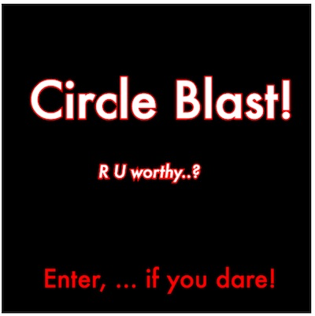

#### Main Game Screen
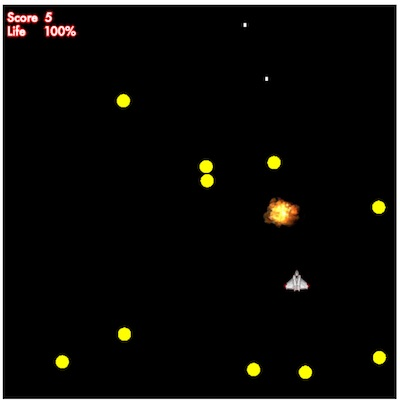

#### Game Over Screen
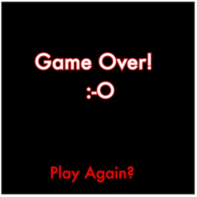

## II. <a id="section2">Get started!

The start code is zipped up here: [HW-pixi-game-start.zip](_files/HW-pixi-game-start.zip)

Take a look at what you have:
- a **game.html** file - currently it's mostly done for you, except that you are going to have to link to 2 JS libraries, and to 3 other JavaScript files. There will be no custom CSS in this project, other than what's already here for the custom "move" cursor.
- an **images** directory - contains our custom cursor, a graphic for the player's ship, and a sprite sheet that is used with the explosion effect.
- a **js** directory - there are 3 JavaScript files in here - **classes.js** and **main.js** are both currently empty, but **utilities.js** is all done for you.

**Reminder: Once we start loading in images utilizing JavaScript, you will run into CORS security issues, and will need to run this project off of a server. See the list of 4 ways to do this on the [Intro to PixiJS](pixi-js-1.md) notes.**

## III. <a id="section3">Coding game.html

- First let's get the **game.html** file completed - it needs to look like this:

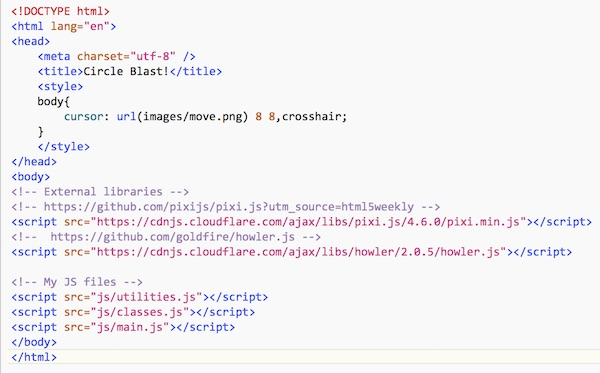

- If you don't want to type in the URLs for the 2 libraries, then google "CDN Pixi" and "CDN Howler" to find and copy/paste the URLs yourself.

### Is everything imported?

Load the **game.html** page into a browser. To verify that you imported these libraries, type `PIXI`, `Howl`, and `getRandomUnitVector()` into the browser console. You should similar results to below, which means that you are all done making changes to this file:

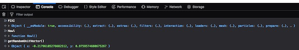

##  IV. <a id="section4">Getting started on main.js

**main.js** will contain the majority of our game code, and will be responsible for setting up our 3 "scenes" and their UI, loading images and sounds, and determining when the game is over.

- **Make main.js look like this - below is the code you can copy & paste:**

```html
// We will use `strict mode`, which helps us by having the browser catch many common JS mistakes
// https://developer.mozilla.org/en-US/docs/Web/JavaScript/Reference/Strict_mode
"use strict";
const app = new PIXI.Application(600,600);
document.body.appendChild(app.view);

// constants
const sceneWidth = app.view.width;
const sceneHeight = app.view.height;	

// pre-load the images
PIXI.loader.
add(["images/Spaceship.png","images/explosions.png"]).
on("progress",e=>{console.log(`progress=${e.progress}`)}).
load(setup);

// aliases
let stage;

// game variables
let startScene;
let gameScene,ship,scoreLabel,lifeLabel,shootSound,hitSound,fireballSound;
let gameOverScene;

let circles = [];
let bullets = [];
let aliens = [];
let explosions = [];
let explosionTextures;
let score = 0;
let life = 100;
let levelNum = 1;
let paused = true;

function setup() {
	stage = app.stage;
	// #1 - Create the `start` scene
	
	// #2 - Create the main `game` scene and make it invisible

	// #3 - Create the `gameOver` scene and make it invisible
	
	// #4 - Create labels for all 3 scenes
	
	// #5 - Create ship
	
	// #6 - Load Sounds
	
	// #7 - Load sprite sheet
		
	// #8 - Start update loop
	
	// #9 - Start listening for click events on the canvas
	
	// Now our `startScene` is visible
	// Clicking the button calls startGame()
}
```

- We also went ahead and created a new PIXI application, and then appended the `view` (a &lt;canvas> tag) to the document.
- We have set up all of our "script scope" variables that we will need for the completed game.
- Note that we are starting the game - by calling `setUp()` - AFTER we have pre-loaded all of our image assets.


- **Load the game in a browser to verify that PIXI is loaded (you should see a 600x600 black screen):**

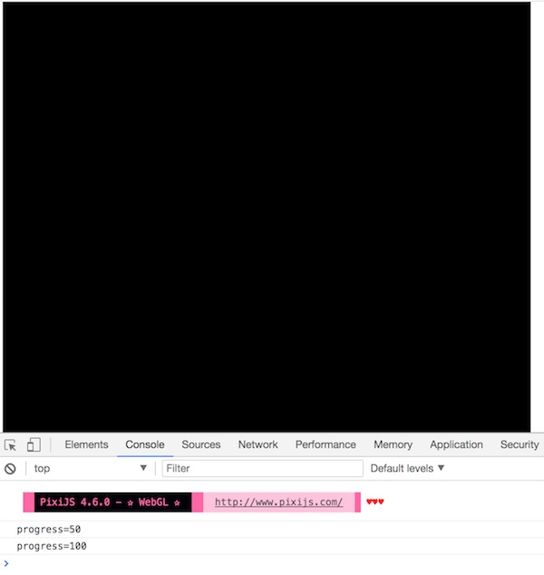

- **You can verify the images loaded by looking under the *Network* tab:**

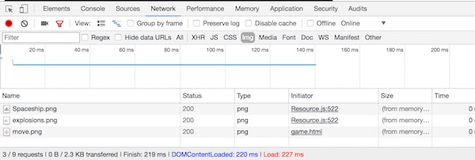

##  V. <a id="section5">Getting started on the 3 scenes

- The are 3 scenes we need to code: "start scene", "game scene" and "game over scene"
- Add the following code to `setUp(){...}`:

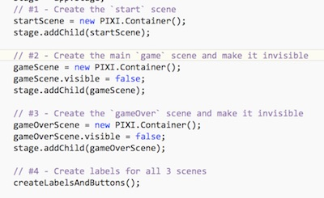

If you try to preview the results you will get an error because we didn't write `createLabelsAndButtons()` yet.

## VI. <a id="section6">Creating the Start Scene

- Now we need to implement the `createLabelsAndButtons()` function - add this to **main.js**:

**Note: We are using the Futura font below, which might not be on your machine. If it's not, just use Verdana or similar. In Part IV, you are going to change the text over to a downloaded web font anyway.**

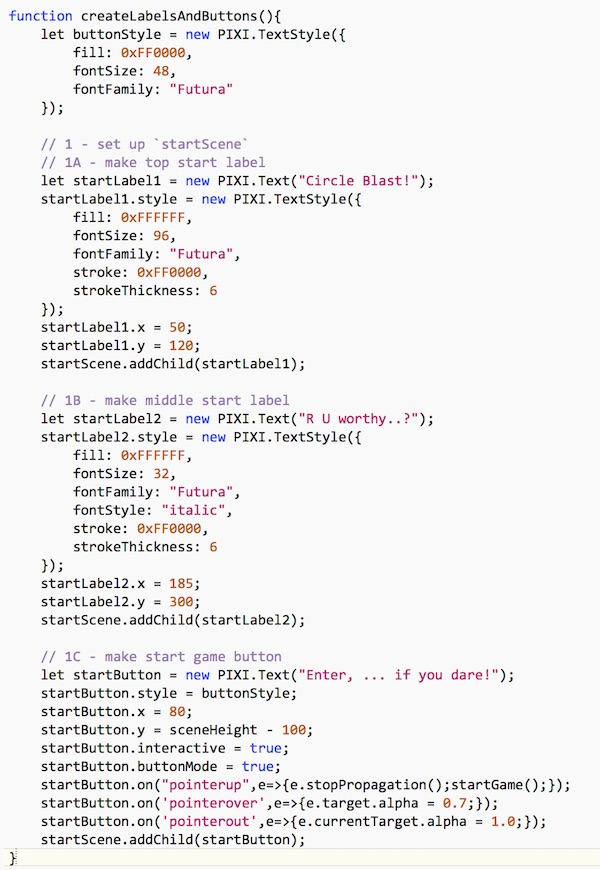

- There is a lot of interface creation code here - but hopefully it is fairly clear what's going on. 
- In the game you will create for project 3, you will probably want to create most of this kind of text in an image editing/creation program like Photoshop, and then load in the images you created. It will look better and require less code than the approach we used here. 
- **Open the game up in the web browser and it should look like this:**


- **Clicking the button will cause an error because we have not yet written the `startGame()` function.**
- You are now done coding the "start scene", so let's move on to the "game scene". 

## VII. <a id="section7">Begin coding the Game Scene

- To get the "start game" button working, implement `startGame()` - this goes in **main.js**:

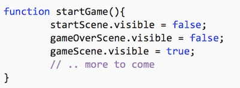

- Test it. Clicking the button should show the game scene and hide the start scene. The game scene is currently empty, so all you will see is the black 600x600 &lt;canvas>.

- This is a great use case of [PIXI.Container](http://pixijs.download/dev/docs/PIXI.Container.html) (all 3 scenes are pixi `Container` instances), the ability to show and hide grouped content (in this case game scenes) with 1 line of code.

- **Now get started on building the game scene user interface - add the following to the end of `createLabelsAndButtons()`:**

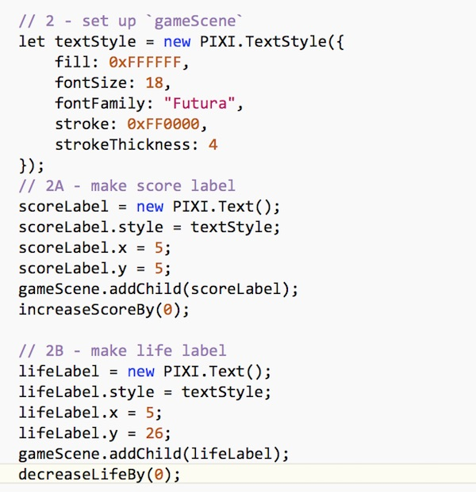

- **Note that `scoreLabel` and `lifeLabel` have been previously declared above in "script scope" so that we could refer to them later**
- **You will also need to declare the following 2 functions. These will be called periodically as the player shoots the circles, and as the ship takes damage:**

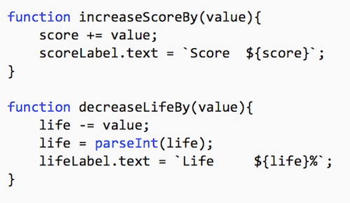

- **Reload the page, and click the "start game" button, you should now see the score and health labels:**

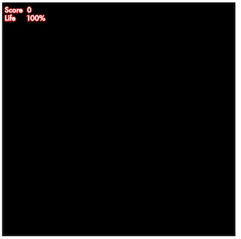

### Coding the "Game Over" scene
- **Let's go ahead and write the code for the "game over" scene - add this to the end of `createLabelsAndButtons()`. Here's all the code you need - for your copy & paste pleasure:**

```javascript
// 3 - set up `gameOverScene`
// 3A - make game over text
let gameOverText = new PIXI.Text("Game Over!\n        :-O");
textStyle = new PIXI.TextStyle({
	fill: 0xFFFFFF,
	fontSize: 64,
	fontFamily: "Futura",
	stroke: 0xFF0000,
	strokeThickness: 6
});
gameOverText.style = textStyle;
gameOverText.x = 100;
gameOverText.y = sceneHeight/2 - 160;
gameOverScene.addChild(gameOverText);

// 3B - make "play again?" button
let playAgainButton = new PIXI.Text("Play Again?");
playAgainButton.style = buttonStyle;
playAgainButton.x = 150;
playAgainButton.y = sceneHeight - 100;
playAgainButton.interactive = true;
playAgainButton.buttonMode = true;
playAgainButton.on("pointerup",startGame); // startGame is a function reference
playAgainButton.on('pointerover',e=>e.target.alpha = 0.7); // concise arrow function with no brackets
playAgainButton.on('pointerout',e=>e.currentTarget.alpha = 1.0); // ditto
gameOverScene.addChild(playAgainButton);
```

- **Reload the page to be sure that there are no code errors.  Nothing will look different at this point.**
- You are all done with `createLabelsAndButtons()` - that's a good thing!

## VIII. <a id="section8">Getting the ship on the screen
Now we need to create a spaceship that the player can control. We will first create and ES6 class to encapsulate all of the ship state and behavior.

### Creating the Ship class

- Add the following to **classes.js**:

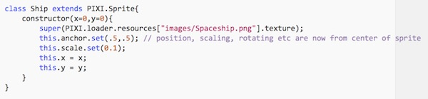

### Create the ship instance

- Add the following to `setUp(){...}` in **main.js**:

```javascript
// #5 - Create ship
ship = new Ship();
gameScene.addChild(ship);
```

- **Reload the page, you should now see the ship in the upper-left corner of the screen - which is (0,0).**
- Only half of the ship is visible because we adjusted the `.anchor` so it would be drawn from its center rather than the upper-left corner, which is the default.

## IX. <a id="section9">Pre-loading the audio files
In this game we are using the [Howler](https://github.com/goldfire/howler.js/) audio library, which uses the high-performance Web Audio API to play audio files.
(Recall that you imported this library at the top of the **game.html** file).

- Add this code to `setUp(){...}` in **main.js**:

```javascript
// #6 - Load Sounds
shootSound = new Howl({
	src: ['sounds/shoot.wav']
});

hitSound = new Howl({
	src: ['sounds/hit.mp3']
});

fireballSound = new Howl({
	src: ['sounds/fireball.mp3']
});
```

- **You can test that this code successfully loaded the audio files by typing the following into the console (which should cause the sound to play):**

`shootSound.play()` 

`hitSound.play()` 

`fireballSound.play()` 

<hr><hr>

**That's enough for this section, move on to [Circle Blast - Part II](HW-circle-blast-2.md)**
