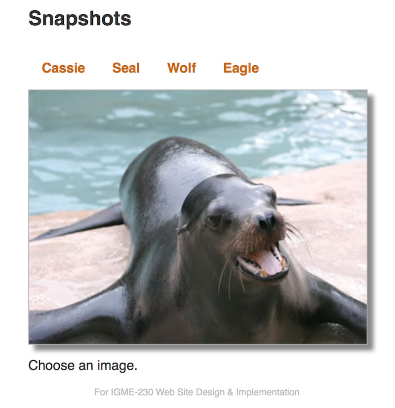

# Homework: Image Gallery

## Overview
In this assignment you will create a simple image gallery. 

To do this assignment, you should have completed at least the 6th web app tutorial page - "Events".

## Instructions
You will need to write some JavaScript to get this working:
1. The start files are here [gallery-start.zip](_files/gallery-start.zip)
1. Clicking on each "link" (they are actually spans) will load the applicable picture - use the `click` event
1. The image name for each link is stored in a custom data attribute of the &lt;span> - we learned how to access these in [web-apps-6.md](./web-apps-6.md)
1. An optimal solution won't use very much code, and should not take long to write
1. Optional: A "juiced up" image gallery that utlizes more JavaScript and showcases your mastery of advanced CSS is a possible portfolio piece. There are many ways to enhance this image gallery if you wanted to:
    1. Effects like crossfades can be done with CSS and by adding a second &lt;img> tag. Demonstrations on how to do this are here: http://css3.bradshawenterprises.com/cfimg/
    1. Adding "you are here" cues indicating which picture was selected would be nice. Adding a visible caption for each picture (to be displayed in a paragraph for example) would also be a good feature. 
    1. A more scalable solution that could display many more images would load data from arrays, and dynamically create thumbnails
1. When you're done, zip and post your files to the appropriate dropbox.
