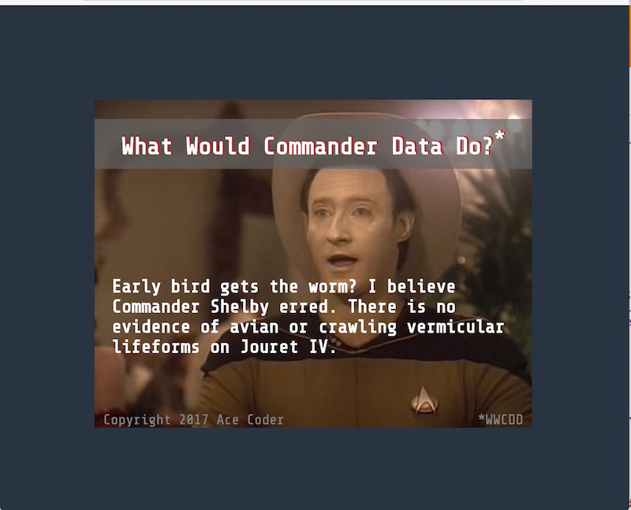

# Homework: Random Phrases - 1

## Overview
In this assignment you will create a "random phrases" web application. 

The exact theme is up to you, the example below used a *Star Trek: TNG* theme.

Ideally your theme is appropriate for all ages and audiences.

To do this assignment, you should have completed at least the 3rd web app tutorial page: [3 - Introduction to the Web Browser DOM](web-apps-3.md).

## Instructions & Rubric
1. Create a valid HTML5 page named **random-phrases-1.html** that has the following content:
    1. A header that serves as the title of the page
    1. A background image
    1. Your name must be somewhere on the page
    1. An area of the page that will hold dynamically created content
    1. The page will use an embedded font
    1. The page content must be legible and nicely styled, with good choices made for colors, margins and fonts
    1. Mobile friendly would be nice, but is not required
    1. The look and theme of the page is worth 50% of the assignment
1. When the page loads (or reloads) a random phrase related to your theme will appear on the page:
    1. You will have at least 5 phrases stored in a JavaScript array
    1. When the page loads (or reloads) a random phrase from the array will be selected and displayed. You can use `Math.random()`, `Math.floor()`, and `array.length` to accomplish this. If you get stuck, look for help on the Internet.
    1. The functionality of the page is worth 50% of the assignment

## Submission
- Post to your web site and link it from your home page before the due date.
- Hint: The coding of this shouldn't take too long, but the page layout and styling will.
