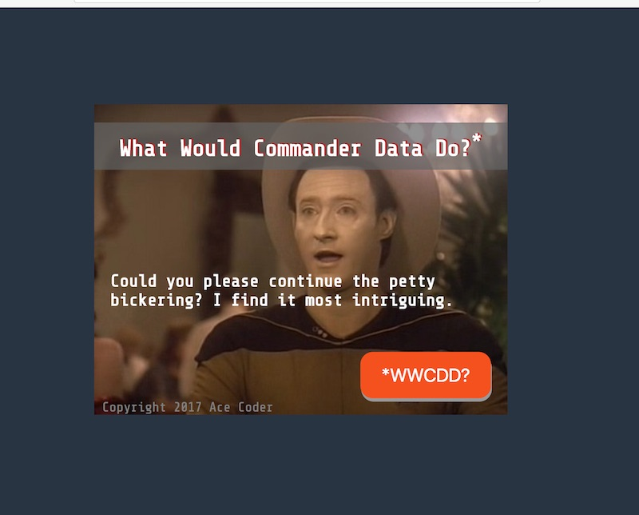

# Homework: Random Phrases-2

## Overview
Simple. Just add a functional button to Random Phrases-1

To do this assignment, you should have completed at least the 6th web app tutorial page - "JavaScript Events".

## Instructions
1. Duplicate the **random-phrases-1.html** file and name it **random-phrases-2.html**
1. All of the requirements of Random Phrases-1 are in effect
1. Create a nicely styled &lt;button> and put it on the screen
1. Clicking the button will call a function named `displayQuote`, which will generate and display a random quote
1. When the page is first loaded, a random quote should still be displayed

## Submission
- Post to your web site and link it from your home page before the due date.
