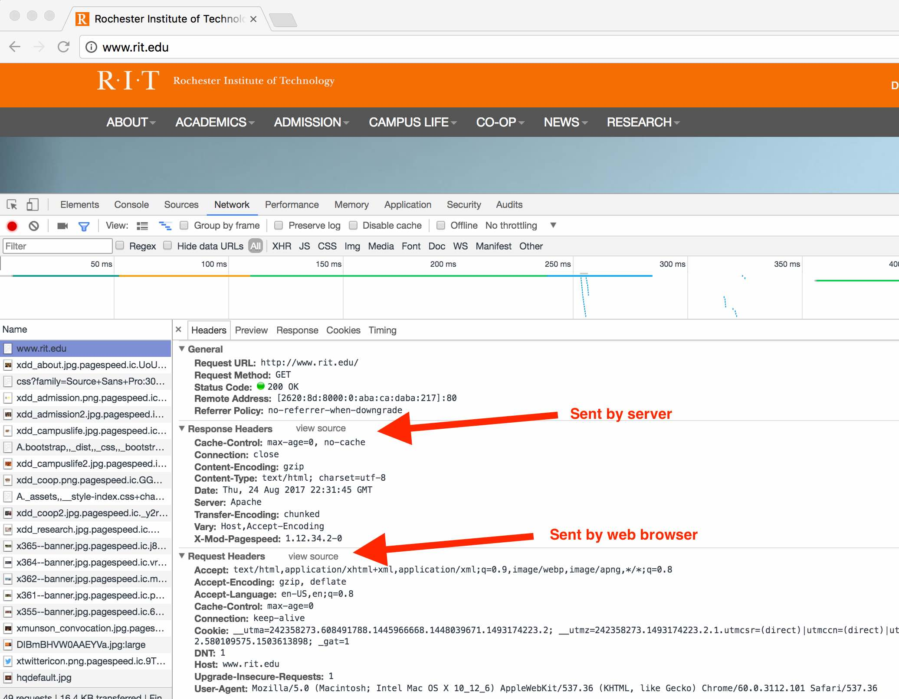

# HTTP Protocol Demo 
## I. Overview
The Hypertext Transfer Protocol (HTTP) is an application *protocol* (a system of rules e.g. steps) for distributed, collaborative, and hypermedia information systems. HTTP is the foundation of data communication for the World Wide Web.

+ https://developer.mozilla.org/en-US/docs/Web/HTTP/Overview
+ https://en.wikipedia.org/wiki/Hypertext_Transfer_Protocol

A critical part of the HTTP protocol are *HTTP Headers*, which allow the client and the server to pass additional information with the request or the response. 

+ https://developer.mozilla.org/en-US/docs/Web/HTTP/Headers


Let's use the command line to connect to RIT's web server and request the default RIT home page (this is what web browsers do).

## II. Try this on the Command Line

1. Launch the PuTTY Application (or Terminal on a Mac)

2. Type `telnet www.rit.edu 80`and press return.

Trying 129.21.1.40...

Connected to web01www01.rit.edu.

Escape character is '^]'.

3. Type `GET / HTTP/1.1` and press return. (This is the *request line* - **GET** is an *HTTP Request Method* - here we are requesting the default file of the server's root directory, which is index.html)

4. Type `HOST: www.rit.edu` and press return. (**HOST** is an *HTTP Request Header*. Here we are sending just one header, but you can easily end more headers, one to a line.)

5. Press return again. (In the HTTP request protocol, a blank line indicates that there are no more request headers)

Now you should first get the *HTTP Status Code* and  *HTTP Response Headers* back from the web server.

```
HTTP/1.1 200 OK
Date: Thu, 24 Aug 2017 18:45:27 GMT
Server: Apache
Vary: Host,Accept-Encoding
X-Mod-Pagespeed: 1.12.34.2-0
Cache-Control: max-age=0, no-cache, s-maxage=10
Content-Length: 77715
Connection: close
Content-Type: text/html; charset=utf-8
```

Note that the **200** status code means everything is OK.
We also got 9 response headers back from the web server.

+ https://en.wikipedia.org/wiki/List_of_HTTP_header_fields

+ https://en.wikipedia.org/wiki/List_of_HTTP_status_codes

**Right after the status code and response headers, you will also see the actual RIT home page HTML:**

```
<!DOCTYPE html>
<html lang="en">
<head>
<meta http-equiv="X-UA-Compatible" content="IE=edge">
<meta name="viewport" content="width=device-width, initial-scale=1.0">
<link rel="stylesheet" href="//fonts.googleapis.com/css?family=Source+Sans+Pro:300,300italic,400,600,900" type="text/css">
<link rel="stylesheet" ...>
<link rel="shortcut icon" href="/_assets/images/favicon.ico">
<title>Rochester Institute of Technology</title>
<meta name="twitter:widgets:link-color" content="#F36E21">
...
<html>
<body>
.. and so on ...
</body
</html>
```
If we paste the entire page into an HTML file and load in in the browser, the text would display, but all of the CSS style rules and images would be missing.

What a web browser would do is to:
1. Send a request for index.html to the www.rit.edu web server.
1. Receive the index.html file, save it to a cache somewhere on the users hard drive.
1. Begin to parse the HTML elements on the page.
1. Begin to layout and display the page.
1. Whenever the browser sees that it needs additional files, it will send a request for that file to the web server. Usually the same connection is re-used. To keep an HTTP connection open, web browsers usually send the **Connection: keep-alive** header when they first request a file from a web server (see screen shot below).
1. When the file arrives, parse it (for example if it is a CSS file) or draw it to the screen (if it is an image).


## III. Try this in a web browser

Below we are going to http://www.rit.edu and viewing the request and response headers in Chrome's web inspector.

In the example below you can see that the browser sent 10 *request headers*. These headers told the server things like "I am Chrome", and "I can accept zipped files and images".

The Server sent back 9 *response headers*, most importantly that the file being sent back is zipped, and is an HTML file (as opposed to an image for example), so the browser will know to first unzip it, and then to interpret (parse) it as HTML.




## IV. Questions and challenges
Look over the links above and answer the following:
1. Give an example of an HTTP *client*.
1. Who (the client or the server) sends *request headers*?
1. Who (the client or the server) sends *response headers*?
1. Who (the client or the server) sends *status codes*?
1. What does the **404** status code mean?
1. What does the **301** status code mean? (You get this status code if you try to connect to igm.rit.edu)
1. Why is the **HOST** request header required?
1. Who (the client? the server? both?) can send text and/or images?
1. Head back to the command line and download RIT's home page, but this time as a ZIP. (Note the file size is now much smaller, and the zipped content can be *chunked* and sent back in pieces that arrive at different times)
1. Download an image that is linked from RIT's home page (for example, a favicon)
1. Set your **User-Agent** to "230-Student" (this will be recorded in RIT's server logs)

## V. Discussion
Why this information about the HTTP protocol is good to know:
1. We will be learning .htaccess files very soon. These files can be used to script the behavior of the web server and web browser. Many things we do with .htaccess files like browser redirection and authentication are accomplished by sending HTTP headers.
1. PHP (a language we will be looking at soon) and other server-side languages can be used to send HTTP headers, such as **content-type**. We can also use PHP to send different HTML to different browsers based on the browser's declared **User-Agent** (if the browser is a smart phone for example)
