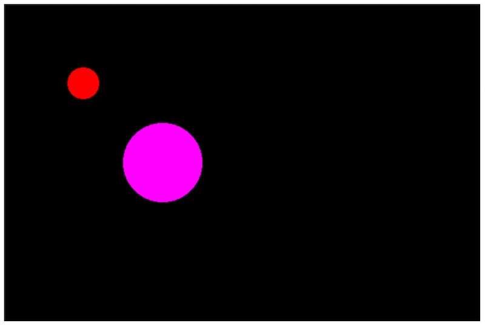
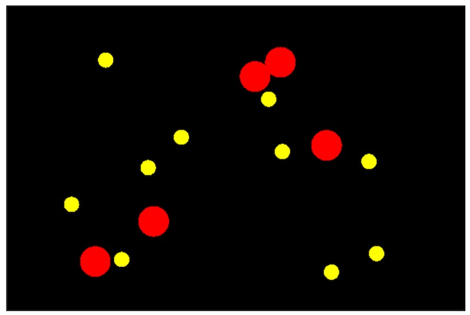

# 2 - ES6 Classes & PixiJS Animation

## Overview
In this chapter we will look at creating ES6 classes, and getting them to work with PixiJS.

## Contents
<!--- Local Navigation --->
I. [ES6 Class Resources](#section1)

II. [A simple ES6 class](#section2)

III. [Inheritance](#section3)

IV. [Extending PIXI.Graphics](#section4)

V. [Animation](#section5)

VI. [Nota Bene](#section6)

VII. [Review Questions](#section7)


### I. <a id="section1">ES6 Class Resources

- https://developer.mozilla.org/en-US/docs/Web/JavaScript/Reference/Classes
- http://exploringjs.com/es6/ch_classes.html
- https://googlechrome.github.io/samples/classes-es6/


### II. <a id="section2">A simple ES6 class

The new ES6 `class` keyword provides a simple and clear syntax to create objects and deal with inheritance.

#### pixi-animation-1.html

```html
<!DOCTYPE html>
<html lang="en">
<head>
	<meta charset="utf-8" />
	<title>Pixi Animation-1</title>
</head>
<body>

<script>
class Vehicle {
  constructor(doors,wheels,occupants) {
    this.doors = doors;
    this.wheels = wheels;
    this.occupants = occupants;
    this.moving = false;
  }
  start(){
  	this.moving = true;
  }
  stop(){
  	this.moving = false;
  }
}

let skateboard = new Vehicle(0,4,1);
skateboard.start();
console.log(skateboard.moving); 		// true

let rollerSkates = new Vehicle(0,8,1);
console.log(rollerSkates.moving); 		// false

</script>
</body>
</html>

```

#### Notes
- the `class` keyword is used to declare a class
- the `constructor` method is called by the `new` keyword
- `this` is required when refering to member variables within the class


### III. <a id="section3">Inheritance

- In object-oriented programming, *inheritance* enables new objects to take on the characteristics (both *state* & *behavior*) of existing objects
- A class that is used as the basis for inheritance is called a *base class* (or *superclass*)
- A class that inherits from a base class is called a *derived class* (or *subclass*)

#### pixi-animation-2.html

```html
<!DOCTYPE html>
<html lang="en">
<head>
	<meta charset="utf-8" />
	<title>Pixi Animation-2</title>
</head>
<body>

<script>
class Vehicle {
  constructor(doors,wheels,occupants) {
    this.doors = doors
    this.wheels = wheels;
    this.occupants = occupants;
    this.moving = false;
  }
  start(){
  	this.moving = true;
  }
  stop(){
  	this.moving = false;
  }
}

class Car extends Vehicle{
	 constructor(doors,occupants,year,make,model) {
	 	super(doors,4,occupants);
	 	this.year = year;
	 	this.make = make;
	 	this.model = model;
	 }
	 
	 honk(){
	 	console.log(`Honk! I am a ${this.make} ${this.model}`);
	 }
}

let car1 = new Car(4,5,2017,"Toyota","Corolla");
car1.start(); 					// call .start() in base class
car1.honk();					// Honk! I am a Toyota Corolla
console.log(car1.moving); 			// true


</script>
</body>
</html>
```

#### Notes

- above we used `extends Vehicle` when we created the `Car` class, so that all `Car` instances will also possess the properties and methods of `Vehicle`.
- we used `super` to call the `constructor` method of the base class.
- In our constructor, adding properties to our object can be streamlined a bit in ES6; the "this" below isn't entirely necessary:
```html
  constructor(doors,wheels,occupants) {
    this.doors = doors
    this.wheels = wheels;
    this.occupants = occupants;
    this.moving = false;
  }
```
We can just say:
```html
  constructor(doors,wheels,occupants) {
    doors = doors
    wheels = wheels;
    occupants = occupants;
    this.moving = false;
  }
```
We do still need to say ```this.moving=false;``` because we aren't passing in a parameter named ```moving```.

### IV. <a id="section4">Extending PIXI.Graphics 

- Now we are going to extend PIXI.Graphics with our own custom class so that we can have an object that knows how to draw itself, and also knows how fast it can move and how to "bounce".
- Create a new empty text file named **classes.js** put it in a folder named **js**, and make it look like this:

#### classes.js

```javascript
class Circle extends PIXI.Graphics{
	constructor(radius=20, color=0xFF0000, x=0, y=0){
		super();
		this.radius = radius;
		this.x = x;
		this.y = y;
		this.beginFill(color);
		this.drawCircle(0,0,radius);
		this.endFill();
		
		// other variables
		this.dx = Math.random() * 10 - 5;
		this.dy = Math.random() * 10 - 5;
	}
	
	move(){
		this.x += this.dx;
		this.y += this.dy;
	}
	
	reflectX(){
		this.dx *= -1;
	}
	
	reflectY(){
		this.dy *= -1;
	}
}
```


We are also going to need a main HTML file to test our new class - go ahead and create pixi-animation-3.html

#### pixi-animation-3.html

```html
<!DOCTYPE html>
<html lang="en">
<head>
	<meta charset="utf-8" />
	<title>Pixi Animation 3</title>
</head>
<body>
<script src="https://cdnjs.cloudflare.com/ajax/libs/pixi.js/4.6.0/pixi.min.js"></script>
<script src="js/classes.js"></script>
<script>
const app = new PIXI.Application(600,400);
document.body.appendChild(app.view); 

let c1 = new Circle()
c1.x = 100;
c1.y = 100;

let c2 = new Circle(50,0xFF00FF,200,200)

app.stage.addChild(c1);
app.stage.addChild(c2);

</script>
</body>
</html>
```


#### Which looks like this:



**Because Circle extends PIXI.Graphics, it has all of the properties and methods inherited from these super classes:**

- [PIXI.Graphics](http://pixijs.download/dev/docs/PIXI.Graphics.html)
- [PIXI.Container](http://pixijs.download/dev/docs/PIXI.Container.html)
- [PIXI.DisplayObject](http://pixijs.download/dev/docs/PIXI.DisplayObject.html)
- [PIXI.EventEmitter](https://github.com/primus/eventemitter3)

### V. <a id="section5">Animation 
Now we need to add  more of these `Circle` objects to the screen and animate them. The code below will get us started:


#### pixi-animation-4.html

```html
<!DOCTYPE html>
<html lang="en">
<head>
	<meta charset="utf-8" />
	<title>Pixi Animation 4</title>
</head>
<body>
<script src="https://cdnjs.cloudflare.com/ajax/libs/pixi.js/4.6.0/pixi.min.js"></script>
<script src="js/classes.js"></script>
<script>

// #1 - Script scoped variables
const app = new PIXI.Application(600,400);
document.body.appendChild(app.view); 

const screenWidth = app.view.width;
const screenHeight = app.view.height;
const circles = [];

// #3 - get this app started!
createCircles();

// #2 - make some circles
function createCircles(){
	// red circles
	for(let i=0;i<5;i++){
		let c = new Circle()
		c.x = Math.random() * (screenWidth - 100) + 50;
		c.y = Math.random() * (screenHeight - 100) + 50;
		circles.push(c);
		app.stage.addChild(c);
	}
	
	// yellow circles
	for(let i=0;i<10;i++){	
		let c = new Circle(10,0xFFFF00);
		c.x = Math.random() * (screenWidth - 100) + 50;
		c.y = Math.random() * (screenHeight - 100) + 50;
		app.stage.addChild(c);
		circles.push(c);
	}
}

</script>
</body>
</html>

```

#### Which looks like this:



#### Notes:
- note that we've added a little more structure to our code, and are keeping track our our circles by putting them in an array

To get the animation working, add the following to **pixi-animation-4.html**:

```javascript
// http://pixijs.download/dev/docs/PIXI.ticker.Ticker.html
// provide a function that will be called 60 FPS
app.ticker.add(()=>
{
	for (let c of circles){
		c.move();
		if (c.x <= c.radius || c.x >= screenWidth-c.radius){
			c.reflectX();
			c.move();
		}
		if (c.y <= c.radius || c.y >= screenHeight-c.radius){
			c.reflectY();
			c.move();
		}
	
	}
	
});

```

**Now your circles should be moving and bouncing off of the walls!**

#### Notes:
- [`app.ticker`](http://pixijs.download/dev/docs/PIXI.ticker.Ticker.html) is a wrapper for [`window.requestAnimationFrame`](https://developer.mozilla.org/en-US/docs/Web/API/window/requestAnimationFrame) which you have already seen in the [Life HW](./HW-life.md) - it is usually called at 60 FPS.

### VI. <a id="section6">Nota Bene
- The class hierarchy for **PIXI.Graphics** is [PIXI.Graphics](http://pixijs.download/dev/docs/PIXI.Graphics.html) > [PIXI.Container](http://pixijs.download/dev/docs/PIXI.Container.html) > [PIXI.DisplayObject](http://pixijs.download/dev/docs/PIXI.DisplayObject.html) >[PIXI.EventEmitter](https://github.com/primus/eventemitter3)
- The class hierarchy for **PIXI.Sprite** is [PIXI.Sprite](http://pixijs.download/dev/docs/PIXI.Sprite.html) > [PIXI.Container](http://pixijs.download/dev/docs/PIXI.Container.html) > [PIXI.DisplayObject](http://pixijs.download/dev/docs/PIXI.DisplayObject.html) > [PIXI.EventEmitter](https://github.com/primus/eventemitter3)

### VII. <a id="section7">Review Questions
Nothing for now.

<hr>

 **[Previous Chapter <- Intro to PixiJS (chapter 1)](pixi-js-1.md)**
 
 **[Homework -> Circle Blast!](HW-circle-blast.md)**
