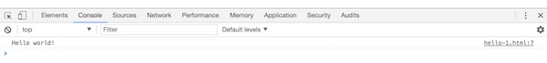
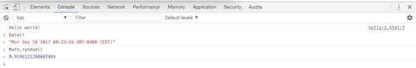
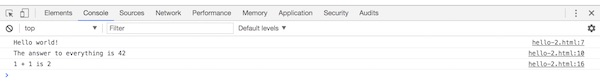
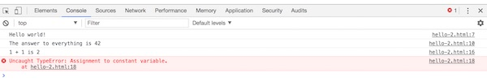

# 2 - Introduction to JavaScript

## Overview
Now we will see how we can program by utilizing the *JavaScript Engine* of a web browser. We will learn about the core JavaScript data types, how to declare variables, and how to see program output and view errors in the JavaScript console.

## Contents
<!--- Local Navigation --->
I. [Introduction](#section1)

II. [History of JavaScript](#section2)

III. [Get started!](#section3)

IV. [The JavaScript console is interactive](#section4)

V. [Declaring variables and constants](#section5)

VI. [Viewing error messages](#section6)

VII. [JavaScript "Primitive" Data Types](#section7)

VIII. [JavaScript "Built-in" Objects](#section8)

IX. [`let` or `var`?](#section9)

X. [Falsy and Truthy values](#section10)

XI. [JavaScript Strict Mode](#section11)

XII. [Nota bene - "Note well"](#section12)

XIII. [Review Questions](#section13)

XIV. [Review Exercise](#section14)


<hr><hr>

## I. <a id="section1"></a>Introduction
If you are comfortable with HTML and CSS, you are already familiar with the basics of getting browser layout engines to display your web pages the way you want them to look.
But to give yourself even more control over the appearance of your web pages, as well as other capabilities, you will need to utilize the JavaScript programming language.

JavaScript was originally created by Brendan Eich of Netscape Communication in 1995, and was re-implemented as JScript in Microsoft Internet Explorer in 1996.

Standardization of the language began in 1996 when Netscape submitted the language to Ecma International (at the time, "European Computer Manufacturers Association").

The term JavaScript is actually trademarked by the Oracle Corporation, so the standardized name of the scripting language that runs in web browsers is **ECMAScript**.


## II. <a id="section2"></a>History of JavaScript
You can read about the evolution of JavaScript & ECMAScript here:

- https://en.wikipedia.org/wiki/JavaScript
- https://en.wikipedia.org/wiki/ECMAScript

In this course we are mostly concerned about the version of JavaScript that was standardized in 2009 called ECMAScript 5 (aka ES5), and the latest version (ES6) which was finalized in 2015. 
Because ES6 has not been full adopted by all of the browser vendors, we will only be using a small subset of its features.

You can peruse the full ES6 standard here - https://tc39.github.io/ecma262/ - but it's not written to be a quick reference.

A nice list of new ES6 language features is here - http://es6-features.org/ - and it will make more sense as you get comfortable with the JavaScript programming language.

There is a helpful ES6/Browser compatibility table here - https://kangax.github.io/compat-table/es6/

## III. <a id="section3"></a>Get started!

Let's go ahead and build a JavaScript "Hello World" application - it looks like this:

### hello-1.html

```html
<!DOCTYPE html>
<html lang="en">
<head>
   <meta charset="utf-8" />
   <title>Hello-1</title>
   <script>
      console.log("Hello world!");
   </script>
</head>
<body>

</body>
</html>
```

Note that JavaScript directives are contained in a &lt;script> tag. 

Go ahead and save this web page in an HTML file named *hello-1.html* and load it into the Chrome web browser - which will be the browser we will use in all of our examples going forward. 

The line of code - `console.log("Hello world!");` - doesn't do anything in the web browser window, but will instead be visible in the JavaScript console. We can see this console by right-clicking in the browser window and choosing **Inspect**. After that, choose the **Console** tab.



<hr>

### ** *Try This!* **
(We will not be collecting any of these "challenges", but you are still expected to complete them ...)
- In *hello-1.html*, change the message from "Hello World!" to "Hello RIT!"

<hr>

## IV. <a id="section4"></a>The JavaScript console is interactive
- This console also contains an interactive interpreter where you can run JavaScript commands. At the prompt, type `Date()` to create and see a new date from the `Date` object, and `Math.random()` to get a random number from the `Math` object.



- Note that the general term for an interactive console like this a [REPL](https://en.wikipedia.org/wiki/Read–eval–print_loop) - "Read-Evaluate-Print-Loop".

<hr>

### ** *Try This* **
In the console, type in the following to see what you get back. *You really need to do this.* The easiest way is to open up the JavaScript console on this web page, and copy/paste the values, one at a time, into the console's command prompt.

```javascript
// try some JavaScript global functions
parseFloat("10")
parseFloat("98point6")
parseFloat("thirty2degrees")
parseInt("10.5")
parseInt("111",2) // binary
parseInt(77,8) // octal
parseInt("FF",16) // hex
parseInt(0x0000FF)
encodeURI("http://www.rit.edu/hello world.html")

// these can be used for type coercion/conversion
Number("10")
Number("onehundred")
String(3.14)
Boolean(0)

// expressions
2+2
5/2
5%2
1/0
3 + " blind mice"
3 - " blind mice"
3 * " blind mice"

// operators
1<2
2>3
!true
!false
true && false
true || false
+"90210"

// bitwise operations
0xFF0000 >>> 16 // extract "red" component
2 & 1
2 | 1

// JavaScript popup boxes
alert("hello")
prompt("What is your favorite color?")
confirm("IGME-230 rocks!")
```

<hr>

## V. <a id="section5"></a>Declaring variables and constants
We use the `const` keyword to declare a read-only reference to a value, and the `let` keyword to declare variables. Both `let` and `const` are limited in scope to the block, statement, or expression on which they are used. Note that we do not specify any *type* information when we declare the variable.

Note that `const` and `let` are both part of the ES6 standard (you are learning some ES6 already!) and are well-supported by current and recent browsers.

### hello-2.html
```html
<!DOCTYPE html>
<html lang="en">
<head>
   <meta charset="utf-8" />
   <title>Hello-2</title>
   <script>
     "use strict";
     console.log("Hello world!");
     const answer = 42;
     // string concatenation
     console.log("The answer to everything is " + answer); 
	
     let x = 1;
     let y = 1;
     let sum = x + y;
     // string templating (ES6 only)
     console.log(`${x} + ${y} is ${sum}`); 
   </script>
</head>
<body>
</body>
</html>
```

**Shows the following in the console:**



- Note above when strings are added to numbers, we get back a concatenated string. 
- Also see the *String Templating* used above - that's a newer ES6 feature that is more powerful than simple string concatenation. 
Note the backtick `` ` `` symbol is used to denote the string, and `${}` encloses the variable names.

<hr>

### ** *Try This* **
In *hello-2.html*:
- modify the *string concatenation* code above to instead use *string templating*
- declare a `z` variable with a value of 1, add it to the `sum`, and output it with the `console.log()`

<hr>


## VI. <a id="section6"></a>Viewing error messages

The console will display error messages that will help you debug your code. Let's produce an error by attempting to change the value of the `answer` constant above.
Add this line of code - `answer = 43;` - right before the closing &lt;script> tag, and then reload the page. You should see an error in the console:



Now go ahead and fix the error by declaring `answer` as a variable rather than a constant (hint: use `let` instead of `const`).

## VII. <a id="section7"></a>JavaScript "Primitive" Data Types

The 5 common built-in "primitive" data types in JavaScript are: `Number`, `String`, `Boolean`, `Undefined` (a value has never been defined) and `Null` (the intentional absence of a value).

(ES6 has also added the `Symbol` type, which we won't need to use in this course.)

JavaScript is a *loosely typed* (aka *dynamic*) language:
- you do not declare the *type* of a variable, as variables DO NOT have types
- values (of course) DO have types
- this also means that the same variable can reference data of different types throughout your program as it runs

### hello-3.html
```html
<!DOCTYPE html>
<html lang="en">
<head>
   <meta charset="utf-8" />
   <title>Hello-3</title>
   <script>
     "use strict";
     // 5 fundamental JavaScript types
     let sum = 99; // Number
     let name = "Fred"; //String
     let isLoggedIn = false; // Boolean
     let userName = undefined;
     let data = null;

     // We can later change what type a variable contains
     sum = "Joe"; // `sum` now contains a String
     name = 50; // `name` now contains a Number

     console.log(sum); // "Joe"

</script>
</head>
<body>
</body>
</html>
```

<hr>

### ** *Try This* **
In *hello-3.html*:
- re-declare the `sum` variable like this - `let sum = 999;` - what error do you get?

<hr>

## VIII. <a id="section8"></a>JavaScript "Built-in" Objects

JavaScript also contains a number of built-in objects that we can use. There is `Object`, which is a starting point for our own customized objects, as well as `Array`, `Date`, `Math`, and others. The "primitive" types above also can be treated like objects and have properties and methods that can be called on them.

### hello-4.html
```html
<!DOCTYPE html>
<html lang="en">
<head>
   <meta charset="utf-8" />
   <title>Hello-4</title>
   <script>
     "use strict";
     // 1) Common JS Objects
     let colors = ["red", "green", "blue"]; // Array literal
     let person = {name:"Fred", age:20};   // Object literal
     let month = new Date().getMonth(); 
     let age = Math.round(20.999);
     let age2 = Math.floor(20.999);

     console.log(colors[0]);		// "red"
     console.log(person.name);		// "fred"
     console.log(month);		// try this yourself
     console.log(age);			// 21
     console.log(age2);			// 20

     // 2) Treat "primitives" like objects
     let sum = 99.980809809;             // Number
     let name = "Fred";                  // String
     let isLoggedIn = false;             // Boolean
     let userName = undefined;
     let data = null;

     console.log(sum.toFixed(2)); 	 // 99.98
     console.log(name.length); 		 // 4
     console.log(isLoggedIn.toString()); // "false"

</script>
</head>
<body>
</body>
</html>
```

### VIII-A. "Boxing" primitive values
In #2 above, we can see instances of where JavaScript primitive values are implicitly coerced or "boxed" into objects. For example, when the `toFixed()` method is called on the variable `sum`, JavaScript will convert the value to a `Number` object, call `toFixed()` on that object, and then return the result as a primitive number. 

What this means is that nearly every value in JavaScript can be *treated like an object*, even if it isn't an object, because object "wrappers" will be automatically created for primitive values as needed.

<hr>

### ** *Try This* **
In *hello-4.html*:
- After this line of code runs - `let y = Number("fred");` - what does `y` contain?

<hr>


## IX. <a id="section9">`let` or `var`?
 - In this document we have been using the ES6 "way" of  `let` and `const` to declare variables and constants. Out on the web you are frequently going to see the older (ES5 and earlier) `var` keyword used to declare variables. In this course, we recommend that you NOT use `var` to declare variables, as the variables that `var` declares are *scoped to functions*, rather than the *block scoping* of `let` and `const`. 
 - As most of the major programming languages - except Python - utilize *block scoped* variables exclusively, programming with block-scoped variables (like `let` gives us) is what you are used to.
 - There definitely ARE some use cases for `var`, you can read some discussion about this here:
     - https://hackernoon.com/why-you-shouldnt-use-var-anymore-f109a58b9b70
     - https://davidwalsh.name/for-and-against-let

## X. <a id="section10">Falsy and Truthy values
JavaScript has a large number of **truthy** and **falsy** values that are *coerced* to `true` or `false` in a boolean expression or context. 

### hello-5.html

```html
<!DOCTYPE html>
<html lang="en">
<head>
	<meta charset="utf-8" />
	<title>Hello-5</title>
</head>
<body>

<script>
"use strict";
let a = 0;
let b = 1;
let c = 2;
let name = "Fred";

// if() statements accept a "truthy" condition
// https://developer.mozilla.org/en-US/docs/Web/JavaScript/Reference/Statements/if...else
	
// #1
if(true){
	console.log("true"); // true
}else{
	console.log("false");
}

// #2
if(false){
	console.log("true");
}else{
	console.log("false"); // false
}

// #3
if(2 > 1){
	console.log("true"); // true
}else{
	console.log("false");
}

// #4
if(0){
	console.log("true"); 
}else{
	console.log("false"); // false
}

// #5
if(undefined){
	console.log("true"); 
}else{
	console.log("false"); // false
}

// #6
if("fred"){
	console.log("true"); // true
}else{
	console.log("false");
}

</script>
</body>
</html>
```

### X-A. Discussion
- #1, #2 and #3 above should be obvious
- #4 and #5 above are both "falsy" values in that JavaScript (per the specification) coerces them to `false`
- How is #6 true? Read on!

Check out these links, and see the code sample below:
- https://developer.mozilla.org/en-US/docs/Glossary/Truthy
- https://developer.mozilla.org/en-US/docs/Glossary/Falsy


### X-B. 8 falsy values, and a single truthy one
```javascript
// All of these are false values, excepting the last one - it turns out that "false" is true
console.log(0 == false ? "0 is false" : "0 is true");
console.log(-0 == false ? "-0 is false" : "-0 is true");
console.log(false == false ? "false is false" : "false is true");
console.log(null == false ? "null is false" : "null is true");
console.log(undefined == false ? "NaN is false" : "NaN is true");
console.log("" == false ? "\"\" is false" : "\"\" is true");
console.log('' == false ? "\'\' is false" : "\'\' is true");
console.log(new Boolean(false) == false ? "\"new Boolean(false)\" is false" : "\"new Boolean(false)\" is true");
console.log("false" == false ? "\"false\" is false" : "\"false\" is true");
```

**Basically, the first 8 values above are all coerced to *false* in a `==` Boolean content. Everything else - like the string "false" for example above, is coerced to *true*.**

The JavaScript specification dicusses this coercion (conversion) here: 
- https://www.ecma-international.org/ecma-262/8.0/index.html#sec-abstract-equality-comparison


## XI. <a id="section11"></a>JavaScript Strict Mode

You may have noticed the `"use strict";` string that started appearing at the top of the &lt;script> tags - so what is that all about?

- ECMAScript 5's strict mode is a way to opt in to a restricted variant of JavaScript. 
- Strict mode makes several changes to normal JavaScript semantics. First, strict mode eliminates some JavaScript silent errors by changing them to throw errors. Second, strict mode fixes mistakes that make it difficult for JavaScript engines to perform optimizations: strict mode code can sometimes be made to run faster than identical code that's not strict mode. Third, strict mode prohibits some syntax likely to be defined in future versions of ECMAScript.
- To invoke strict mode for an entire script, put the exact statement `"use strict";` (or `'use strict';`) before any other statements. In this class, we will put it at the very top of our &lt;script> tag.

You can read more about strict mode here:
- https://www.w3schools.com/js/js_strict.asp
- https://developer.mozilla.org/en-US/docs/Web/JavaScript/Reference/Strict_mode
- https://johnresig.com/blog/ecmascript-5-strict-mode-json-and-more/

## XII. <a id="section12"></a>Nota bene 
1. The `const` keyword is misnamed - it implies that a value can not be changed, this is false. Instead, the `const` declaration creates a read-only reference to a value. It does not mean the value it holds is immutable, just that the variable identifier cannot be reassigned. For instance, in the case where the content is an object, this means the object's properties CAN be altered.
1. The JavaScript `Number` can hold both a 64-bit number AND a 64-bit Integer values - documentation on the finer points of this is here:
    - https://developer.mozilla.org/en-US/docs/Web/JavaScript/Reference/Global_Objects/Number
    - https://medium.com/dailyjs/javascripts-number-type-8d59199db1b6
1. JavaScript has 2 zeros `+0` and `-0` -  you can read about that here: https://abdulapopoola.com/2016/12/19/why-javascript-has-two-zeros-0-and-0/
1. We expect you to review the following programming structures on your own:
    - branching/conditionals such as [if...else](https://developer.mozilla.org/en-US/docs/Web/JavaScript/Reference/Statements/if...else), [switch](https://developer.mozilla.org/en-US/docs/Web/JavaScript/Reference/Statements/switch), and the [ternary operator](https://developer.mozilla.org/en-US/docs/Web/JavaScript/Reference/Operators/conditional_operator)
    - repetitive constructs such as [for](https://developer.mozilla.org/en-US/docs/Web/JavaScript/Reference/Statements/for), [do...while](https://developer.mozilla.org/en-US/docs/Web/JavaScript/Reference/Statements/do...while), and [while](https://developer.mozilla.org/en-US/docs/Web/JavaScript/Reference/Statements/while)


## XIII. <a id="section13"></a>Review Questions
1. Who created the initial version of JavaScript in 1995?
1. What is the official name of JavaScript?
1. Which versions of JavaScript will we be covering in this course?
1. How can you get the interactive JavaScript [REPL](https://en.wikipedia.org/wiki/Read–eval–print_loop) to appear in Chrome?
1. Which JavaScript keyword declares *variables*?
1. Which JavaScript keyword declares "constants" (i.e. a binding to a value that can not be changed)?
1. What is the name of the error that occurs when you try to change the reference to a previously declared *constant* like `const a=10;`?
1. Find the MDN page - https://developer.mozilla.org/ - for the type of error you saw in the previous question, and give the 1-line summary of that error from the top of that MDN page.
1. What are the 5 built-in JavaScript "primitive" data types?
1. What kinds of values can a `Number` type hold? (Google it)
1. True or False. JavaScript *variables* DO NOT have types, but JavaScript *values* DO have types.
1. Give an example of *boxing* in JavaScript.
1. Give a line of code that will convert the string "3.14" to a `Number`.
1. What does `NaN` stand for?
1. Give an example of an operation that will produce a value of `Infinity`.
1. Give an advantage of JavaScript's strict mode.
1. Which of the following examples will evaluate to `true` in a boolean context (ex. inside an `if` statement)? (Try them out in the browser if you are not sure)
    1. `undefined`, `null`, `false`, `0`, `""`, `''`
    1. `0.0`
    1. `"undefined"`, `"null"`
    1. `"false"`
    1. `"true"`
    1. `new Date()`
    1. `new Array()`, `[]`
    

## XIV. <a id="section14"></a>Review Exercise
Make a copy of **hello-4.html** and name it **web-apps-2-HW.html**. Delete all of the existing  `console.log()` calls, and add JavaScript that does the following (search the web for documentation if you don't know how to do these):

1. Use a method of the `Array` object to append another color to the end of the `colors` array.
1. Print out the last element in the `colors` array, without hard-coding the index value.
1. Loop through the `colors` array using a `for` loop and print out each value to the console.
1. Add a new property named `school` to the `person` object and give it a value of "RIT". Then print this value to the console.
1. Print out the number of seconds that have passed since 1970 - use the `Date` object.
1. Print out the value of pi - use the `Math` object.
1. Print out the absolute value of -999 - use the `Math` object.
1. Print out an "all caps" version of the string "Hello" - use a method of the `String` object.

<hr>

**[Previous Chapter <- Introduction to Web Applications (chapter 1)](web-apps-1.md)**

**[Next Chapter -> Intro to the Web Browser DOM (chapter 3)](web-apps-3.md)**
