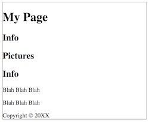
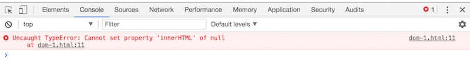
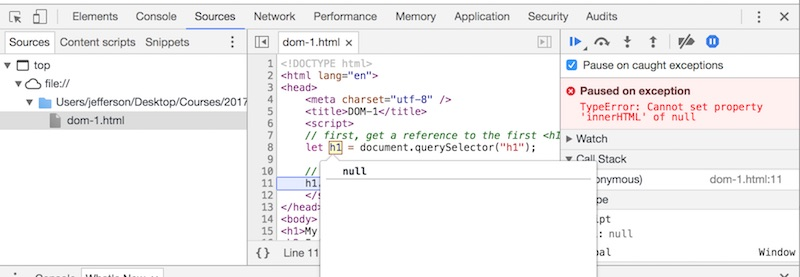
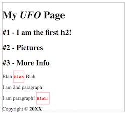
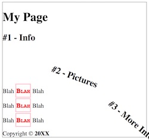
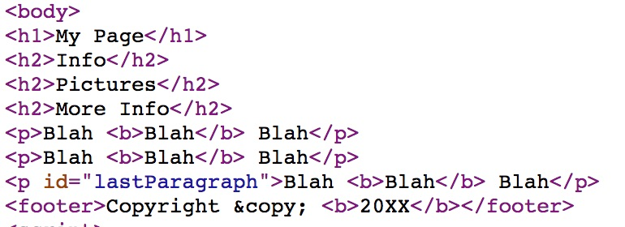
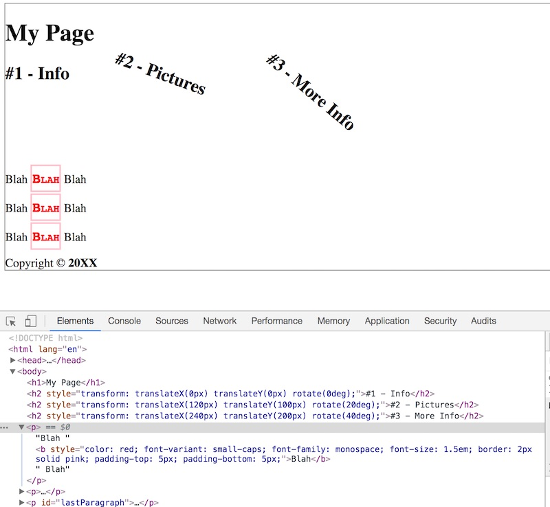

# 3 - Introduction to the Web Browser DOM
## Overview
When developers discuss database records and operations, there's a concept known as **C.R.U.D.** - "Create", "Read", "Update" and "Delete". Every database needs to be able to let the developer perform these operations in code.

Similarly, if we are going to create web applications, we will have to do the same things to our web pages: **create** new elements, select (**read**) existing elements, **update** elements, and **delete** elements.

How do we do this in a web browser? Read on!

## Contents
<!--- Local Navigation --->
I. [Introduction](#section1)

II. [Selecting and modifying elements on the page](#section2)

III. [The code didn't work!](#section3)

IV. [Waiting until the page loads](#section4)

V. [Try out more CSS selectors with `document.querySelector()`](#section5)

VI. [Introducing `document.querySelectorAll()`](#section6)

VII. [Seeing your changes in the Web Inspector](#section7)

VIII. [Dealing with `null`](#section8)

IX. [Nota bene](#section9)

X. [Review Questions](#section10)

XI. [Review Exercise](#section11)


<hr><hr>


## I. <a id="section1"></a>Introduction
Today we are going to look at how to use JavaScript to alter HTML elements on the page. To
do this we will need to utilize the DOM (Document Object Model).
The DOM API defines methods and properties needed to access and manipulate the contents and style of a web page.

## II. <a id="section2"></a>Selecting and modifying elements on the page
If you want to modify an HTML element, you first need to:

1. Get a *reference* to the element
1. Change the value of a *property* of the element

- To get a reference to an element we usually use `document.querySelector(selector)` where `selector` is a valid CSS selector. For example `document.querySelector("p")` would select the first paragraph on a web page, while `document.querySelector("#table")` would select the element on the page of `id="table"`.
- To get a reference to multiple elements we usually use `document.querySelectorAll(selector)`. For example, `document.querySelectorAll("p")` would return an array (actually a `DomNodeList`) of all of the paragraph tags on a page.
- HTML elements are instances of the class `HTMLElement` and have `innerHTML` and other properties we can set. A full list of element properties and methods can be found here: 
    - https://developer.mozilla.org/en-US/docs/Web/API/Element
    - https://developer.mozilla.org/en-US/docs/Web/API/HTMLElement


Go ahead and try running the code sample below - it is attempting to change the text of the &lt;h1> on the page to "My *UFO* Page":

### dom-1.HTML

```html
<!DOCTYPE html>
<html lang="en">
<head>
   <meta charset="utf-8" />
   <title>DOM-1</title>
   <style>
      body{border:1px solid gray;}
   </style>
   <script>
     "use strict";
     // first, get a reference to the first <h1> on the page
     let h1 = document.querySelector("h1");

     // second, change its HTML
     h1.innerHTML = "My <i>UFO</i> Page";	
</script>
</head>
<body>
<h1>My Page</h1>
<h2>Info</h2>
<h2>Pictures</h2>
<h2>Info</h2>
<p>Blah Blah Blah</p>
<p>Blah Blah Blah</p>
<footer>Copyright &copy; 20XX</footer>
</body>
</html>
```



## III. <a id="section3"></a>The code didn't work!
When you load this into Chrome, the &lt;h1> text doesn't change. Huh?

### A. Check the JavaScript console
Go ahead and right-click to bring up the Web Inspector to get an idea why.



The error is: `Uncaught TypeError: Cannot set property 'innerHTML' of null`. 
The JavaScript engine is complaining about our second line of code.

### B. Check the JavaScript debugger
So what has a value of `null`? It turns out that our variable `h1` does - which we can see if we select the **Sources** tab, then select **dom-1.html** on the left, check the **Pause on caught exceptions** checkbox, and reload the page.



**(Fun fact - if you click in the gutter next to the code listing, you can add and remove breakpoints that will interrupt code execution whenever the debugger is open. You will then be able to inspect the values of variables, and step through your code)**

Our `h1` selector seems to be correct, but the value is `null` - so what gives?

## IV. <a id="section4"></a>Waiting until the page loads
The "null" problem we had above is happening because the JavaScript code is running *before* the web page has loaded. 
The error happens because the line of code - `let h1 = document.querySelector("h1");` returns `null`, and then when we try to set the `.innerHTML` property of null we get an error.

**How to fix this? Simply run the code *after* the page loads.** There are several ways to accomplish this, for now  the easiest way is to move the &lt;script> tag to just before the closing &lt;body> tag. 

### dom-2.HTML

```html
<!DOCTYPE html>
<html lang="en">
<head>
	<meta charset="utf-8" />
	<title>DOM-2</title>
	 <style>
      body{border:1px solid gray;}
   </style>
</head>
<body>
<h1>My Page</h1>
<h2>Info</h2>
<h2>Pictures</h2>
<h2>Info</h2>
<p>Blah Blah Blah</p>
<p>Blah Blah Blah</p>
<footer>Copyright &copy; 20XX</footer>
<script>
	"use strict";
	// The page has loaded, so it's "safe" to search for elements :-)
	
	// first, get a reference to the first <h1> on the page
	let h1 = document.querySelector("h1");
	
	// second, change its HTML
	h1.innerHTML = "My <i>UFO</i> Page";	
</script>
</body>
</html>
```

**Load the page into a browser, you should now see the changes we made to the &lt;h1>!:**


<hr>

### ** *Try This!* **
- In *dom-2.html*, write code that changes the &lt;footer> text to "Copyright, Me!"
- Now do the &lt;footer> challenge above with only a single line of code (i.e. get rid of the variable)

<hr>

## V. <a id="section5"></a>Try out more CSS selectors with `document.querySelector()`
The power of `document.querySelector()` and `document.querySelectorAll()` is that they accept all CSS selectors, including those in the CSS3 standard.

https://www.w3.org/TR/css3-selectors/#selectors

Let's try a few of these out below. Note that we have added an additional paragraph at the bottom:

### dom-3.html

```html
<!DOCTYPE html>
<html lang="en">
<head>
	<meta charset="utf-8" />
	<title>DOM-3</title>
	<style>
		body{border:1px solid gray;}
	</style>
</head>
<body>
<h1>My Page</h1>
<h2>Info</h2>
<h2>Pictures</h2>
<h2>More Info</h2>
<p>Blah Blah Blah</p>
<p>Blah Blah Blah</p>
<p id="lastParagraph">Blah Blah Blah</p>
<footer>Copyright &copy; 20XX</footer>
<script>
	"use strict";
	// first, get a reference to the first <h1> on the page
	let h1 = document.querySelector("h1");
	
	// second, change its HTML
	h1.innerHTML = "My <i>UFO</i> Page";	
	
	// 3 - get a reference to the second paragraph and change its HTML in 1 line of code
	document.querySelector("p:nth-of-type(2)").innerHTML = "I am 2nd paragraph!";
	
	// 4 - get a reference to the third paragraph using an id selector and change its HTML in 1 line of code
	document.querySelector("#lastParagraph").innerHTML = "I am the last paragraph";
	
	// 5 - get a reference to the <footer>
	let footer = document.querySelector("footer");
	
	// 6 - we can set CSS values through the .style property
	footer.style.color = "green";
	footer.style.fontFamily = "monospace";
	footer.style.fontSize = "2em";
	footer.style.border = "2px solid pink";
	footer.style.paddingTop = "10px";
	footer.style.paddingBottom = "10px";
	footer.style.margin = "5px";
</script>
</body>
</html>
```

**Load the page into a browser, and revel in the changes our JavaScript created:**



### A. Explanations
There was quite a bit in that last example. Let's discuss:

#3 above - we used this **pseudo selector** - `p:nth-of-type(2)` - to select the 2nd paragraph

#4 above - we used an **id selector** to get a reference to the element with the id of "lastParagraph"

#5 above - we used a **type selector** to get a reference to the footer

#6 above - we then changed the CSS on the &lt;footer> element by accessing the `.style` property. Note that in JavaScript, to use the CSS properties that have dashes in their name (like `font-family`) we need to make alterations:
- drop the dash in the property name
- "camel case" the second word
- thus the CSS `font-family` property becomes `style.fontFamily`. 

See above that we also had to do this for `font-size`, `padding-top` and `padding-bottom`.

<hr>

### ** *Try This!* **
- In *dom-3.html*, write code that changes the text of the second-to-last &lt;h2> to "I am the second-to-last h2!". 
Utilize the (rarely used) CSS3 `E:nth-last-of-type(n)` selector.

<hr>

## VI. <a id="section6"></a>Introducing `document.querySelectorAll()`
`document.querySelectorAll()` returns an array of results that match the given selector.

**dom-4.html**
```html
<!DOCTYPE html>
<html lang="en">
<head>
	<meta charset="utf-8" />
	<title>DOM-3</title>
	<style>
		body{border:1px solid gray;}
		p b{transform: rotate(20deg)}
	</style>
</head>
<body>
<h1>My Page</h1>
<h2>Info</h2>
<h2>Pictures</h2>
<h2>More Info</h2>
<p>Blah <b>Blah</b> Blah</p>
<p>Blah <b>Blah</b> Blah</p>
<p id="lastParagraph">Blah <b>Blah</b> Blah</p>
<footer>Copyright &copy; <b>20XX</b></footer>
<script>
	"use strict";
	// 1 - get a reference to ALL of the <h2> elements on the page and add a number to the beginning of them
	// also, do some CSS transforms on them.
	let allHeadings = document.querySelectorAll("h2");

	// 2 - loop through array using classic `for` loop
	for(let i=0;i<allHeadings.length;i++){
		let h2 = allHeadings[i];
		let currentText = h2.innerHTML;
		h2.innerHTML = "#" + (i + 1) + " - " + currentText;
		h2.style.transform = "translateX(" + (i * 120) + "px) translateY(" + (i * 100) + "px) rotate(" + 
		(i * 20) + "deg)";
		
		// or write the above as an ES6 template string
		//h2.style.transform = `translateX(${i*120}px) translateY(${i*100}px) rotate(${i*20}deg)`;
		
		h2.style.display = "inline-block"; // make sure the h2 isn't too wide, or it will rotate off the screen
	}
	
	// 3 - use a *descendent selector* to target the <b> tags inside of paragraphs 
	// but not that <b> tag in the footer
	let myList = document.querySelectorAll("p b");
	for (let element of myList) { // use the ES6 `for...of` loop 
		// we  set CSS values through the .style property
		element.style.color = "red";
		element.style.fontVariant = "small-caps";
		element.style.fontFamily = "monospace";
		element.style.fontSize = "1.5em";
		element.style.border = "2px solid pink";
		element.style.paddingTop = "5px";
		element.style.paddingBottom = "5px";
	}
	
	</script>
</body>
</html>
```

**Load the page into a browser to see the changes our JavaScript brought about:**



### A. Explanations
#1 above - we used `querySelectorAll("h2")` to get all of the &lt;h2> elements in an array (actually a DomNodeList). 

#2 above - we looped through the array using the classic `for` loop that we know and love. We set the CSS `transform` property and saw some interesting effects.

#3 above - we used a *descendant* selector to target &lt;b> tags that are inside of paragraphs, and the ES6 [`for...of`](https://developer.mozilla.org/en-US/docs/Web/JavaScript/Reference/Statements/for...of) to loop over the array. 

<hr>

### ** *Try This!* **
- In *dom-4.html*, add the "translate/rotate" effect to all of the &lt;p> tags. Use an additional selector and loop to accomplish this.

<hr>

## VII. <a id="section7"></a>Seeing your changes in the Web Inspector
**It is important to understand the difference in Chrome between what we see when we "View Source" in Chrome, and what we see when we activate the Web Inspector.**

### A. "View Source" in Chrome
If we view the HTML source of our page in Chrome (View > Developer > View Source) we will not see any of the changes our JavaScript made.
For example, if our JavaScript made changes to the text and HTML, it would not be reflected in the HTML source. Also, there will be no indication that our new styles were applied:



### B. Web Inspector in Chrome
But if we utilize the Web Inspector, we WILL see all of those changes reflected in the DOM tree under the **Elements** tab:



<hr>

### ** *Try This!* **
You can modify DOM elements from the web inspector by typing in and running JavaScript code from the console. Load *dom-4.html* into the browser and open up the Web Inspector:

- Type `document.querySelector("h1").innerHTML = "New Title!"` in the console - this will change the title of the first &lt;h1> on the page.
- Type `document.body.style.backgroundColor = "red"` in the console - this will change the background color of the page.
- Type `document.querySelectorAll("p").forEach(e=>e.innerHTML="Hi there!")` in the console - this will replace the text of all of the &lt;p> tags.

Reload the browser page to revert to get rid of the changes.
<hr>


## VIII. <a id="section8">Dealing with `null`
- If `querySelector()` doesn't find any matches on the page it returns `null`
- If `querySelectorAll()` doesn't find any matches on the page it returns `[]` (we usually say it's an empty `Array`, but it's actually an empty `NodeList`, which is an "array-like" object)

 What happens if we try to call a method (or set a property) on `null`? Answer: We get a runtime error! How can we avoid this? Read on!

**dom-5.html**
```html
<!DOCTYPE html>
<html lang="en">
<head>
	<meta charset="utf-8" />
	<title>Writing safer code</title>
</head>
<body>

<script>
"use strict";
let element = document.querySelector("h4"); // will be null because page has no h4 elements
//element.innerHTML = "Found an h4 tag"; // WILL CAUSE AN ERROR

/* Safer way is to check for null first! */
if (element != null){
   element.innerHTML = "Found an h4 tag";
}else{
  console.log("No h4 found");
}

/* Shorten up your if statements! */
// JavaScript has a number of "falsy" values (false, 0, undefined, null , "", '') 
// that evaluate to false in boolean contexts.
// In a boolean context, anything that is not false, is true.

// So we can replace the above with:
if (element){ // element will be considered true if it is not one of the falsy values
   element.innerHTML = "Found an h4 tag";
}else{
  console.log("No h4 found");
}
</script>
</body>
</html>
```

## IX. <a id="section9"></a>Nota bene 
1. In this document we have been using `document.querySelector()` and `document.querySelectorAll()` to select elements on the page. Out on the web you will also see the `document.getElementsByTagName()` and `document.getElementById()` methods used - we recommend that you DO NOT use these methods as they are much less flexible and powerful than the `document.querySelector()` and `document.querySelectorAll()` methods.
2. Using the JavaScript debugger and setting breakpoints was briefly touched upon above. Being able to utilize the JavaScript debugger is an essential skill, and we will be demoing this in class. If you need to see it demoed again then please ask! Here is a helpful article on using the Chrome web tools: https://developers.google.com/web/tools/chrome-devtools/javascript/breakpoints
3. What happens when `document.querySelectorAll()` finds no matching elements on the page, what does it *return*? Answer: an empty array.
4. What happens when we try to loop though an empty array with a `for` or `for...of` loop? Answer: Nothing. The looping never happens if the array is empty.
5. When `document.querySelector()` finds no matching elements on the page, what does it *return*? Answer: `null`.

## X. <a id="section10"></a>Review Questions
1. What does "DOM" stand for?
1. What does the DOM API "give" us?
1. What does "CRUD" stand for?
1. What happens when we try to use JavaScript DOM methods to access the contents of a page *before* it has loaded?
1. What is the name of the DOM method that will return the first element that matches the given selector?
1. What is the name of the DOM method that will return **all** of the elements that match the given selector?
1. Which property is used to get and set the text and HTML contents of an HTML element?
1. Which property is used to get and set the CSS *styles* of an HTML element?
1. Write a line of JavaScript that sets the `background-position` style property of an element to the value of `"top"`.
1. Give 2 ways to loop through an array.
1. Compare and contrast "View Source" versus the capabilities of the Web Inspector. Which method gives the developer a "live" view of the current HTML and CSS of a page?
1. What happens if we try to access a method or property (ex. `.innerHTML`) on a variable that has a `null` or `undefined` value?
1. How can we add breakpoints to our code in the debugger, and inspect the values of variables?
1. What does the `debugger;` statement do? (We did not talk about this one at all, so google it!)
1. List the 8 "falsy" values listed at the end of [2 - Introduction to JavaScript](web-apps-2.md). Recall that in a boolean context like this `if(expression){ doSomethingIfTrue() }`, if an expression does not evaluate to `false`, it's `true`!

## XI. <a id="section11"></a>Review Exercise
Make a copy of **dom-4.html** and name it **web-apps-3-HW.html**. Delete all of the existing JavaScript code, and add JavaScript that does the following (search the web for documentation if you don't know how to do these). Make sure that you DO NOT modify the HTML source of the page in ANY way (by adding `class` or `id` attributes to the paragraphs, for example.

1. Change the `.innerHTML` of the first &lt;h1> to "My UFO Page"
1. Change the `.innerHTML` of the first &lt;h2> to "My UFO Info"
1. Change the `.innerHTML` of the 2nd &lt;h2> to "My UFO Pictures"
1. Change the `.innerHTML` of the 3rd &lt;h2> to an empty string - `""`
1. Select the &lt;body> element and make 2 style changes:
  - The `font-family` shall be "sans-serif"
  - The font `color` shall be "reddish" (specify a red shade in hexadecimal) - 
  **Power tip:** `document.body` is a handy shortcut property for getting a reference to the &lt;body> element.
6. Select the first paragraph and make some changes:
  - The inner HTML will contain the text "Report your UFO sightings here:" and have a working link to http://www.nuforc.org  - **Power tip:** In JavaScript strings, single-quotes `'` can be nested inside of double-quotes `"`
  - There will be `.style` changes:
    - the font `color` is "green"
    - the `font-weight` is "bold"
    - the `font-size` is "2em"
    - the `text-transform` is "uppercase"
    - the `text-shadow` is "3px 2px #A44"
7. Change the `.innerHTML` of the 2nd paragraph to an empty string - `""`
8. Change the `.innerHTML` of the 3rd paragraph to instead show an image of a UFO that is out on the web (use an &lt;img> tag)
9. Change the `.innerHTML` of the &lt;footer> copyright notice to show the current year and your name

**Here is a completed example:**


<hr>
    
**[Previous Chapter <- Introduction to JavaScript (chapter 2)](web-apps-2.md)**
  
**[Next Chapter -> More Web Browser DOM Methods (chapter 4)](web-apps-4.md)**
  
