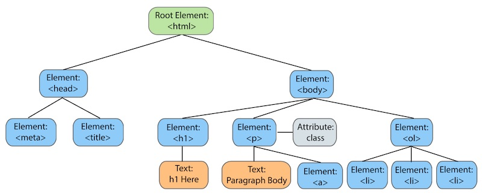
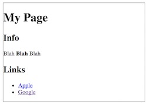
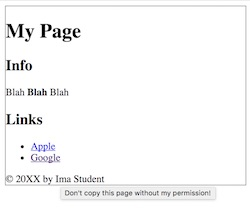
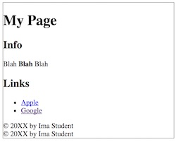
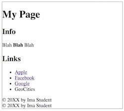
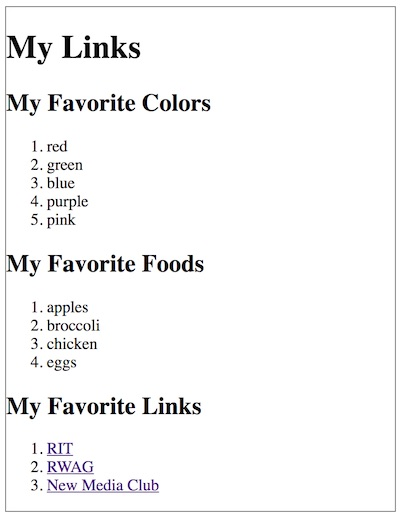

# 4 - More Web Browser DOM Methods

## Overview
Today we are going to look at alternatives to `.innerHTML` that can be used to **"CRUD"** (i.e. Create, Read, Update, Delete) HTML elements in the web browser.

## Contents
<!--- Local Navigation --->
I. [The DOM Tree](#section1)

II. [Starter Page](#section2)

III. [Creating and appending elements](#section3)

IV. [Inserting elements into the middle of a DOM tree](#section4)

V. [Modifying Existing DOM Elements](#section5)

VI. [Removing Existing DOM Elements](#section6)

VII. [Nota bene](#section7)

VIII. [Review Questions](#section8)

IX. [Review Exercise](#section9)


<hr><hr>

## I. <a id="section1"></a>The DOM Tree
Today we are going to look at other ways to use JavaScript to alter HTML elements on the page. 
Although we can do quite a bit with the `.innerHTML` property, there are times that we might want to insert a new element somewhere on the page, for example a new list item into the middle of a list. Or to delete a single element, for example a list item that is currently inside (a child of) an unordered list. To do these things, we are going to need more "fine grained" control.

### A. The DOM is an inverted tree
In Computer Science, *trees* are data structures that consist of *nodes* that contain values; and each node in the tree has *relationships* with one or more of the other nodes in the tree. 

The browser DOM is an inverted tree structure that consists of *nodes* - which are HTML elements (software *objects*) that have properties and methods associated with them. These nodes have hierarchical relationships with one another - such as *parent*, *child*, and *sibling*.  Read about this here: https://www.w3schools.com/js/js_htmldom_navigation.asp

Today we will learn how to create new DOM elements and insert them anywhere into the DOM tree that we want to. Note that in the graphic below, both [HTML elements](https://developer.mozilla.org/en-US/docs/Web/API/HTMLElement) and the [`Text`](https://developer.mozilla.org/en-US/docs/Web/API/Text) that goes inside of them are considered *nodes*.



Take a look above, and try to answer these questions:
- which element is the *parent* of the &lt;body> element?
- which element is a *sibling* of the &lt;body> element?
- which elements are typically *children* of the &lt;head> element? (in addition to the 2 elements shown above)
- what is the difference between *descendant* elements and *child* elements (of the &lt;body> for example?
- which elements are *children* of the &lt;body> element?
- which elements are *descendants* of the &lt;body> element? (Hint: pretty much everything you can see on the page.)


### more-dom-0.html

Here is the HTML representation of the graphic above.

```
<!DOCTYPE html>
<html lang="en">
<head>
  <meta charset="utf-8" />
  <title></title>
</head>
<body>
  <h1>Hi there</h1>
  <p>Paragraph Body <a href="#">Link to somewhere</a></p>
  <ol>
    <li></li>
    <li></li>
    <li></li>
  </ol>
</body>
</html>
```

<hr>

### ** *Try This!* **
- Load  *more-dom-0.html* in a web browser, open the JavaScript console, and "walk the tree" by typing in the code below, one line at a time. 
- Note that if you are certain of the exact structure of the HTML page like we do here, you can access the entire contents of the document using only the "tree" properties (as opposed to CSS selectors, id, classes, etc with `document.querySelector()` or  `document.querySelectorAll()`)
- Note below that the `.firstChild` or `lastChild` methods might return text nodes (even "empty" ones that just consist of a line feed). To be safe, use `.firstElementChild` or `lastElementChild` if what you really want back is the HTML element in that position.

```
document.firstElementChild.nodeName
document.body.nodeName
document.body.parentElement.nodeName
document.body.children.length
document.body.children[0].innerHTML = "Hello there!"
document.body.children[2].lastElementChild.innerHTML = "Last item in list!"
document.body.children[1].nodeName
document.body.children[1].nodeType // 1 means type "Element"
document.body.children[1].firstChild.nodeName
document.body.children[1].nodeType // 3 means type "Text Node"
document.body.children[1].firstChild.nodeValue = "NEW Paragraph Body! " // note how this just replaces the text, not the link
document.body.children[1].firstElementChild.innerText = "Google"
document.body.children[1].firstElementChild.href = "http://www.google.com" // link now goes to google
document.body.children[1].firstElementChild.attributes // read only property
document.body.children[1].firstElementChild.setAttribute("title","Go to Google")
```

<hr>

### B. New DOM Methods
Here are some of the new DOM methods we will be working with today. These allow us to *create* DOM elements, *modify* them, *insert* them into the document, and *delete* them from the document:

- [`document.createElement(elementName)`](https://developer.mozilla.org/en-US/docs/Web/API/Document/createElement)
- [`document.createTextNode(text)`](https://developer.mozilla.org/en-US/docs/Web/API/Document/createTextNode)
- [`element.getAttribute(attributeName)`](https://developer.mozilla.org/en-US/docs/Web/API/Element/getAttribute)
- [`element.setAttribute(attributeName,attributeValue)`](https://developer.mozilla.org/en-US/docs/Web/API/Element/setAttribute)
- [`element.appendChild(anotherElement)`](https://developer.mozilla.org/en-US/docs/Web/API/Node/appendChild)
- [`element.insertBefore(referenceElement,anotherElement)`](https://developer.mozilla.org/en-US/docs/Web/API/Node/insertBefore)
- [`element.removeChild(anotherElement)`](https://developer.mozilla.org/en-US/docs/Web/API/Node/removeChild)
- [`element.replaceChild(oldElement,newElement)`](https://developer.mozilla.org/en-US/docs/Web/API/Node/replaceChild)
- [`element.hasChildNodes()`](https://developer.mozilla.org/en-US/docs/Web/API/Node/hasChildNodes)

And some properties:

- [`Node`](https://developer.mozilla.org/en-US/docs/Web/API/Node)
- [`element.parentNode`](https://developer.mozilla.org/en-US/docs/Web/API/ParentNode)
- [`element.children`](https://developer.mozilla.org/en-US/docs/Web/API/ParentNode/children)
- [`element.lastElementChild`](https://developer.mozilla.org/en-US/docs/Web/API/ParentNode/lastElementChild)
- [`document.body`](https://developer.mozilla.org/en-US/docs/Web/API/Document/body) - handy shortcut to &lt;body> tag!

## II. <a id="section2"></a>Starter Page

### more-dom-1.html
```html
<!DOCTYPE html>
<html lang="en">
<head>
	<meta charset="utf-8" />
	<title>More DOM 1</title>
	<style>
		body{border:1px solid gray;}
	</style>
</head>
<body>
<h1>My Page</h1>
<h2>Info</h2>
<p>Blah <b>Blah</b> Blah</p>
<h2>Links</h2>
<ul>
	<li><a href="http://www.apple.com">Apple</a></li>
	<li><a href="http://www.google.com">Google</a></li>
</ul>

<script>

</script>
</body>
</html>
```

**Looks like this in the browser:**



## III. <a id="section3"></a>Creating and appending elements
Our page is missing a &lt;footer>, so let's create one and insert it into the &lt;body>, at the very end of the page. 

### more-dom-2.html

```html
<!DOCTYPE html>
<html lang="en">
<head>
	<meta charset="utf-8" />
	<title>More DOM 2</title>
	<style>
		body{border:1px solid gray;}
	</style>
</head>
<body>
<h1>My Page</h1>
<h2>Info</h2>
<p>Blah <b>Blah</b> Blah</p>
<h2>Links</h2>
<ul>
	<li><a href="http://www.apple.com">Apple</a></li>
	<li><a href="http://www.google.com">Google</a></li>
</ul>

<script>
	"use strict";
	// 1 - Create a <footer> element
	let footer = document.createElement("footer");
	
	// 2 - set the title attribute, which gives us a tooltip 
	footer.setAttribute("title","Don't copy this page without my permission!");
	
	// 3 - create the text of the <footer>
	let textNode = document.createTextNode("© 20XX by Ima Student");
	
	// 4 - insert the text into the <footer> element
	footer.appendChild(textNode);
	
	// 5 - insert the <footer> at the end of the <body>
	document.body.appendChild(footer);
</script>
</body>
</html>
```

- **Load the page into a browser, you should now see the new &lt;footer> at the bottom of the page, and the tooltip effect!:**
- **The &lt;footer> is now the "last child" of the &lt;body> element. You could now get a reference to it with `let footer = document.body.lastElementChild`**



<hr>

### ** *Try This!* **
- In *more-dom-2.html*, write code that uses `document.createElement()` to add an &lt;hr> tag to the end of the page. This should be pretty easy because horizontal rules do not have a text node to worry about.
- Now do the &lt;hr> challenge above with only a single line of code (i.e. get rid of the variable)

<hr>

## III. Creating and appending elements, with a little less code

We can simplify this code though, by using `.innerHTML` instead of `document.createTextNode()`, and other changes. See below:

### more-dom-3.html

```html
<!DOCTYPE html>
<html lang="en">
<head>
	<meta charset="utf-8" />
	<title>More DOM 3</title>
	<style>
		body{border:1px solid gray;}
	</style>
</head>
<body>
<h1>My Page</h1>
<h2>Info</h2>
<p>Blah <b>Blah</b> Blah</p>
<h2>Links</h2>
<ul>
	<li><a href="http://www.apple.com">Apple</a></li>
	<li><a href="http://www.google.com">Google</a></li>
</ul>

<script>
	"use strict";
	// 1 - Create a <footer>
	let footer = document.createElement("footer");
	
	// 2 - set the title attribute, which gives us a tooltip 
	footer.setAttribute("title","Don't copy this page without my permission!");
	
	// 3 - create the text of the <footer>
	let textNode = document.createTextNode("© 20XX by Ima Student");
	
	// 4 - insert the text into the <footer>
	footer.appendChild(textNode);
	
	// 5 - insert the <footer> at the end of the <body>
	document.body.appendChild(footer);
	
	/* NEW CODE*/
	// 6 - this code does the same thing as #1-#5 above, without having to use
	// document.createTextNode() or element.setAttribute()
	
	// add another <footer>, with less code!
	let footer2 = document.createElement("footer");
	footer2.title = "Don't copy this page without my permission!";
	footer2.innerHTML = "&copy; 20XX by Ima Student"
	document.body.appendChild(footer2);
	
</script>
</body>
</html>
```

**Load the page into a browser, you should now see the second &lt;footer>:**



<hr>

### ** *Try This!* **
- Some of you are no doubt thinking right now: "Two footers? How stupid is that? That's not going to pass validation!"
- Is two footers "legal", or even advisable? How to start to answer this question? How about seeing what the HTML5 specification says about &lt;footer> elements? Go take a quick look here: https://html.spec.whatwg.org/#the-footer-element
- Be able to answer this question: *When is an HTML page allowed to have more than one &lt;footer>?*

<hr>


## IV. <a id="section4"></a>Inserting elements into the middle of a DOM tree
Rather than just append everything to the bottom of the &lt;body>, let's see how to add &lt;li> elements to both the end and the middle of an unordered list.

### more-dom-4.html

```html
<!DOCTYPE html>
<html lang="en">
<head>
	<meta charset="utf-8" />
	<title>More DOM 4</title>
	<style>
		body{border:1px solid gray;}
	</style>
</head>
<body>
<h1>My Page</h1>
<h2>Info</h2>
<p>Blah <b>Blah</b> Blah</p>
<h2>Links</h2>
<ul>
	<li><a href="http://www.apple.com">Apple</a></li>
	<li><a href="http://www.google.com">Google</a></li>
</ul>

<script>
	"use strict";
	// 1 - Create a <footer>
	let footer = document.createElement("footer");
	
	// 2 - set the title attribute, which gives us a tooltip 
	footer.setAttribute("title","Don't copy this page without my permission!");
	
	// 3 - create the text of the <footer>
	let textNode = document.createTextNode("© 20XX by Ima Student");
	
	// 4 - insert the text into the <footer>
	footer.appendChild(textNode);
	
	// 5 - insert the <footer> at the end of the <body>
	document.body.appendChild(footer);
	
	// 6 - this code does the same thing as #1-#5 above, without having
	// to use document.createTextNode() or element.setAttribute()
	
	// add another <footer>!
	let footer2 = document.createElement("footer");
	footer2.title = "Don't copy this page without my permission!";
	footer2.innerHTML = "&copy; 20XX by Ima Student"
	document.body.appendChild(footer2);
	
	/* NEW CODE*/
	// 7 - create a new <li> and insert it into the end of the <ul>
	let listItem = document.createElement("li");
	listItem.innerHTML = "GeoCities";
	
	let unorderedList = document.querySelector("ul");
	unorderedList.appendChild(listItem);
	
	// 8 - create a new <li> and a new <a>
	// 8A - create an <li> with a link in it
	let fbListItem = document.createElement("li");
	let link = document.createElement("a");
	link.innerHTML = "Facebook";
	link.href = "http://www.facebook.com";
	fbListItem.appendChild(link)
	
	// 8B - get a reference to the google list item
	let googleListItem = document.querySelector("ul li a[href*='google.com']").parentNode;
	
	// 8C - insert the Facebook link before the Google list item
	unorderedList.insertBefore(fbListItem,googleListItem);
	
</script>
</body>
</html>

```

### The new code here is in #7 and #8. 

- #7 creates a new &lt;li> with the text "GeoCities" and appends it to the end of the list.
- #8A creates a new  &lt;li> and a new "Facebook" &lt;a>, and appends the &lt;a> to the &lt;li>
- #8B gets a reference to the "Google" &lt;li> (note the cool CSS selector and the `.parentNode` property), and then inserts the "Facebook" &lt;li> *before* it.
- That "cool" selector is a CSS3 *substring matching attribute selector* - read up on those here: https://www.w3.org/TR/css3-selectors/#attribute-selectors


**Load the page into a browser, you should now see the 2 new list items, one of which is a functioning link to Facebook:**



<hr>

### ** *Try This!* **
- In *more-dom-4.html*, write code that adds a new &lt;li> tag, with a clickable link to `http://www.amazon.com`, to the end of the list. 

<hr>


## V. <a id="section5"></a>Modifying Existing DOM Elements

Modifying the properties and styles of existing DOM elements is easy. Add the following to the end of **more-dom-4.html**:

```javascript
// 9 - Modify the google link's href
let googleLink = document.querySelector("ul li a[href*='google.com']");
googleLink.href = "http://www.bing.com";
```

- Reload the page and click the Google link - it should now send you to www.bing.com - don't tell Google about this as they might come after you!

- You can also open up the web inspector to verify that the value of the Google link's `href` is now `http://www.bing.com`

<hr>

### ** *Try This!* **
- In *more-dom-4.html*, write code that changes the `href` of the apple.com link so that it now points at `http://lowendmac.com`. 
- You will again need to use a CSS3 *substring matching attribute selector* - read up on those here: https://www.w3.org/TR/css3-selectors/#attribute-selectors

<hr>

## VI. <a id="section6"></a>Removing Existing DOM Elements

Removing DOM elements is trivial. Add the following to the end of **more-dom-4.html**:

```javascript
// 10 - Delete the paragraph
document.body.removeChild(document.querySelector("p"));
```

- Reload the page - the paragraph is now gone. You can also see this in the Web Inspector. 

## VII. <a id="section7"></a>Nota bene

### A. `innerHTML` or `document.createElement()`?
In the previous chapter we used `.innerHTML` to create new HTML elements, while in this chapter we were more *methodical* (literally) and used methods such as `document.createElement()`, `document.createTextNode()`, `element.appendChild()`

Which approach should you use in your code? Our recommendation is to use whichever approach works for you. Consider:
- `.innerHTML` is simpler in many use cases, but in some applications you will be doing a lot of string concatentation, which can sometimes be problematic as it can make the code hard to read. ES6 *String templating* can lighten the load though.
- the "DOM element creation" approach we used here can result in **more code** to write, to debug, and to maintain. 

### B. The `Node` properties of HTML elements
All HTML elements inherit from the `Node` class. Once we have selected an element on the page, these "node" properties of element such as `parentNode`,  `lastElementChild`, `.childNodes`, `.firstChild`, `.lastChild`, `.nodeName`, `nodeValue` and others can come in very handy.

## VIII. <a id="section8"></a>Review Question
Be sure to read the HTML DOM page linked near the top of this document.

1. The browser DOM can be visualized as ___________________
1. How many *root* nodes does an HTML document (or any XML document) have?
1. Exactly how many *parent* elements can an element on a web page have?
1. What are the *child* elements of the &lt;ul> tag in **more-dom-4.html**?
1. What is the *first-child* of the &lt;ul> tag in **more-dom-4.html**?
1. What is the *last-child* of the &lt;ul> tag in **more-dom-4.html**?
1. What is the *next-sibling* of the "Google" &lt;li> tag in **more-dom-4.html**?
1. What is the *previous-sibling* of the "Google" &lt;li> tag in **more-dom-4.html**?
1. What is the *first-child* of the "Google" &lt;li> tag in **more-dom-4.html**?
1. What is the *parent* of the "Google" &lt;li> tag in **more-dom-4.html**?
1. When is an HTML page allowed to have more than one &lt;footer>?
1. Give an example of a CSS3 *substring matching attribute selector* that matches an element that has an `href` value that ends with (has a suffix of)  `.edu` - to help you here's the CSS3 spec page again: https://www.w3.org/TR/css3-selectors/#attribute-selectors

## IX. <a id="section9"></a>Review Exercise

Here is your starter code:

### web-apps-4-HW.html

```html
<!DOCTYPE html>
<html lang="en">
<head>
	<meta charset="utf-8" />
	<title>Web Apps-4-HW</title>
	<style>
		body{border:1px solid gray;}
	</style>
</head>
<body>
<h1>My Favorites</h1>
<h2>My Favorite Colors</h1>

<ol id="colorsList">
	
</ol>

<h2>My Favorite Foods</h1>

<ol id="foodsList">
	
</ol>

<h2>My Favorite Links</h1>

<ol id="linksList">
	
</ol>

<script>
"use strict";
let colors = ["red","green","blue","purple","pink"];
let foods = []; // add some foods

// Optional - can you figure out how to pull both the key AND the value
// from the `links` object literal?
let links = {
		"RIT": "http://www.rit.edu",
		"RWAG" : "https://www.facebook.com/RWAGclub",
		"New Media Club" : "http://newmediaclub.cias.rit.edu"
	}

</script>
</body>
</html>
```

### Instructions
1. Create the **web-apps-4-HW.html** file
1. Add you favorite colors and foods to the arrays. If you would rather change the theme of the page to movies, music, books or similar, feel free.
1. Write code that loops through the `colors` array, generates list items, and appends them to the appropriate list element. For this array use a classic `for` loop.
1. Write code that loops through the `foods` array, generates list items, and appends them to the appropriate list element. For this array use an ES6 `for...of` loop.
1. Be sure that your code uses `document.createElement()` to create each element.
1. Optional: add your favorite web sites to the `links` object literal, and then loop through the object, pulling out both the *key* and the *value*, generate functioning links, and add them to the last &lt;ol> on the page. The JavaScript `for...in` loop will get the job done.

### Final Result

**It should look like this, except with your favorites (whatever they are):**



<hr>

- **Important:** If you have not yet done the [Random Phrases-1](HW-random-phrases-1.md) homework, go check it out. See the mycourses dropbox for the actual due date.

<hr>

**[Previous Chapter <- Introduction to the Web Browser DOM (chapter 3)](web-apps-3.md)**

**[Next Chapter -> JavaScript Functions (chapter 5)](web-apps-5.md)**
