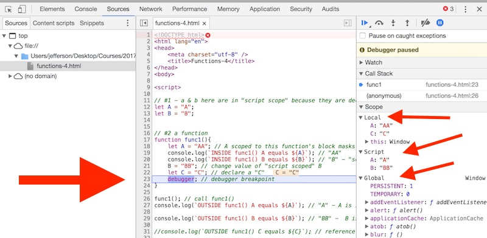

# 5 - JavaScript Functions

## Overview
In computer programming, a *function* is a named section of a program that perform a specific task; they are basically "mini programs" within a larger program. Today we are going to learn about how to write functions in JavaScript.

## Contents
<!--- Local Navigation --->
I. [Introduction](#section1)

II. [Function *Declarations*](#section2)

III. [Function *Expressions*](#section3)

IV. [Default function parameters](#section4)

V. [Variable Scope (`let` & `const`)](#section5)

VI. [Variable Scope with the `var` keyword](#section6)

VII. [Nested variable declarations](#section7)

VIII. [Nested functions](#section8)

IX. [ES6 Arrow Functions](#section9)

X. [Nota bene](#section10)

XI. [Review Questions](#section11)

XII. [Review Exercise](#section12)


<hr><hr>

## I. <a id="section1"></a>Introduction
Functions contain a sequence of statements called the *function body*. There are two advantages to using functions:
1. Reusability
1. Procedural Abstraction

Here is a short,  well-written page that explains what and why these two concepts are important - please take the time to read it: https://www.cs.utah.edu/~zachary/computing/lessons/uces-10/uces-10/node11.html


## II. <a id="section2"></a>Function *Declarations*

Here are some examples of JavaScript function declarations. Note that when we declare a JavaScript function, we do not declare the *type* of the arguments, or the *type* of the return value.

### functions-1.html

```
<!DOCTYPE html>
<html lang="en">
<head>
	<meta charset="utf-8" />
	<title>Functions-1</title>
</head>
<body>

<script>

// 1 - These first 2 examples do not have a return value, and instead rely on "side effects"

// 1A - no arguments, no return value
function sayHello(){
	console.log("Hello!");
}

// 1B - String argument, no return value
function sayHelloTo(name){
	console.log("Hello " + name + "!");
}

sayHello(); 			// "Hello!"
sayHelloTo("Bob"); 		// "Hello Bob!"


// 2 - these functions DO return values

// 2A - one String argument, String return value
function formatGreeting(name){
	return "Hello " + name + "!";
}

// 2B - here we store the returned value in a variable
let greeting = formatGreeting("Mary");
greeting = greeting.toUpperCase();
console.log(greeting); 	// HELLO MARY!

</script>
</body>
</html>

```

## III. <a id="section3"></a>Function *Expressions*
In JavaScript functions are *first-class* values - they are objects actually. 
This means that like any other JavaScript type (e.g. numbers or strings) they can be referenced by a variable, passed as an argument to a function, and returned as a value by a function.

### functions-2.html

```
<!DOCTYPE html>
<html lang="en">
<head>
	<meta charset="utf-8" />
	<title>Functions-2</title>
</head>
<body>

<script>


// 1 - Function Expression
let formatGreeting1 = function(name){
	// we are going to use ES6 String template literals instead of concatenation going forward
	return `Hello ${name}!`;
}

let formatGreeting2 = function(name){
	return `Greetings and felicitations, kind ${name}.`;
}

// 1A - we can still call the functions as normal
let greeting = formatGreeting1("Mary");
let greeting2 = formatGreeting2("Mary");

console.log(greeting); 		// Hello Mary!
console.log(greeting2); 	// Greetings and felicitations, kind Mary.


// 2 - A function that takes another function as an argument, and then calls it
function createGreetings(myData,myFunc){
	let greetings = []; // empty array
	for (let n of names){
		let g = myFunc(n); // call the passed in function and pass in a name
		//let g = myFunc.call(this,n); // does the same thing
		greetings.push(g); // add greeting to array
	}
	return greetings;
}

let names = ["Gary","Larry","Mary","Sherri"];
// 2A - here we pass the names array, and our 1st greeting format function
let greetings1 = createGreetings(names,formatGreeting1); 

// 2B - here we pass the names array, and our 2nd greeting format function
let greetings2 = createGreetings(names,formatGreeting2); 

console.log(greetings1); // ["Hello Gary!", "Hello Larry!", "Hello Mary!", "Hello Sherri!"]
console.log(greetings2); // ["Greetings and felicitations, kind Gary.", "Greetings and felicitations, kind Larry.", "Greetings and felicitations, kind Mary.", "Greetings and felicitations, kind Sherri."]

</script>
</body>
</html>

```

### A. Explanation
- in #1 above, we declared two function expressions
- in #1A above, we see that we can call these functions normally, the same way as we would call a declared function.
- in #2 above, we have declared a function that takes another function as an argument
- as we loop through the array, we call the passed in function repeatedly
- in #2A & #2B above we call `createGreetings()` with 2 different functions passed in

## IV. <a id="section4"></a>Default function parameters
In JavaScript, parameters of functions default to `undefined`. However, in some situations 
it might be useful to set a different default value. This is where **default parameters** can help.

### functions-3.html

```
<!DOCTYPE html>
<html lang="en">
<head>
	<meta charset="utf-8" />
	<title>Functions-3</title>
</head>
<body>

<script>

// #1 - A standard JavaScript function, it does not handle missing arguments well
function multiply1(a, b) {
  return a * b;
}

console.log(multiply1(2,5)); // 10
console.log(multiply1(2));   // we omit the b parameter, the result is NaN (not a Number), because b is undefined


// #2 - by checking the value of b before using it, we can give it a default value 
function multiply2(a, b) {
  b = (typeof b !== 'undefined') ?  b : 1; // ternary operator
  return a * b;
}

console.log(multiply2(2,5)); 	// 10
console.log(multiply2(2)); 	// 2, because b will default to 1


// #3 - this is much easier with ES6 default parameters
function multiply3(a, b = 1) {
  return a * b;
}

console.log(multiply3(2,5)); 	// 10
console.log(multiply3(2)); 	// 2, because b has a default value of 1


</script>
</body>
</html>
```
### A. Explanation
- note the behavior in #1 when the second parameter is left out. We get a result of `NaN` (Not a Number) because when `undefined` is multiplied by anything, the result is always `NaN`
- note in #2 that we are using the *ternary operator*, which is a shortcut if/then/else. This also illustates one way to check to see if a value is undefined.
- note in #3 that default function parameters are an ES6 feature

## V. <a id="section5"></a>Variable Scope (`let` & `const`)
When functions are declared, and when variables are declared using either `let` or `var`, they are *scoped* to the current *block* they were declared in.

- A **Block** is delimited by a pair of curly braces `{}` and is used to group zero or more statements.
- **Scope** means where your variable is accessible and modifiable in your program.
- Functions and variables declared by `let` and `const` have as their scope the block in which they are defined, as well as in any contained sub-blocks. 
- If a variable is declared with `let` and `const` **outside** of a block (at the top-level of the &lt;script> element) it has **script** scope. Script scope means that the variable is available throughout the current script, and in other &lt;script> tags.

### functions-4.html

```
<!DOCTYPE html>
<html lang="en">
<head>
	<meta charset="utf-8" />
	<title>Functions-4</title>
</head>
<body>

<script>

// #1 - a & b here are in "script scope" because they are declared outside of a block
let A = "A";
let B = "B";


// #2 a function 
function func1(){
	let A = "AA"; // A scoped to this function's block masks the "script scoped" A
	console.log(`INSIDE func1() A equals ${A}`); // "AA"
	console.log(`INSIDE func1() B equals ${B}`); // "B" - "script scoped" b is visible
	B = "BB"; // change value of "script scoped" B
	let C = "C"; // declare a block-scoped C variable
	debugger; // debugger breakpoint
}

func1(); // call func1()
console.log(`OUTSIDE func1() A equals ${A}`); // "A" - A is in scope

console.log(`OUTSIDE func1() B equals ${B}`); // "BB" -  B is in scope

//console.log(`OUTSIDE func1() C equals ${C}`); // reference error! C is not defined

debugger; // debugger breakpoint

</script>
</body>
</html>
```
### A. Explanation
Be sure to run this example in Chrome with the web inspector open (see screenshot below). The `debugger;` statement will suspend execution of the program and allow us to inspect both the value of the variables,  and their *scope*. 
Note that we have 3 scopes here: "Local", "Script", and "Global".
- `func1()` has 2 "locally" scoped variables (i.e. to the function *block*) - `A` and `C`.
- `A` and `B` are "script" scoped and are thus visible throughout this page and other scripts of the page.
- There are many globally scoped objects - alerts, arrays, the `Math` object, and so on. Our scripts have full access to these and other global variables.
- **Try this**: Remove the `debugger;` statements and uncomment the final `console.log()` that tries to print out `C`. Of course it fails because we can't access local variables from outside the block in which they were declared in.




## VI. <a id="section6"></a>Variable Scope with the `var` keyword
- Variables declared with the `var` keyword (which we have NOT been using in this course) are scoped to the nearest enclosing *function* in which they were declared, they are NOT *block scoped*.
- If a variable is declared with the `var` keyword *outside* of a function, that variable is now in the *global scope*.

You can read about this behavior of `var` and other behaviors such as variable declaration **hoisting** and **global scope** here:

- https://developer.mozilla.org/en-US/docs/Web/JavaScript/Reference/Statements/var

## VII. <a id="section7"></a>Nested variable declarations
### functions-5.html

```
<!DOCTYPE html>
<html lang="en">
<head>
	<meta charset="utf-8" />
	<title>Functions-5</title>
</head>
<body>

<script>

function doStuff(){
	let x = 1;
	let y = 1;
	if(x==1){
		x++;
		y++;
		let z = 1; // z is scoped to the if block
	}
	console.log(x); // 2
	console.log(y); // 2
	console.log(z); // ReferenceError: z is not defined!
}

doStuff();

</script>
</body>
</html>
```
### A. Explanation
- z above is scoped to the inner "if" block, and is not visible outside of that block.


## VIII. <a id="section8"></a>Nested functions
We can declare a function *within* a function. The nested (inner) function is private to its containing (outer) function. 
Below we have given the `addSquares()` function a "helper" function that is not visible from the outside of `addSquares()`.

### functions-6.html
```
<!DOCTYPE html>
<html lang="en">
<head>
	<meta charset="utf-8" />
	<title>Functions-6</title>
</head>
<body>

<script>

// borrowed from: https://developer.mozilla.org/en-US/docs/Web/JavaScript/Guide/Functions
function addSquares(a, b) {
  function square(x) {
    return x * x;
  }
  return square(a) + square(b);
}

let a = addSquares(2, 3); // returns 13
let b = addSquares(3, 4); // returns 25
let c = addSquares(4, 5); // returns 41


</script>
</body>
</html>
```
- The inner function (`square`) can be accessed only from statements in the outer (`addSquares`) function.
- This inner function (`square`) forms a *closure*: the inner function can use the arguments and variables of the outer function, while the outer function **cannot** use the arguments and variables of the inner function.

Closures are an important topic in JavaScript - you can learn more about them: 

- https://developer.mozilla.org/en-US/docs/Web/JavaScript/Guide/Functions#Nested_functions_and_closures
- https://developer.mozilla.org/en-US/docs/Web/JavaScript/Closures

## IX. <a id="section9"></a>ES6 Arrow Functions
Arrow functions are an ES6 addition.  They have two advantages: they have a shorter syntax than regular functions, and they do not bind their own `this` keyword. This second advantage might not mean anything to you now, but we will revisit it in a future chapter of this tutorial.

### functions-7.html

```
<!DOCTYPE html>
<html lang="en">
<head>
	<meta charset="utf-8" />
	<title>Functions-7</title>
</head>
<body>

<script>

// 1 - function declaration
function addThem1(num1,num2){
	return num1 + num2;
}

// 2 - function expression
let addThem2 = function(num1,num2){
	return num1 + num2;
}

// 3 - arrow function with the usual "block body"
let addThem3 = (num1,num2) => {return num1 + num2;}

// 4 - arrow function with a "concise body" and implied return statement
let addThem4 = (num1,num2) => num1 + num2;

// They all do the same thing
console.log(addThem1(5,5)) // 10
console.log(addThem2(5,5)) // 10
console.log(addThem3(5,5)) // 10
console.log(addThem4(5,5)) // 10

// 5 - and here's an even more concise version, if the function has only a single argument the
// parentheses can be omitted
let doubleIt = num => num * 2;
console.log(doubleIt(5));

</script>
</body>
</html>
```
### A. Explanation
- 4 of the 5 function definitions above do the same thing, but the syntax is increasingly concise. 
- Arrow functions really come in handy with arrays, when you can to pass them as arguments to functions such as `.sort()` or `.filter()` or `.forEach()`, which we will work with soon.
- Arrow function docs: https://developer.mozilla.org/en-US/docs/Web/JavaScript/Reference/Functions/Arrow_functions.


## X. <a id="section10"></a>Nota bene

A. We have not yet talked about the `this` keyword - `this` has a special value within functions based on how it is called - we will take a closer look at `this` in the next section, JavaScript Events & `this`.

B. A new kind of function for ES6 is called a **Generator Function** - which is a function that can be paused and later resumed. We will not be covering them in this course. If you are interested, here is some information about them:

- http://thejsguy.com/2016/10/15/a-practical-introduction-to-es6-generator-functions.html
- https://davidwalsh.name/es6-generators
- https://developer.mozilla.org/en-US/docs/Web/JavaScript/Guide/Iterators_and_Generators

C. Function declarations and function expressions are very similar, but there are subtle differences.
One of these is that within the same scope, function declarations are immediately available to all the code, but `let` function expressions are not available until the variable  has been *declared* and *initialized*.

To see this in action:

- head back to **functions-1.html** and add this line of code - `sayHello();` - to the very top of the &lt;script> tag, before sayHello has been declared. Run the code. You should see two of the "Hello1" logs now, proving that the `sayHello(){...}` function was available even though it was declared later on in the code.
- head back to **functions-2.html** and add this line of code - `console.log(formatGreeting1("Freddy"));` - to the very top of the &lt;script> tag, before the `formatGreeting` variable was initialized. Run the code. You will get an error message - `Uncaught ReferenceError: formatGreeting1 is not defined` - which means that at the top of the code `formatGreeting1` has not yet been declared (or initialzed). This means that `formatGreeting1` is in a "temporal dead zone" from the start of the block until the initialization is processed.

D. We are going to use String Template literals in our examples instead of string concatentation going forward. But there is one caveat - Internet Explorer 11 (the final version of IE) does not support them, so be cautious about using them in your "shipping" JavaScript projects.

E. You may have noticed **global** variable scope above. How can you add variables to this **global** scope?
1. Use the `var` keyword (which we will avoid using in this class)
2. Every time you give an element an `id` value, you are actually creating a property on the global `.window` object. You can read about this here:

http://2ality.com/2012/08/ids-are-global.html

This "auto creation" of global properties is a feature you probably don't want to use in your code, but you need to be aware of it because it can cause quirky behavior in your programs depending on how you "id" your elements.

## XI. <a id="section11"></a>Review Questions
1. What is a *block*?
1. Define *scope*
1. Declaring a variable with `let` or `const` at the top level of the &lt;script> tag (outside of any other blocks or functions) gives it what kind of *scope*?
1. Declaring a variable with `let` or `const` inside of a `for` loop of a function gives it what kind of *scope*?
1. What does the `debugger;` statement do?
1. What does D.R.Y. stand for and *mean*? (see next section below)


## XII. <a id="section12"></a>Review Exercise

Duplicate your **web-apps-4.html** file and name the copy **web-apps-5.html**
Notice how the `colors` and `foods` (or whatever categories you chose) list generating code is almost the same - this violates a software development best practice known as D.R.Y. - "**D**on't **R**epeat **Y**ourself".
What you need to do is to factor out that duplicated code and put it into a function.

1. Hint: The function declaration looks something like this:

```
function createList(listElement,array){
  // you write the rest
}
```

2. Now call this function twice, passing in a reference to the list element you want to populate and the applicable array.
3. Now add a default value to the `array` parameter - an array with the values "puppydogs", "butterflies", and "lollipops". We recommend doing this the ES6 way. (These default values would only be used if no value was passed in for the array parameter)
4. Delete all the old duplicated code - now don't you feel better about yourself?

The HTML produced should be identical to what was produced in the previous version.

<hr>

 **[Previous Section <- More Web Browser DOM Methods (part 4)](web-apps-4.md)**
 
 **[Next Section -> JavaScript Events (part 6)](web-apps-6.md)**


