# 6 - JavaScript Events

## Overview
DOM events are sent to let our code know that interesting things have happened - for example "the page loaded", "the button was clicked", "the file started to download", "the select value changed" - you can see a complete list of DOM events here: 

- https://developer.mozilla.org/en-US/docs/Web/Events

And learn more about events here:

- https://developer.mozilla.org/en-US/docs/Learn/JavaScript/Building_blocks/Events

## Contents
<!--- Local Navigation --->
I. [Event Handlers](#section1)

II. [Event Handlers and function references](#section2)

III. [Breaking our code](#section3)

IV. [Events and Arrow Functions](#section4)

V. [Event Listeners - `addEventListener()`](#section5)

VI. [Event Listeners - `removeEventListener()`](#section6)

VII. [Adding properties to elements with `element.dataset`](#section7)

VIII. [Nota bene](#section8)

IX. [Review Questions](#section9)

X. [Review Exercise](#section10)


<hr><hr>


## I. <a id="section1"></a>Event Handlers
Browser "on-event" handlers have been around since the early days of the Internet, and are the easiest way to hook into events like `onload`, `onclick`, `onmousedown`,`onkeyup` and so on.

### events-1.html

```html
<!DOCTYPE html>
<html lang="en">
<head>
	<meta charset="utf-8" />
	<title>Events-1</title>
	<style>
	body{border:1px solid gray;}
	p{font-size:2em;}
	</style>
</head>
<body>
<p>I am a paragraph</p>
<script>
  "use strict";
  let p = document.querySelector("p");
  
  // 1 - the onclick event handler now has a function expression as its value
  p.onclick = function(e){
    // 2 - the keyword 'this' in this context means the object that triggered the event
	this.innerHTML = "I was clicked!";
	
   // 3 - will do the same thing
   //e.target.innerHTML = "I was clicked!";
  }


</script>
</body>
</html>
```

Go ahead and try this code out - clicking the paragraph should cause its text to change.

### A. Explanation
1. In #1 above, we give the `onclick` event handler a *function expression* as its value. This function will be called once a click event has been triggered by the paragraph. 
1. In #2 above, we used the `this` keyword. In JavaScript the value of `this` varies depending how it it used. In a function that is triggered by an event, this is a reference to the object that called the method - in this case the paragraph. 
1. In #3 above, the `e` parameter is the default `Event` object that is sent along by the event handler. It has a number of properties and methods, and in this case `e.target` is the object that recieved the event (once again, the paragraph).

**If we pop a breakpoint into the debugger (Use the **Sources** tab, and select **event-1.html**, then click in the gutter to set breakpoint), and then click the paragraph, we can inspect the properies of this `Event` object, and see that it's actually a `MouseEvent` object.**

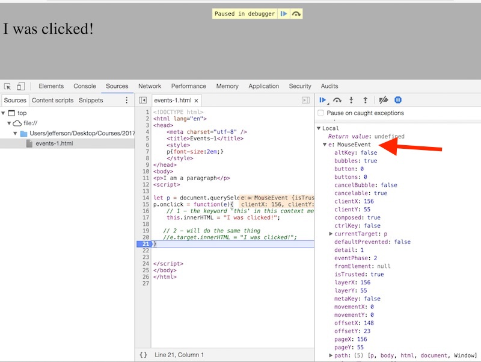


**Below we can see that the value of `e.target` and the value of `this` were both the paragraph that was clicked on.**

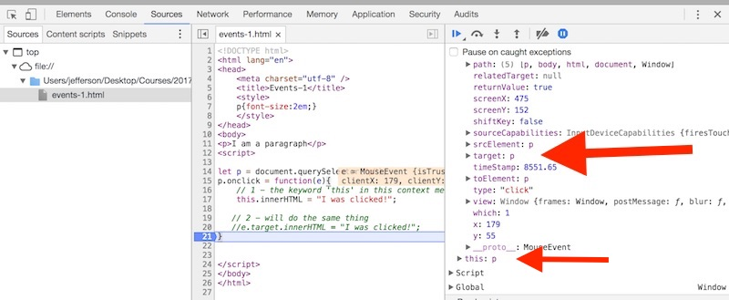


## II. <a id="section2"></a>Event Handlers and function references
Below our code will point at a declared (and named) function - this code will be triggered when the paragraph is clicked on.
Go ahead and try this code out - clicking the paragraph will cause its text to change as it did in the previous section, clicking
the div will similarly trigger the `divClicked()` function.

### events-2.html
```html
<!DOCTYPE html>
<html lang="en">
<head>
	<meta charset="utf-8" />
	<title>Events-2</title>
	<style>
	body{border:1px solid gray;}
	p{font-size:2em;}
	div{font-size:2em;font-weight:bold;}
	</style>
</head>
<body>
<p>I am a paragraph</p>
<div>I am a division</div>
<script>
"use strict";
let p = document.querySelector("p");
p.onclick = function(e){
	// 1 - the keyword 'this' in this context means the object that triggered the event
	this.innerHTML = "I was clicked!";
   
   // 2 - will do the same thing
   //e.target.innerHTML = "I was clicked!";
}

   // 3 - Let's declare a function to be called later
function divClicked(){
	this.innerHTML = "I am a div, and I was clicked!";
}

   // 4 - .onclick now points at the divClicked() function
document.querySelector("div").onclick = divClicked;
</script>
</body>
</html>
```

### A. Explanation
- In #3 above, we declare a function which we will call later.
- In #4 above, the value of onclick is the function's *reference*. The function will be called when the button is clicked.

## III. <a id="section3"></a>Breaking our code
One common mistake that is easy to make, is to write this line:

`document.querySelector("div").onclick = divClicked;`

**as this:**

`document.querySelector("div").onclick = divClicked(); // add parentheses`

- Go ahead and make that change to **events-2.html** and run this code - note that our `div.onclick` code doesn't seem to work now - what happened?
- Check out the debugger - add a breakpoint and reload the page. Then find the value of `p.onclick` (recall we didn't change that code) - you can see below that the value of `p.onclick` is a function.

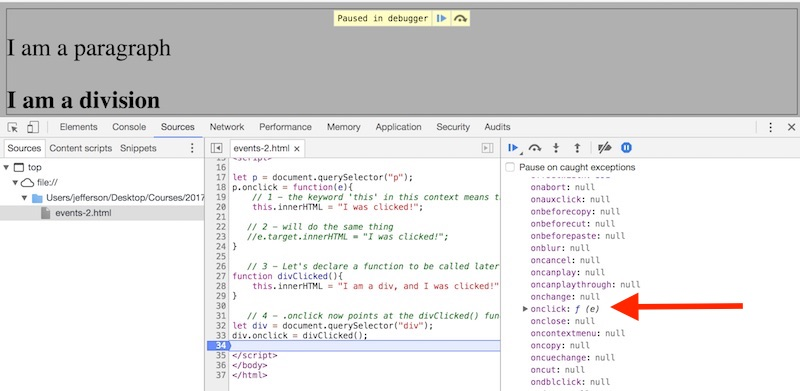

- Now check out the value of `div.onclick` in the debugger - you will see that it is `null` - which is why the click code no longer works.

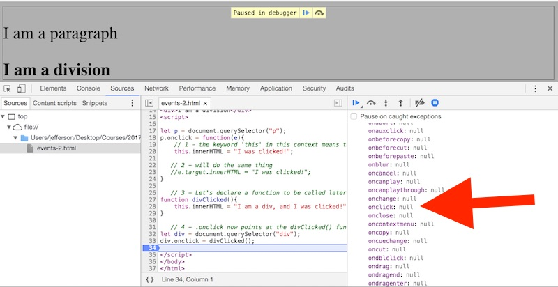

- What happened is that when we added the `()` to the end of `onclick = divClicked()`, the function was called immediately, and the *return value* of the function (`undefined`) was stored in the `onclick` property instead of the function *reference* it was expecting.
- Go ahead and change the code back so that it works again.

## IV. <a id="section4"></a>Events and Arrow Functions
We can use arrow functions as event handlers too. You might recall that in the [Functions chapter](./web-apps-5.md) we mentioned that arrow functions have two advantages: 

- they have a shorter syntax than regular functions
- they do not bind their own `this` keyword. 

What this means is that when an event handler points at a *regular function*, the value of `this` is the object that received the event.
But when an event handler points at an *arrow function*, the value of `this` will instead be "the value of the enclosing execution context", which below will be the `window` object - so we will be able to call top level functions in the script.

Go ahead and run **events-3.html** and see what happens.


### events-3.html

```html
<!DOCTYPE html>
<html lang="en">
<head>
	<meta charset="utf-8" />
	<title>Events-3</title>
	<style>
	body{border:1px solid gray;}
	p{font-size:2em;}
	div{font-size:2em;font-weight:bold;}
	</style>
</head>
<body>
<p>I am a paragraph</p>
<div>I am a division</div>
<script>
"use strict";
// 1 - Let's declare a function that can be called later
function changeParagraph(){
	document.querySelector("p").innerHTML = "Somebody changed me!";
}

// 2 - Let's declare an arrow function to be called later
let divClicked = (e) => { 
			  e.target.innerHTML = "I am a div, and I was clicked!";
			  this.changeParagraph();
			}

// 3 - .onclick now points at the divClicked arrow function
let div = document.querySelector("div").onclick = divClicked;

</script>
</body>
</html>
```

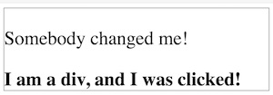

### A. Explanation
- Clicking the div changed both the div and the paragraph
- in #1 above, we created a function that will change the paragraph
- in #2 above, we declared an arrow function that will change the div
- in #3 above, we hooked up the div `onclick` event to the arrow function
- when the div is clicked, the code in #2 runs. Here, `e.target` refers to the element that was clicked on, the div. But in an arrow function (unlike a regular function), `this` now refers to the `window` object, which includes the `changeParagraph()` function we called earlier.
- (actually, in the above example, the `this` in `this.changeParagraph()` was optional, but we wanted to illustrate how the value of `this` has changed in an arrow function.

## V. <a id="section5"></a>Event Listeners - `addEventListener()`

The major limitation of the event handlers shown above is that each element can have only *one* event handling function attached to it at a time.
`addEventListener()` - which we will cover now, has no such restrictions.

Try out the code below:

### events-4.html

```html
<!DOCTYPE html>
<html lang="en">
<head>
	<meta charset="utf-8" />
	<title>Events-4</title>
	<style>
	body{border:1px solid gray;}
	p{font-size:2em;}
	div{font-size:2em;font-weight:bold;}
	</style>
</head>
<body>
<p>I am a paragraph</p>
<div>I am a division</div>
<script>
"use strict";
// 1 - Let's declare 3 arrow functions that can be called later
let changeText = (e) => { e.target.innerHTML = "I was clicked!"; };
let changeColor = (e) => { e.target.style.color = "red"; };
let changeStyle = (e) => { e.target.style.fontStyle = "italic"; };


// 2 - get references to the <p> and the <div>
let p = document.querySelector("p");
let div = document.querySelector("div");

// 3 - use addEventListener() to add three events to the <p>
p.addEventListener("click",changeText); // NOTE the event is named 'click', NOT 'onclick'
p.addEventListener("click",changeColor);
p.addEventListener("click",changeStyle);

// 4 - we will only give the <div> two events
div.addEventListener("click",changeText);
div.addEventListener("click",changeColor);

</script>
</body>
</html>
```

When you run the code and click on the elements, this is what you will see:

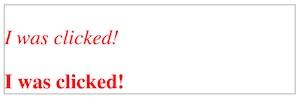

### A. Explanation
- When you try out the code, you should see that the paragraph has 3 functions attached to it. These 3 functions will change the HTML, the color to red, and the font-style to italic.
- When you try out the code, you should see that the div has 2 functions attached to it. These 2 functions will change the HTML, the color to red, but leave the font-style alone.
- It is very important to note that the events that are being passed into `addEventListener()` are named 'click', NOT 'onclick' like the event handler was.


## VI. <a id="section6"></a>Event Listeners - `removeEventListener()`
You can also call `removeEventListener()` to later remove event functions.

Add the following to **events-4.html**

```javascript
let messWithDiv = (e) => { 
			   div.removeEventListener("click",changeText);
			   div.removeEventListener("click",changeColor);
			   div.addEventListener("click",changeStyle);
			};

p.addEventListener("click",messWithDiv);
```

Try out this new code. If you click on the paragraph first, and then the div, you will see that the div has lost 2 of its event functions, but gained the `changeStyle` function.

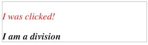

## VII. <a id="section7"></a>Adding properties to elements with `element.dataset`
Let's imagine that we would like to toggle the paragraph and div back and forth when we click on them. We would also like to use the same code for the paragraph and div, as well as any number of other elements. There are a number of ways to do this, but let's go ahead and try out the HTML5 "Custom Data" attribute to add properties to the HTML elements we click on. You can read more about them here:

- http://html5doctor.com/html5-custom-data-attributes/

### events-5.html

Type in the following code and test it in the browser.
```html
<!DOCTYPE html>
<html lang="en">
<head>
	<meta charset="utf-8" />
	<title>Events-5</title>
	<style>
	body{border:1px solid gray;}
	p{font-size:2em;}
	div{font-size:2em;font-weight:bold;}
	</style>
</head>
<body>
<p>I am a paragraph</p>
<div>I am a division</div>
<script>
"use strict";
// 1 - get references to <p> and <div>
let p = document.querySelector("p"); 
let div = document.querySelector("div");

// 2 - create a custom property named "state" for each element and give it a default value
// all new properties will be added to the element's .dataset property
p.dataset.state = "normal"; // A
div.dataset.state = "normal"; // B

// 3 - Let's declare an arrow function that can be called later
let toggleStyle = (e) => { 
			   let state = e.target.dataset.state; // C
			   if (state == "changed"){ // == for comparison
			      e.target.style.backgroundColor = "white";
			      e.target.style.fontStyle = "normal";
			      state = "normal";
			} else{
			      e.target.style.backgroundColor = "yellow";
			      e.target.style.fontStyle = "italic";
			      state = "changed";
			}
						
			e.target.dataset.state = state;
	         };


// 4 - add events 
p.addEventListener("click",toggleStyle);
div.addEventListener("click",toggleStyle);

</script>
</body>
</html>
```

**Running the code will allow you to repeatedly click on each element, and toggle its styles back and forth, looking like this:**

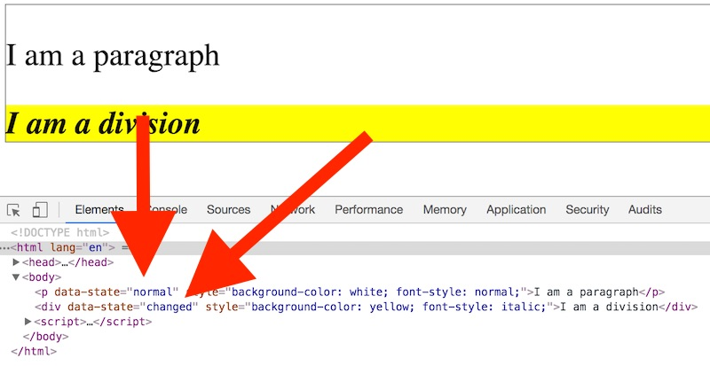

### A. Explanation
Clicking on an element should toggle the styles back and forth from its normal appearance, to a changed appearance with a yellow background color and italic text. This toggling between the 2 appearances is being tracked by changing `dataset.state` from "normal" to "changed". By adding a `state` property to any element we click on, our code allows that element to "remember" that it has been changed or not. Note that we came up with the name `.state` on our own. We could have called it anything like `.selected` or `.clicked`.

- **Note *above* that we can see the changing value (as we click) of the div's `data-state` in the web inspector elements tab.**

- **Note *below* that we can also see the value of the div's `dataset.state` (the same value) in debugger.**

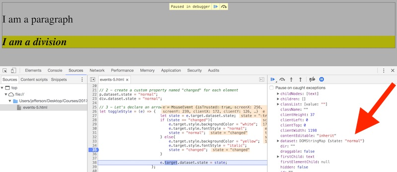


### B. One more thing
Note the 2A, 2B, and 3C lines in the **events-5.html** code sample above. Lines A & B are not necessary because line C will evaluate to `undefined` if we never define an initial value for `dataset.state` on each element. And because `undefined` is a [falsy](https://developer.mozilla.org/en-US/docs/Glossary/Falsy) value and will evaluate to `false`, the code will run fine. So why did we include A and B? To make the coder's intent more clear, and also so that we could have this discussion :-)

## VIII. <a id="section8"></a>Nota bene

If we use the `window.onload` event handler, we can move our code back up to the the &lt;head> section of the document, see below:

### events-6.html

```html
<!DOCTYPE html>
<html lang="en">
<head>
	<meta charset="utf-8" />
	<title></title>
	<script>
	"use strict";
	window.onload = init; // do you understand WHY there are no parentheses after init?

	function init(){
		// this is the second log we see in the console - do you understand WHY?
		console.log("Page is loaded!"); 
		document.querySelector("h1").innerHTML = "Window loaded!";
	}
	
	// this is the first log we see in the console - do you understand WHY?
	console.log("Page is NOT loaded!"); 
	</script>
</head>
<body>
<h1>???</h1>
</body>
</html>
```

**Be sure you can answer the "WHY" questions above!**

## IX. <a id="section9"></a>Review Questions
1. Give 2 advantages to using *event listeners* instead of *event handlers*
1. Give a situation where you might use an *event handler* anyway
1. What does an event handler (or event listener) "point" at?
1. What are the two advantages of using arrow functions?

## X. <a id="section10"></a>Review Assignment

### A) Overview of *Color Chooser*


#### 1) The starting code looks like this:

Create the following file, and name it **web-apps-6-HW.html**

```html
<!DOCTYPE html>
<html lang="en">
<head>
	<meta charset="utf-8" />
	<title>Web Apps-6</title>
	<style>
		body{
			font-family:sans-serif;
		}
		#colorform{
			background-color:#dfecdf;
			color: #111;
			padding:1em;width:400px;
		}
		#colorform p#info{
			background-color:white;
			color: black;
			width:300px;
			height:100px;
			padding:.5em;
		}
		
		#colorform legend{ 
			font-weight:bold;
			font-size:1.2em;
		}
	</style>
</head>
<body>

<div id="colorform">
	<legend>Choose your favorite color!</legend>
	<p><input type="radio" name="colorGroup" id="colorGroup" value="red" /> Red</p>
	<p><input type="radio" name="colorGroup" id="colorGroup" value="green" /> Green</p>
	<p><input type="radio" name="colorGroup" id="colorGroup" value="blue" /> Blue</p>
	<p><button id="colorButton" type="button">Submit</button></p>
	<p id="info"></p>
</div>

<script>
/* Write you code here! */
</script>
</body>
</html>
```

#### 2) Which looks like this in the browser:

Note that because we `name` all of the radio buttons the same, they are considered a "group" by the browser, and we can only select one radio button at a time. Try it. The submit button currently does nothing.

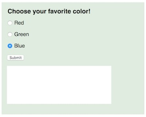

#### 3) After you have written all of your JavaScript code, and clicked a radio button ...

You should see a message indicating what color you have selected.

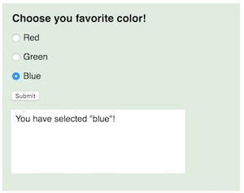


#### 4) Once you click the Submit button ...

You should see another message about the color you selected, and the &lt;legend> element should also change to that color.

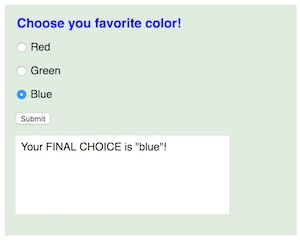

### B) Hints
1. You can use event handlers OR event listeners, it's your choice
1. You can use standard functions OR arrow functions, it's your choice
1. The **Submit button** code should be triggered by the `click` event
1. The **Radio button** code should be triggered by the `change` event
1. `document.querySelectorAll()` can be used to get reference to all of the radio buttons. You can then loop through the list you get back (use a [`for`](https://developer.mozilla.org/en-US/docs/Web/JavaScript/Reference/Statements/for) or [`for...of`](https://developer.mozilla.org/en-US/docs/Web/JavaScript/Reference/Statements/for...of) loop).
1. To get the value of the selected radio button, use `e.target.value`
1. In the submit button code, you can check to see which radio button is selected by checking its `.checked` property
1. The `value` of these radio buttons happens to be a CSS color keyword, so it will be pretty easy to assign the value to the color property of the &lt;legend> element (and CSS color values are not case sensitive, so don't worry about the capitalization).

### C) Submission
Be sure to submit this to the applicable dropbox, and do not post it to your web site.

### D) Extra Credit (worth 1 full HW)
Can you do a version of this web app, but with HTML checkboxes? Name the file **web-apps-6-HW-with-checkboxes.html**

Hint: Checkboxes have a `.checked` property.

Hint: Don't worry about changing the color of the &lt;legend> in this version.

Checkboxes allow the user to make multiple selections. Yours should work like the version below.

**Check multiple select boxes:**

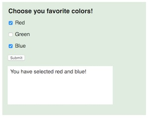

**Click Submit button:**

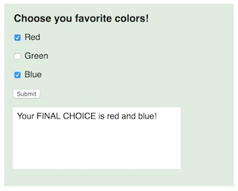

**Submission: Post to extra credit dropbox**

<hr>

- **Important:** If you have not yet done the [Random Phrases-2](HW-random-phrases-2.md) homework, go check it out. See the mycourses dropbox for the actual due date.

- **Important:** If you have not yet done the [Image Gallery](HW-image-gallery.md) homework, go check it out. See the mycourses dropbox for the actual due date.

- You should also check out [Chibi Card Matching](HW-chibi-matching.md) game demo.

<hr>

**[Previous Chapter <- JavaScript Functions (chapter 5)](web-apps-5.md)**

**[Next Chapter -> JavaScript Object Literals (chapter 7)](web-apps-7.md)**
