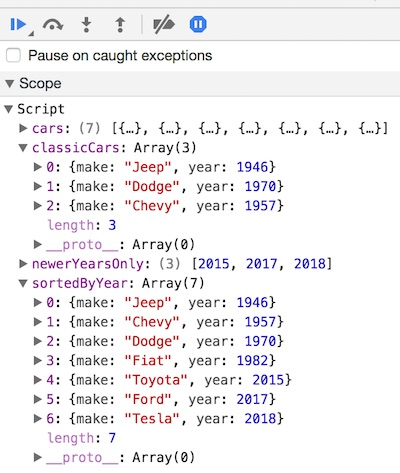

# 8 - JavaScript Arrays

## Overview

JavaScript arrays are "List-like" objects that are used to store information sequentially. 
Unlike primitive arrays (Int, Float etc) in languages like C, JavaScript arrays are NOT constrained to holding only one *type* of value, and can hold multiple types of data in the same array.

JavaScript arrays are *objects*, and thus have properties and methods like other objects do. 

## Contents
<!--- Local Navigation --->
I. [Array Operations](#section1)

II. [Iterating over Arrays](#section2)

III. [Other "Array-like" objects in JavaScript](#section3)

IV. [Method Chaining & Fluent Interfaces](#section4)

V. [Nota bene](#section5)

VI. [Review Questions](#section6)

VII. [Review Exercise](#section7)

<hr><hr>

## I. <a id="section1">Array Operations

### A. Create an Array
```javascript
// empty arrays
let emptyArray1 = []; 			// array literal syntax
let emptyArray2 = new Array(); 		// this second method is not commonly used

// an array of strings
let colors = ["red","green","blue"];
console.log(`colors.length = ${colors.length}`); // 3

// an array of numbers
let numbers = [7.9, 5.9, 100.3];

// mixed types in the same Array
let collection = ["Jaberwocky", 42, 98.6, false, Date(), Math.sin, null];
```

#### 2-Dimensional Arrays
This example of an 8x8 2-D array is from: https://developer.mozilla.org/en-US/docs/Web/JavaScript/Reference/Global_Objects/Array

The following creates a chess board as a two dimensional array of strings. The first move is made by copying the 'p' in (6,4) to (4,4). The old position (6,4) is made blank.

```javascript
var board = [ 
  ['R','N','B','Q','K','B','N','R'],
  ['P','P','P','P','P','P','P','P'],
  [' ',' ',' ',' ',' ',' ',' ',' '],
  [' ',' ',' ',' ',' ',' ',' ',' '],
  [' ',' ',' ',' ',' ',' ',' ',' '],
  [' ',' ',' ',' ',' ',' ',' ',' '],
  ['p','p','p','p','p','p','p','p'],
  ['r','n','b','q','k','b','n','r'] ];

// Move King's Pawn forward 2
board[4][4] = board[6][4];
board[6][4] = ' ';
```

### B. Access an Array item

```javascript
let first = colors[0]; // "red"
let last = colors[colors.length - 1]; // "blue"
```

### C. Add to the end of an Array

```javascript
colors.push("purple");
```

### D. Remove from the end of an Array

```javascript
last = colors.pop(); // remove "purple" from the end
```


### E. Remove from the front of an Array

```javascript
first = colors.shift(); // remove "red" from beginning
```


### F. Add to the front of an Array

```javascript
colors.unshift("red"); // add "red" back to the front
```

### G. Find the index of an item in the Array

```javascript
let pos = colors.indexOf("green");
```

### H. Remove 1 or more items by index position

```javascript
// remove 1 item
position = 2;
let numberToRemove = 1;
let removedArray1 = colors.splice(position, numberToRemove); // ["blue"]

// remove more than 1
position = 0;
numberToRemove = 2;
let removedArray2 = colors.splice(position, numberToRemove);  // ["red","green"]

console.log(`colors.length = ${colors.length}`); // 0
```
                                    

### I. Copy an item from an index position

```javascript
let fruits = ["apples","oranges","bananas"];
position = 0;
let numberToCopy = 2;
let copiedItems = fruits.slice(position,numberToCopy);

console.log(fruits); // ["apples","oranges","bananas"]
console.log(copiedItems); // ["apples","oranges"]
```

### J. Copy the whole array

Note: a shallow copy only copies object references

```javascript
let shallowCopy = fruits.slice();
console.log(shallowCopy); // ["apples","oranges","bananas"]

let car = {make:"Ford"};
let cars = [car];
let carsCopy = cars.slice();
console.log(car == cars[0] && cars[0] == carsCopy[0]); // true, all the same car
```

### K. Sample code for this section
#### array-operations.html

```html
<!DOCTYPE html>
<html lang="en">
<head>
	<meta charset="utf-8" />
	<title>Array Operations</title>
</head>
<body>

<script>
// A.
// An array of strings
let colors = ["red","green","blue"];
console.log(`colors.length = ${colors.length}`); // 3

// an array of numbers
let numbers = [7.9, 5.9, 100.3];

// mixed typed
let collection = ["Jaberwocky", 42, 98.6, false, Date(), Math.sin, null];

// B.
let first = colors[0]; // "red"
let last = colors[colors.length - 1]; // "blue"

// C.
colors.push("purple");

// D.
last = colors.pop(); // remove "purple" from the end

// E.
first = colors.shift(); // remove "red" from beginning

// F.
colors.unshift("red"); // add "red" back to the front

// G.
let position = colors.indexOf("green"); // 1

// H.
// remove 1 item
position = 2;
let numberToRemove = 1;
let removedArray1 = colors.splice(position, numberToRemove); // ["blue"]

// remove more than 1
position = 0;
numberToRemove = 2;
let removedArray2 = colors.splice(position, numberToRemove); // ["red","green"]

console.log(`colors.length = ${colors.length}`); // 0

// I
let fruits = ["apples","oranges","bananas"];
position = 0;
let numberToCopy = 2;
let copiedItems = fruits.slice(position,numberToCopy);
console.log(fruits); // ["apples","oranges","bananas"]
console.log(copiedItems); // ["apples","oranges"]

// J
let shallowCopy = fruits.slice();
console.log(shallowCopy); // ["apples","oranges","bananas"]

let car = {make:"Ford"};
let cars = [car];
let carsCopy = cars.slice();
console.log(car == cars[0] && cars[0] == carsCopy[0]); // true, all the same car

debugger;

</script>
</body>
</html>
```

## II. <a id="section2">Iterating over Arrays

### A. `for` loop

```javascript
for (let i=0; i<colors.length; i++){
	console.log(colors[i]);
}

for (let i=0; i<colors.length; i++){
	console.log(colors[i]);
	if (colors[i] == "red") break; // stop after "red"
}

for (let i=0; i<colors.length; i++){
	if (colors[i] == "red") continue; // skip "red"
	console.log(colors[i]);
}
```

### B. `for...of` loop

```javascript
for (let color of colors){
	console.log(color);
	// we can also use break and continue
}
```

### C. `Array.forEach()`

`.forEach()` is a method of Array - we pass it a function that will be called on every member of the array.
One disadvantage of `.forEach()` is that you can not break out of the loop early.

```javascript
colors.forEach(function(item, index, array) {
  console.log(item, index);
});
```

### D. `Array.map()`

The `map()` method creates a new array that contains the results of calling the passed in function on every element in the original array.

```javascript
let numbers = [1,2,3,4];
let doubleIt = function(num){return num * 2};
//let doubleIt = num => num * 2; // same thing as an arrow function
let newArray = numbers.map(doubleIt); // [2,4,6,8]

```

### E. `Array.filter()`
The `filter()` method creates a new array with all elements that pass the test (i.e return `true`) implemented by the provided function.

```javascript
let evenOnly = function(num){return num % 2 == 0};
//let evenOnly = num => num % 2 == 0; // same thing as an ES6 arrow function
let filteredArray = numbers.filter(evenOnly); // [2,4]
```

### F. Sample code for this section
#### array-iteration.html

```html
<!DOCTYPE html>
<html lang="en">
<head>
	<meta charset="utf-8" />
	<title>Array Iteration</title>
</head>
<body>

<script>
let colors = ["red","green","blue"];

// A
for (let i=0; i<colors.length; i++){
	console.log(colors[i]);
}

for (let i=0; i<colors.length; i++){
	console.log(colors[i]);
	if (colors[i] == "red") break; // stop after "red"
}

for (let i=0; i<colors.length; i++){
	if (colors[i] == "red") continue; // skip "red"
	console.log(colors[i]);
}

// B
for (let color of colors){
	console.log(color);
	// we can also use break and continue
}


// C
colors.forEach(function(item, index, array) {
  console.log(item, index);
});

// D
let numbers = [1,2,3,4];
let doubleIt = function(num){return num * 2};
//let doubleIt = num => num * 2; // same thing as an ES6 arrow function
let newArray = numbers.map(doubleIt); // [2,4,6,8]

// E
let evenOnly = function(num){return num % 2 == 0};
//let evenOnly = num => num % 2 == 0; // same thing as an ES6 arrow function
let filteredArray = numbers.filter(evenOnly); // [2,4]

debugger;
</script>
</body>
</html>

```


## III. <a id="section3">Other "Array-like" objects in JavaScript
### A. `NodeList`

When we use `document.querySelectorAll()`, we get back a `NodeList`.

- https://developer.mozilla.org/en-US/docs/Web/API/NodeList

NodeLists are NOT arrays. Although they have a `.length` property and can use `for...of` and `.forEach()`, they CANNOT use other array methods like `.filter()` or `.map()`.

```javascript
let allNodes = document.querySelectorAll("*"); // returns a NodeList object

for (let i=0;i<allNodes.length;i++){
	console.log(allNodes[i]); // works fine
}

for (let node of allNodes){
	console.log(node); // works fine
}

allNodes.forEach(function(item, index, array) {
  console.log(item, index); // works fine on newer browsers
});

// NodeList does not have the .filter() method
let filteredArray = allNodes.filter(node => node.tagName == "BODY"); //FAIL!
```

### B. Typed Arrays

Typed arrays are **fixed size arrays** that hold only a single primitive type, such as a `UInt8` or a `Float64`. You probably won't use them in this class, but you can read about them here: https://developer.mozilla.org/en-US/docs/Web/JavaScript/Typed_arrays

Here is a quick example:

```javascript
let typedArray1 = new Uint8Array([0,33,64,128]); // 0-255 allowed
typedArray1[1] = 32; // allowed
console.log(typedArray1);  [0,32,64,128]

// looping through typed arrays is OK
for (num of typedArray1){
	console.log(num); // 0 32 64 128
}

let typedArray2 = new Uint8Array([-10,33,64,128,256,3000]); // -10, 256 & 300 are bad values
console.log(typedArray2); // [246, 33, 64, 128, 0, 184] - extraneous bits were trimmed!

typedArray2.push(10); // ERROR, you can't add items to a typed array!
```


### C. Sample code for this section
#### array-like-objects.html

```html
<!DOCTYPE html>
<html lang="en">
<head>
	<meta charset="utf-8" />
	<title>Array-like Objects</title>
</head>
<body>

<script>
// A
let allNodes = document.querySelectorAll("*"); // returns a NodeList object

for (let i=0;i<allNodes.length;i++){
	console.log(allNodes[i]); // works fine
}

for (let node of allNodes){
	console.log(node); // works fine
}

allNodes.forEach(function(item, index, array) {
  console.log(item, index); // works fine on newer browsers
});

// NodeList does NOT have the .filter() method!
let filteredArray = allNodes.filter(node => node.tagName == "BODY"); //FAIL!

debugger;
</script>
</body>
</html>
```

## IV. <a id="section4">Method Chaining
[Method Chaining](https://en.wikipedia.org/wiki/Method_chaining) is a syntax for invoking multiple method calls on objects. Each method returns an object reference, allowing the calls to be chained together in a single statement without requiring variables to store the intermediate results.

### Method Chaining Example:
JavaScript has good support for chaining in that many of the array methods return a reference to an array, which allows us to chain the method calls.

```javascript
// A. Method chaining, and here it's pretty easy to read and understand
let highestNumber = [1,5,8,3,-10].sort().pop(); 	// 8
let lowestNumber = [1,5,8,3,-10].sort().shift(); 	// -10


// B. Method chaining, but here it's not quite as clear as to what's going on
// we use .trim() and .toLowerCase() to make the string comparison more flexible 
let nameArray = [" sUe ","  mARy  ","  bOB  "," freDdY  "];
let bobLowercaseAndTrimmed = nameArray.find( e=> e.trim().toLowerCase() == "bob" ).toLowerCase().trim(); // "bob"
let bobCapitalizedAndTrimmed = bobLowercaseAndTrimmed.charAt(0).toUpperCase() + bobLowercaseAndTrimmed.slice(1); // "Bob"


// C. Consider writing 2 generalized functions and encapsulate the chaining there
// It's more lines of code, but it's easier to understand, debug, and reuse
function findNameInArray(name,array){
	return array.find(e=> e.trim().toLowerCase() == name.trim().toLowerCase())
}

function capitalizedWord(word){
	// return a trimmed and capitalized version of word
	return (word.trim().charAt(0).toUpperCase() + word.trim().toLowerCase().slice(1));
}

// Call these functions (which are more "bulletproof" than our earlier versions)
let bobCapitalizedAndTrimmed2 = capitalizedWord(findNameInArray("bob",nameArray)); // "Bob"
let bobCapitalizedAndTrimmed3 = capitalizedWord(findNameInArray("   bOb ",nameArray)); // "Bob"
```

### Fluent Interfaces
*Method chaining* is commonly seen in JavaScript libraries that have a [Fluent Interface](https://en.wikipedia.org/wiki/Fluent_interface). *Fluent interfaces* are software interfaces that read like ordinary written language. Here's an example (from the wikipedia link above) that illustrates jQuery's approach (can you see how it almost reads like a sentence?):

```javascript
// getting an item from a table
client.getItem('user-table')
    .setHashKey('userId', 'userA')
    .setRangeKey('column', '@')
    .execute()
    .then(function(data) {
        // data.result: the resulting object
    })
```
	
## V. <a id="section5">Nota bene

What if we have a `NodeList`, but need access to `Array` methods?  Easy, just move the contents of the `NodeList` into a new `Array`!

```javascript

// Here are 4 ways to convert a NodeList to an array (there are others):

// 1 - a for loop
let array1 = [];
for(let i = 0, node; node = allNodes[i]; ++i) array1.push(node);

// 2 - call the slice() method on the NodeList 
let array2 = Array.prototype.slice.call(allNodes);

// 3 - .from() is a new Array method for ES6
let array3 = Array.from(allNodes); 	

// 4 - ES6 spread operator
let array4 = [...allNodes]; 		
```

## VI. <a id="section6">Review Questions
1. True or False. JavaScript Arrays may hold only a single *type* of value.
1. Which array operation adds an item to the *end* of an array?
1. Which array method can be used to *remove* items from an array?
1. Which array method can be used to *copy* items to a new array?
1. Describe 3 ways to loop through a JavaScript Array.
1. Does `Array.filter()` modify the old array (the one it is called on), or create a new array?
1. What is the type of the object that is returned by `document.querySelectorAll()`?
1. Using *method chaining* (at least 2 methods) and [Math](https://developer.mozilla.org/en-US/docs/Web/JavaScript/Reference/Global_Objects/Math) and [Number](https://developer.mozilla.org/en-US/docs/Web/JavaScript/Reference/Global_Objects/Number) methods, write code that produces a random number with only 2 digits past the decimal point. Be sure to test this in the browser - the JavaScript console is an easy place to do so.
1. Define *Fluent Interface*.

## VII. <a id="section7">Review Exercise

See the HTML comments in the starter code below for what you have to do - name this **web-apps-8-HW.html**

### web-apps-8-HW.html

```html
<!DOCTYPE html>
<html lang="en">
<head>
	<meta charset="utf-8" />
	<title>web-apps-8-HW</title>
</head>
<body>
<script>
let cars = [
	{make:"Toyota",	year:2015},
	{make:"Jeep",	year:1946},
	{make:"Ford",	year:2017},
	{make:"Tesla",	year:2018},
	{make:"Fiat",	year:1982},
	{make:"Dodge",	year:1970},
	{make:"Chevy",	year:1957},
];

// For this HW you will use Array.filter(), Array.sort(), and Array.map() on
// the cars array above.

/*
 1 - Create a new array named 'classicCars' that contains only those cars with a
 .year of 1970 or earlier. Use Array.filter() on the cars array:
 https://developer.mozilla.org/en-US/docs/Web/JavaScript/Reference/Global_Objects/Array/filter
*/


/*
 2 - Create a new array named 'sortedByYear' that contains the contents of the
 car array, sorted by .year, ascending (oldest to most recent)
 Use Array.sort() on the cars array - and read about writing a comparison function here:
 https://developer.mozilla.org/en-US/docs/Web/JavaScript/Reference/Global_Objects/Array/sort
 
*/


/*
 3 - Create a new array named 'newerYearsOnly' that contains only the .year property 
 (not the entire car object) of those cars that are .year 2010 or newer. 
 Use Array.map() on the cars array:
 https://developer.mozilla.org/en-US/docs/Web/JavaScript/Reference/Global_Objects/Array/map
 
 This will give you a few undefined values. Use Array.filter() to get rid of these 
 undefined values so that newerYearsOnly contains only years (Numbers)
 
 Hint: you could use Number.isInteger() or the typeof operator:
 https://developer.mozilla.org/en-US/docs/Web/JavaScript/Reference/Global_Objects/Number/isInteger
 https://developer.mozilla.org/en-US/docs/Web/JavaScript/Reference/Operators/typeof
 
 You could do this additional filter on a separate filter on the different lines,
 or as a "one-liner" by chaining the method calls.
*/

debugger;
</script>
</body>
</html>
```

**Which looks like this in the debugger:**



<hr>

- **Important:** If you have not yet done the [Pixel Artist](HW-pixel-artist.md) homework, go check it out. See the mycourses dropbox for the actual due date.
- Also be sure to check out the [Life](HW-life.md) and [Adventure!](HW-adventure.md) demos.

<hr>

**[Previous Chapter <- JavaScript Object Literals (chapter 7)](web-apps-7.md)**

**[Next Chapter -> Web Storage (chapter 9)](web-apps-9.md)**
