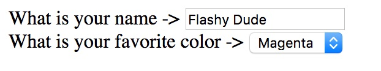
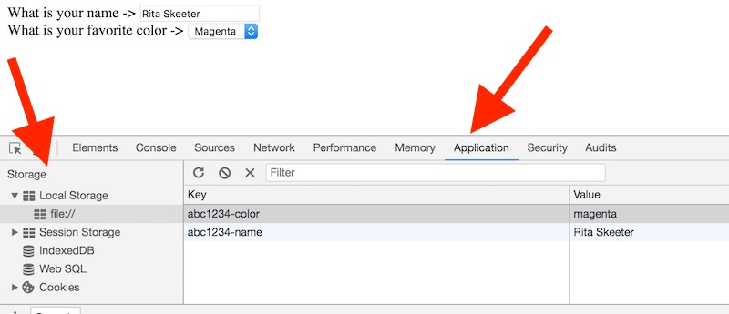
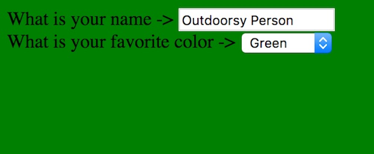

# 9 - WebStorage API

## I. Overview
The HTML5 WebStorage API allows us to store **key:value** data in the user's browser, and that information can be retrieved at a later date by your JavaScript (when the user returns to your page).

## Contents
<!--- Local Navigation --->
I. [WebStorage Reference](#section1)

II. [An Example](#section2)

III. [Storing Objects with WebStorage](#section3)

IV. [Nota Bene](#section4)

V. [Review Questions](#section5)

VI. [Review Exercise](#section6)

<hr><hr>

## I. <a id="section1">WebStorage Reference
There are some WebStorage examples on the Internet that we can point you to:

- https://developer.mozilla.org/en-US/docs/Web/API/Web_Storage_API/Using_the_Web_Storage_API
- https://developer.mozilla.org/en-US/docs/Web/API/Web_Storage_API
- https://html.spec.whatwg.org/multipage/webstorage.html
- https://mdn.github.io/dom-examples/web-storage/


## II. <a id="section2">An Example

- Go ahead and try out this example, whenever you `onchange` the values of the textbox or the &lt;select>, their values are written to `localStorage`. 
- If you close the window and reopen it, your changes will be preserved.  
- After you have referred to the links above, it should be pretty easy to figure out what's going on in the code.
- One thing worth mentioning is the `prefix` variable (see below). Because Web Storage uses the same set of keys for *each domain*, this means on servers like banjo that all of the students are sharing the same set of keys, so that if someone uses `highscores`as a key, another student's `highscores` key could wipe out and replace their data. One solution is to prefix your key names with something unique, like your RIT web account id. Therefore `highScores` would become `abc1234-highScores` for one student, and `xyz9876-highScores` for someone else, and the keys would never conflict.

### webstorage-1.html
```html
<!DOCTYPE html>
<html lang="en">
<head>
	<meta charset="utf-8" />
	<title>Web Storage Example</title>
</head>
<body>

<div>
What is your name -> <input type='text' id='nameField'>
</div>

<div>
What is your favorite color -> 
<select id="colorSelect">
	<option value="red">Red</option>
	<option value="green">Green</option>
	<option value="blue">Blue</option>
	<option value="magenta">Magenta</option>
	<option value="cyan">Cyan</option>
	<option value="white">White</option>
	<option value="gray">Gray</option>
</select>
</div>

</body>
<script>

/* This stuff happens "onload" */
// declare some constants
const nameField = document.querySelector("#nameField");
const colorSelect = document.querySelector("#colorSelect");
const prefix = "abc1234-";
const nameKey = prefix + "name"
const colorKey = prefix + "color";

// grab the stored data, will return null if user has never been to this page
const storedName = localStorage.getItem(nameKey);
const storedColor = localStorage.getItem(colorKey);

// if we find a previously set name value, display it
if (storedName){
	nameField.value = storedName;
}else{
	nameField.value = "Turbo";
}

// if we find a previously set color value, display it
if (storedColor){
	colorSelect.querySelector(`option[value='${storedColor}']`).selected = true;
}

/* This stuff happens later when the user does something */
// when the user changes their favorites, update localStorage
nameField.onchange = e=>{ localStorage.setItem(nameKey, e.target.value); };
colorSelect.onchange = e=>{ localStorage.setItem(colorKey, e.target.value); };


</script>
</html>
```

### A. And here is what it looks like:



### B. You can also see your selections reflected in the web inspector:



## III. <a id="section3">Storing Objects with Web Storage
- A major limitation of Web storage is that it doesn't allow us to store arrays and other objects directly. But there's an easy workaround - you can easily convert built-in JavaScript objects (Object, Array, Date, etc) to and from a string respresentation, and then save them to `localStorage`. This is known as *serialization* - https://en.wikipedia.org/wiki/Serialization

### A. Save an array to localStorage with `JSON.stringify()`

```javascript
let listID = "abc1234-action-list";
let items = ["Direct Movie","Deliver Baby","Cure Cancer"];
items = JSON.stringify(items); 			// now it's a String
localStorage.setItem(listID, items);
```

### B. Retrieve an array from localStorage with `JSON.parse()`

```javascript
let listID = "abc1234-action-list";
let items = localStorage.getItem(listID); 	// returns a String
items = JSON.parse(items);  			// now it's an Array
```

## IV. <a id="section4">Nota Bene
- The process by which the browser works out how much space to allocate to web data storage and what to delete when that limit is reached is not simple, and differs between browsers - read about it here: https://developer.mozilla.org/en-US/docs/Web/API/IndexedDB_API/Browser_storage_limits_and_eviction_criteria


## V. <a id="section5">Review Questions
1. What is a limitation of using localStorage on a shared domain like people.rit.edu? What is a workaround that will mitigate this issue?
1. What is the difference between local and session storage?
1. If the user opens up the demo page in a different web browser on the same machine, will their chosen preferences still be visible? Why or why not?
1. Define *serialization*
1. What does `JSON.stringify()` do?
1. What does `JSON.parse()` do?
1. One big issue with the applications we have written this semester is that reloading the page will wipe out all of the user's work (for example the poem they created in *Magnetic Poetry*, or their pixel art creation in *Pixel Artist*). Think about the various HW assignments that we have worked on for this Web Apps unit - pick two of them - and describe how they could be improved by utilizing web storage.

## VI. <a id="section6">Review Exercise
- Make a copy of **web-storage-1.html** and name it **web-apps-9-HW.html**. 
- Modify the code so that the user's color choice will also be reflected in the background color of the entire page. Conveniently, all of the color names in the &lt;select> are also CSS color keywords.
- This effect will happen both when user makes a choice in the &lt;select>, and when the user later returns to the page.
- Hint: This will only require two lines of code to get working.

**Which should look something like this:**



<hr>

**[Previous Chapter <- JavaScript Arrays (chapter 8)](web-apps-8.md)**

**[Next Chapter -> Web Services (chapter 10)](web-apps-10.md)**
