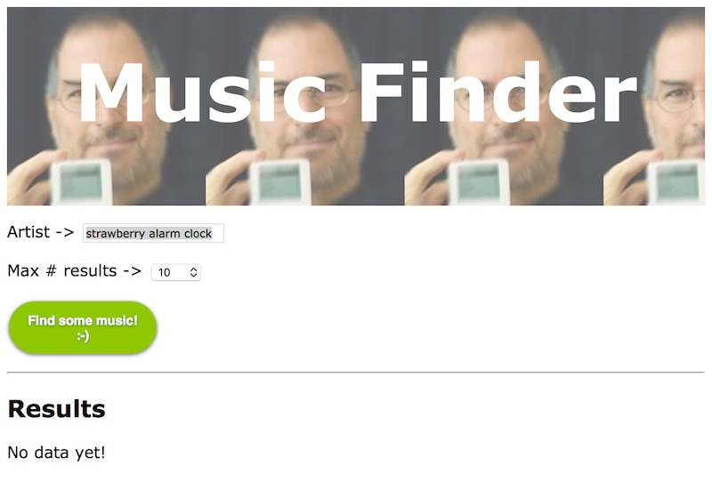
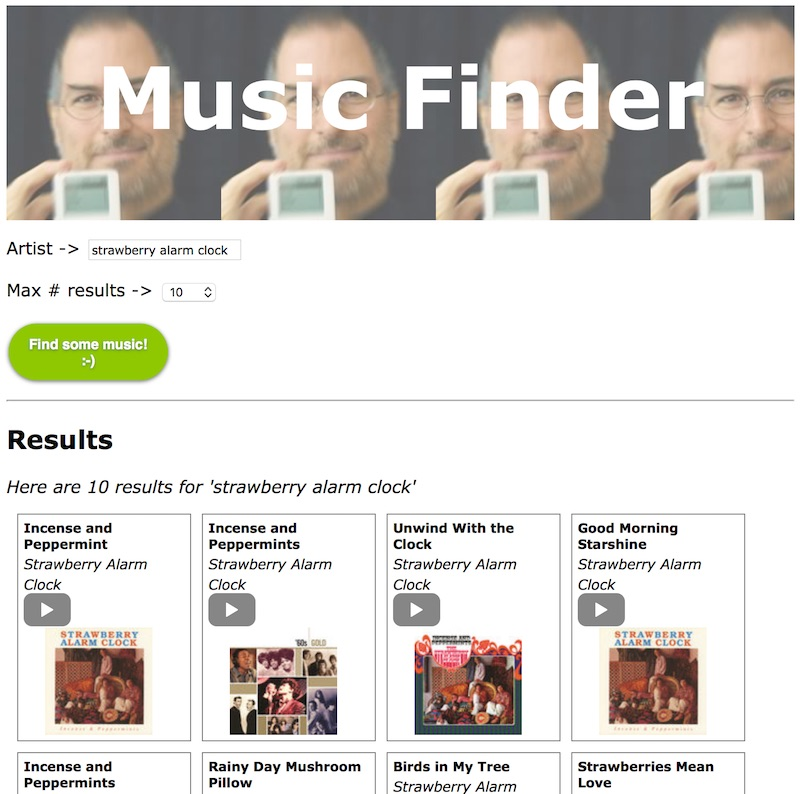

# *Music Finder* Project Example
## I. Overview 
*Music Finder* is an example project of what you might create that would fulfill the Project 2 requirements.
- If you choose to build *Music Finder* for Project 2, then you must work alone (no partner).
- The documentation for the iTunes web service used by this project is here: https://affiliate.itunes.apple.com/resources/documentation/itunes-store-web-service-search-api/

## II. Functional Requirements
- There will be text input that the user can type a search term into.
- There will be a way for the user to limit the the number of results they get from a search.
- When the user clicks a search button, the iTunes web service will be contacted and the results downloaded to the user's web browser.
- The relevant information from the results of the search will be displayed to the user, at a minimum:
    - artist name
    - title of track
    - a playable preview of the track (use the &lt;audio> element)
- Be sure to handle failure states gracefully (i.e. without crashing or giving an error in the console). If the search gives no results, notify the user of that fact.
- The user's most recent search term will be stored in HTML5 `localStorage`, and will be the default term displayed in the text input field when the user first opens the page. Peruse these notes if you need to: [Part 9 - Local Storage](../../notes/web-apps-9.md)

## III. Experience Requirements
- The app will be intuitive to use. Add tooltips and/or instructions as necessary.
- The design of the site will be much nicer than the example shown below. In particular the results will be formatted more pleasingly.
- The nicely styled search button(s) will have "over" and "active" states - use CSS to accomplish this.

## IV. Screen Shots

### A. Starting State:

### B. And after the user has made a search:

