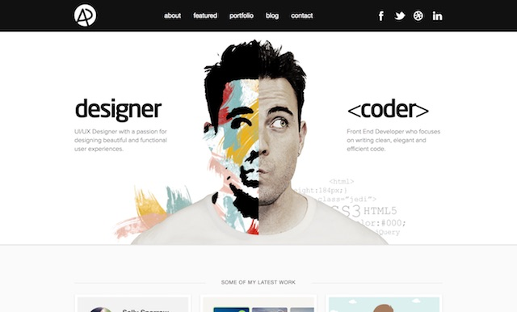
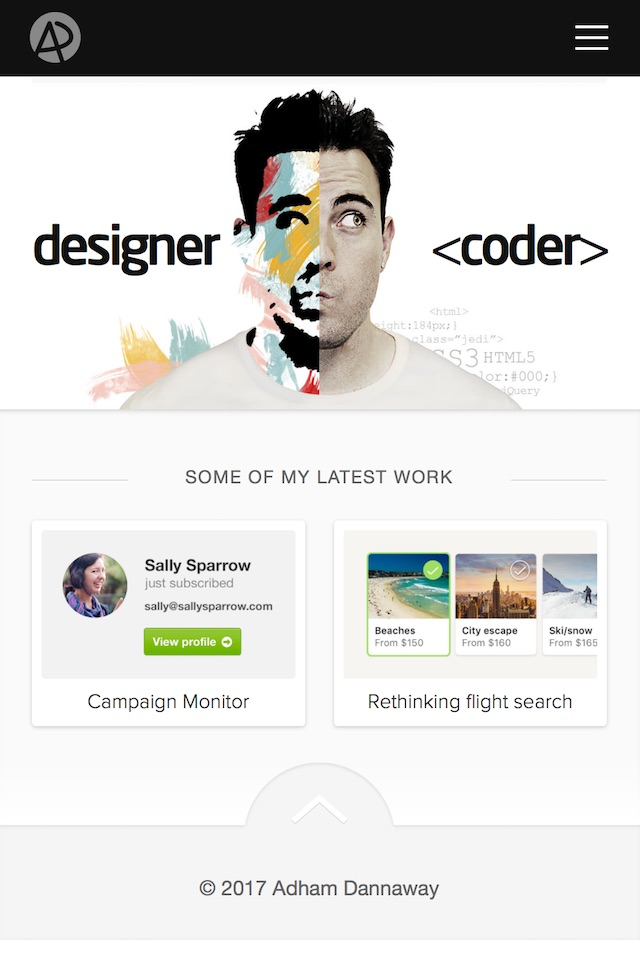

# Capstone Project - Web Portfolio
## Overview
One thing that we hear again and again from employers is how essential it is for GDD students to have a portfolio of "passion projects" (or "side projects") to demonstrate that student's talent and passion for creating games/interactive experiences. The most common way to let others see these projects is by posting them to the web. 

Each portfolio piece should be showcased with the following:
- a description
- a discussion of the technologies and/or techniques that were used
- if it was a group project, detail your exact role
- multiple screenshots
- ideally a link to a demo video that is hosted on YouTube or Vimeo
- if possible, a web playable version of the project

There are many ways to publish your portfolio of work to the web:
- https://www.behance.net
- https://www.linkedin.com
- https://github.com and/or https://pages.github.com
- https://wordpress.com or similar
- https://people.rit.edu (the banjo.rit.edu server)

This semester, for this class, you will create and publish a portfolio of your work to people.rit.edu. Read below for details.

**(In the future you will likely wish to additionally utilize some of the other publishing methods listed above!)**

## Description
You will create a personal portfolio site to showcase your work to potential employers and/or customers. The site must include examples of your work, contact information, and your resume. The examples should include at least three different things you've created; those could be projects or exercises from this or other classes, or work you've done on your own. An effective portfolio will highlight your *best work*, and that work should correlate to your career goals. 

Here are some example portfolios that were created by IGM students:

- [http://dougwatro.com (utilized Bootstrap)](http://dougwatro.com)

Some other examples are here:

- [http://www.adhamdannaway.com (utilized Wordpress Themes)](http://www.adhamdannaway.com)
- https://onepagelove.com

## Content Requirements
- the page is named index.html, and it will include:
  - a navigation system to allow the user to quickly access distinct content
  - your name and an image (could be a photo or an avatar)
  - a *tagline* (see #2 here: https://www.smashingmagazine.com/2009/02/10-steps-to-the-perfect-portfolio-website/) - example: "Creative Developer", "Unity/Unreal Game Developer seeking an internship opportunity", ...
  - "about you" content - example: "I'm a UX/UI Designer and Front End Developer from Sydney, Australia. I enjoy turning complex problems into simple, beautiful and intuitive interface designs. When I'm not coding or pushing pixels, you'll find me in the gym or on the court shooting hoops."

  - contact information
  - a gallery section with brief information about each of your work examples (examples can be projects or exercises from this class or other classes, or work you've done on your own)
  - Individual sub-section sections with more detail for each of your work examples:
    - each example needs a title, an image (could be a screenshot, photo, or link to a working demo video), and a one-paragraph description that highlights the tools you used and the skills that it illustrates. If the example is interactive and can play in a web brower, a link to a working version should be provided
    - if the example is from a group project, be sure to clearly indicate what your role was on the project

  - Resume (either printer friendly HTML, or a PDF, NEVER a Word .doc) that also has a printer-friendly stylesheet

## Design Requirements
- the site is a [responsive](https://en.wikipedia.org/wiki/Responsive_web_design), [single-page design](https://en.wikipedia.org/wiki/Single-page_application)
- It must have a minimum of two layouts--one optimized for desktop, one for phones
- It is assumed that you wil be using a CSS framework such as Bootstrap. If so, colors and typefaces must be modified so that the site is not a "cookie cutter" replica of the framework's templates
- Principles of visual design (taught in prerequisite classes) employed: clear visual hierarchy, good use of white space, effective alignment of content, thoughtful choices of colors and visual elements
- Effective typography employed; typeface(s) chosen should be clear and legible as well as appropriate to the content being presented
- The initial "landing" on the page should be compelling, ideally with a tag line and page design that "pulls" the user in. 

## Technology Requirements
- Semantic, valid HTML
- Well-structured, valid CSS
- Passes WAVE accessibility evaluation without significant errors 
- Semantic HTML
- Images and other media are properly optimized (both file size and image dimensions) for screen display

## Documentation Requirements (submit to dropbox in a PDF file)
- Notes page with information about how you made the site, including the following content: 
- Source information for any images or code that you didn't create yourself (including CSS frameworks, typefaces, and any code libraries)
- If you used a CSS framework, explain how you modified it so that your portfolio doesn't look exactly like other sites that use that framework. 
- What you did to go beyond the base expectations for the project--what did you do that was particularly challenging? This could involve art/design, content, or code. 

## Grading
If you complete all required components with no errors, you'll earn 16/20 points, or 80%. In order to go above that, 

Requirement | Possible Points (20) |
----------- | --------------- |
All required content present | 3 |
Written content quality and organization | 3 |
Responsive Design | 2 |
Visual Design | 2 |
Typography | 1 |
Sematic, valid HTML | 1 |
Well-structured, valid CSS | 1 |
No major accessibility errors | 1|
Drop-down navigation menu | 1 |
Properly optimized media | 1 |
"Above and Beyond" | 4 |

## Deliverables
- Due end of week 4: Create a github repository named *230-portfolio-notes* and post the following to it:
  - an up-to-date resume in PDF format
  - populate README.md with your portfolio content. Utilize something similar to this [230-portfolio-notes.md template](../other-files/230-portfolio-notes.md)
- Due end of week 8: 
- Due end of week 13: Final submission (see below)

## Final Submission and Due Date
The site must be placed in a portfolio directory inside of your igme230 directory (`http://people.rit.edu/youruserid/igme230/portfolio/`), and you should add two links to your project 1 page: one for the portfolio itself, and one directly to the notes.html page. 

- The completed site is due at 11:59pm on XXX, XX/XX
- The page should display properly at the URL specified above by that time
- ZIP and Post the project to mycourses, and put a link to the URL in the comments field of the dropbox

## Examples

### I. http://www.adhamdannaway.com

### II. Here is the mobile version of the same page

### III. http://dougwatro.com

### IV. Lynda.com Bootstrap example

