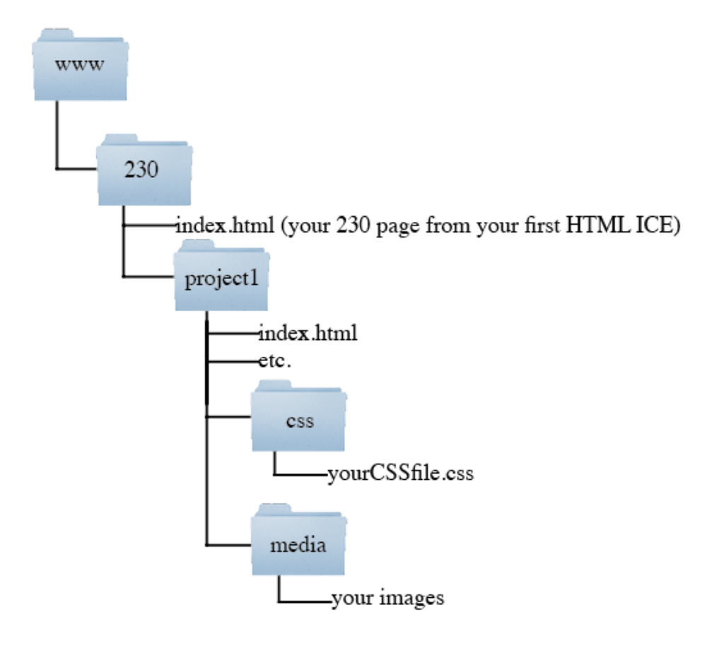

# Project 1 - Game Proposal Site
For project 3, you will be making a Web game or app. To get you started thinking about this early, you’ll be building a site to promote and document the project. Don't worry too much about what you'll be capable of, or the fact that your specs will probably change. Just think about what you might want to make. I'd also suggest you keep an eye on the Web for what sorts of apps and games other people are making that are small enough in scope for you to build in the span of a few weeks.

## Requirements ##
Location: The page will be located in the project1 directory in your 230 directory on Banjo. This means that the location of page on the web will be http://people.rit.edu/abc1234/230/project1/ (where 'abc1234' is your RIT id), as shown below:

Your main page for the tutorial will be the index page for this directory. You must have css and media directories to store the associated files. **Remember**: Our server is case sensitive, so your files must use the case indicated in this assignment. 

## Content and Structure ##
Content is the foundation of the Web; all pages exist to present some content, not the other way round. For this reason, your content needs to be written **first**.
By this time next week, your content should be written, chunked, and organized, and posted to your repo on GitHub. We will be checking this! Once this is done, begin building your HTML structure to fit the content (populating it with dummy content). Only when the structure is finalized should you be putting in the actual content!

## Required Content ## 
- The title of your (intended) project.
- A brief description of the project.
- The following pages (each in separate HTML files):
  - index.html: your "landing" page (the default file for your project1 directory)
  - proposal.html: what you plan to do, in more detail than the overview
  - documentation.html: A documentation page, which will document your overall process, resources used, and notes about this current assignment. Cite the sources of all information, tutorials, images and other media used. Also indicate how you met the project requirements, and any additional specifics you want me to see.
  - project.html: The game or app itself (this will just be a placeholder for now)
  
## HTML/CSS Markup ##
-	Structural tags like `<header>`, `<section>`, `<article>`, `<nav>`, and `<footer>` should be used appropriately. 
-	CSS selectors and rules will be used for formatting and positioning: 
  -	The style rules will be located in an external style sheet.
  -	There will be at least 5 style declarations (rules) in your document. 
  -	At least one of your style declarations will utilize a class selector.
  -	At least one of your style declarations will utilize an id selector.

## Design ## 
- College-level work
- Professionally styled  so that so that the results are pleasing and in no way resemble any templates or in-class exercises. The page design will be well thought out with appropriate organization, spacing, colors and fonts, and all pages should be consistent in look, feel and navigation.
-	Design principles (e.g. CRAP) applied appropriately.
- Navigation should be consistent across all pages, with a single, unified nav scheme, with all global nav in the same place on every page
  - Good navigation should always answer the questions "Where am I?" and "Where can I go?" This means your nav should **always** be the same on every page; don't make a link go away just because the user is on the page it links to.
- Text should be of sufficient size and contrast to be easily readable
- Responsive Design: 
  - At a minimum, you must support screen sizes equal to or less than max-width: 480px
  - Your design should be re-formatted to support these smaller screens. Changing font-size, margins, moving side bars, hiding elements, and ??? are all options

## Other Requirements ##
- HTML tables used only for tabular data, not page layout.
- No plugin content
- Site is fully accessible even without graphics enabled (e.g., use the alt attribute for all images)
- Images are not resized via code; all images should be at their native resolutions. If you need an image to be smaller, resize it in your graphic editor of choice.
- Additional "above and beyond" work.

# Critique Session #
The second class of week 5, we will have a critique session in class. In small groups, you will both give and receive feedback on your projects, so be prepared for this discussion.
While the critiques aren’t going to directly determine your project grade, the feedback you receive will be taken into consideration, so make sure your project is built to impress!

# Final Submission #
After receiving feedback from your classmates, make fixes and improvements to your site, and post it to Banjo before midnight on Friday of week 5.

**Submission:** Post to Banjo - be sure to test that it works in a Web browser. I must be able to get to it from your page when I click your name in my class list, so make sure to link to it from your main page. If your main page doesn't load when I click my link, or I can't immediately find a way to get to your project from that main page, you will get a 0 for the project. Please check when you upload it!
